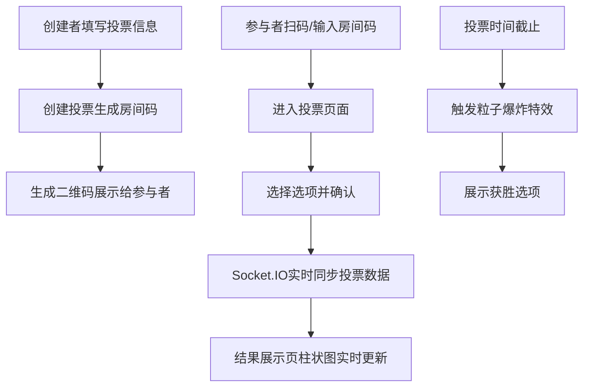

## 1. 产品概述
在线团队决策投票与实时结果可视化系统，让工作小组或活动组织者快速发起多选投票，参与者通过手机或电脑扫码进入投票页面实时投票，大屏幕以动态柱状图展示投票进度和结果，营造紧张刺激的综艺式投票体验。

- 核心价值：实现团队决策的高效、透明、可视化，适用于会议投票、活动评选、节目淘汰等场景
- 目标用户：团队组织者、活动策划者、会议主持人

## 2. 核心功能

### 2.1 用户角色
| 角色 | 进入方式 | 核心权限 |
|------|---------|---------|
| 投票创建者 | 首页创建投票 | 创建投票、生成房间码和二维码、重置投票、查看结果展示 |
| 投票参与者 | 输入房间码或扫码 | 浏览投票选项、提交投票（每人限投一票） |
| 结果展示者 | 输入房间码进入展示页 | 全屏展示实时投票结果、投屏到大屏幕 |

### 2.2 功能模块
1. **首页/创建投票页**：投票标题输入、选项管理（2-10个，可附带emoji）、有效期设置、创建按钮、房间码与二维码展示
2. **投票参与页**：选项展示（彩色方块）、投票交互、确认弹窗、投票成功提示
3. **结果展示页**：实时动态柱状图、票数与占比显示、倒计时、获胜粒子特效

### 2.3 页面详情
| 页面名称 | 模块名称 | 功能描述 |
|---------|---------|---------|
| 创建投票页 | 表单区域 | 输入投票标题、动态添加/删除选项（2-10个）、每个选项可添加emoji图标、选择有效期（5分钟/10分钟/自定义） |
| 创建投票页 | 创建结果展示 | 生成6位数房间码、显示二维码（qrcode.js）、提供参与链接、展示重置按钮 |
| 投票参与页 | 选项展示 | 以彩色方块展示所有选项（薄荷绿、樱花粉、天空蓝、柠檬黄等柔和色调）、点击脉冲放大+颜色加深动画（0.3秒） |
| 投票参与页 | 投票确认 | 弹出确认弹窗、提交投票、显示"投票成功"淡入提示（1秒自动消失） |
| 结果展示页 | 实时柱状图 | Canvas绘制动态柱状图、柱高随票数0.5秒缓动变化、柱顶显示票数和占比、深色背景+发光边缘效果 |
| 结果展示页 | 结束特效 | 投票截止时粒子爆炸特效（2秒，粒子颜色为获胜选项颜色）、显示获胜选项名称和票数 |

## 3. 核心流程
创建者在首页填写投票信息 → 点击创建生成房间码和二维码 → 参与者扫码或输入房间码进入投票页 → 参与者选择选项并确认投票 → 投票通过Socket.IO实时同步 → 结果展示页Canvas柱状图实时更新 → 投票截止触发粒子爆炸特效展示获胜者

## 4. 用户界面设计

### 4.1 设计风格
- **主色调**：活力橙到紫罗兰渐变（创建页），深蓝到黑渐变（结果展示页）
- **按钮风格**：圆角大卡片样式，弹性缩放交互动画
- **字体**：现代无衬线字体，大号标题突出重点
- **布局**：全屏flex布局，居中卡片式设计
- **动效**：弹性缩放、脉冲放大、颜色缓动、粒子爆炸

### 4.2 页面设计概述
| 页面名称 | 模块名称 | UI元素 |
|---------|---------|-------|
| 创建投票页 | 背景 | 活力橙→紫罗兰线性渐变，全屏覆盖 |
| 创建投票页 | 表单卡片 | 白色圆角大卡片（24px圆角），柔和阴影，弹性悬浮效果 |
| 创建投票页 | 输入框 | 圆角设计，聚焦时边框高亮动画 |
| 创建投票页 | 创建按钮 | 渐变填充，弹性缩放点击反馈，圆角设计 |
| 投票参与页 | 选项方块 | 彩色方块（薄荷绿#98D8C8、樱花粉#F7B7C8、天空蓝#A8D8EA、柠檬黄#FFE66D等），圆角设计 |
| 投票参与页 | 点击反馈 | 脉冲放大1.1倍+颜色加深，0.3秒过渡动画 |
| 投票参与页 | 确认弹窗 | 半透明遮罩，居中卡片，淡入淡出动画 |
| 投票参与页 | 成功提示 | 顶部居中，淡入后1秒淡出，绿色勾选图标 |
| 结果展示页 | 背景 | 深蓝#0A1628→纯黑径向渐变 |
| 结果展示页 | 柱状图 | 带发光边缘的彩色柱子，0.5秒缓动高度变化 |
| 结果展示页 | 柱顶标签 | 白色字体显示票数和百分比 |
| 结果展示页 | 获胜特效 | 粒子爆炸（2秒），粒子颜色为获胜选项颜色，中心显示获胜信息 |

### 4.3 响应式
- 桌面端优先设计，移动端自适应
- 投票参与页针对手机触摸优化，选项方块足够大可点击
- 结果展示页全屏适配，适合投影到大屏幕
