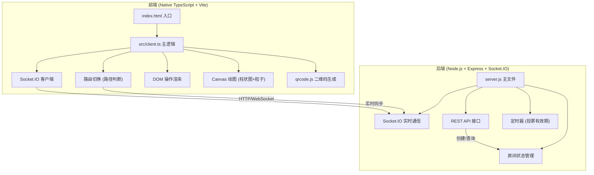
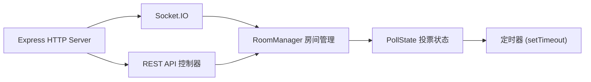

## 1. 架构设计



## 2. 技术描述
- **前端**：原生 TypeScript、Vite 构建、Canvas 2D 绘图、qrcode.js 二维码
- **构建工具**：Vite（端口5173，proxy转发/api和/socket.io到后端）
- **后端**：Node.js + Express@4 + Socket.IO@4（端口3001）
- **依赖**：express, socket.io, qrcode, uuid, concurrently
- **开发依赖**：typescript, vite, @types/express, @types/socket.io

## 3. 路由定义
| 路由 | 页面 | 说明 |
|-----|------|-----|
| / | 创建投票页 | 首页，用于创建新投票 |
| /vote/:roomCode | 投票参与页 | 参与者投票页面 |
| /result/:roomCode | 结果展示页 | 全屏实时结果展示 |

## 4. API 定义

### 4.1 REST API
```typescript
// 创建投票 POST /api/create
interface CreatePollRequest {
  title: string;
  options: { text: string; emoji?: string }[];  // 2-10个选项
  duration: number;  // 有效期（秒）
}

interface CreatePollResponse {
  roomCode: string;  // 6位房间码
  pollId: string;    // uuid
}

// 获取投票结果 GET /api/poll/:roomCode
interface PollResult {
  roomCode: string;
  title: string;
  options: {
    id: string;
    text: string;
    emoji?: string;
    votes: number;
    color: string;
  }[];
  totalVotes: number;
  endTime: number;  // 截止时间戳
  isEnded: boolean;
  winnerId?: string;
}

// 重置投票 POST /api/reset/:roomCode
interface ResetPollResponse {
  success: boolean;
  endTime: number;  // 新的截止时间
}
```

### 4.2 Socket.IO 事件
```typescript
// 客户端 -> 服务端
'join': { roomCode: string }           // 加入房间
'vote': { roomCode: string; optionId: string; clientId: string }  // 提交投票

// 服务端 -> 客户端
'poll-state': PollResult               // 实时推送投票状态
'voted': { success: boolean; message: string }  // 投票结果确认
'poll-ended': { winner: PollOption; results: PollResult }  // 投票结束
```

## 5. 服务器架构


### 核心模块职责
- **RoomManager**：维护内存中的房间集合，生成唯一6位房间码，管理投票生命周期
- **PollState**：单场投票的状态（标题、选项、票数、截止时间、已投票客户端集合）
- **Socket.IO 处理器**：接收投票、广播状态更新、处理房间加入/离开
- **定时器**：投票到期自动结束，广播结束事件和获胜信息

## 6. 数据模型

### 6.1 数据结构定义
```typescript
interface PollOption {
  id: string;
  text: string;
  emoji?: string;
  votes: number;
  color: string;  // 柔和色调
}

interface Poll {
  id: string;  // uuid
  roomCode: string;  // 6位数字
  title: string;
  options: PollOption[];
  totalVotes: number;
  createdAt: number;
  endTime: number;
  isEnded: boolean;
  winnerId?: string;
  votedClients: Set<string>;  // 已投票的clientId集合
}

type RoomMap = Map<string, Poll>;
```

### 6.2 颜色调色板（选项用）
```typescript
const OPTION_COLORS = [
  '#98D8C8', // 薄荷绿
  '#F7B7C8', // 樱花粉
  '#A8D8EA', // 天空蓝
  '#FFE66D', // 柠檬黄
  '#C5B4E3', // 薰衣草紫
  '#F4A261', // 珊瑚橙
  '#81C995', // 青竹绿
  '#FFD3B5', // 蜜桃粉
  '#B8D4E3', // 雾霾蓝
  '#E8D5B7', // 奶茶色
];
```
