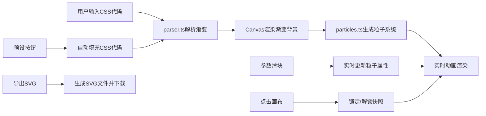

## 1. 产品概述
CSS渐变粒子实时预览工具，为前端开发者和设计师提供即时可视化的CSS渐变与粒子系统调试环境。解决调试复杂背景效果时反复切换编辑器与浏览器的痛点，提升创意工作效率。

## 2. 核心功能

### 2.1 用户角色
| 角色 | 注册方式 | 核心权限 |
|------|----------|----------|
| 设计师/开发者 | 无需注册 | 使用所有预览、编辑、导出功能 |

### 2.2 功能模块
1. **CSS代码编辑器**：语法高亮、实时错误标记、渐变代码解析
2. **渐变渲染画布**：实时渲染linear/radial/conic渐变背景
3. **粒子动画系统**：200+粒子动态飘移、碰撞反弹、参数可调
4. **预设模板库**：极光梦境、落日熔金等精美渐变预设
5. **粒子参数控制**：数量、速度、大小、透明度滑块实时调节
6. **快照锁定功能**：点击画布锁定/解锁粒子动画帧
7. **SVG导出功能**：导出当前渐变与粒子状态为SVG文件

### 2.3 页面详情
| 页面名称 | 模块名称 | 功能描述 |
|----------|----------|----------|
| 主页面 | 左侧控制面板 | 代码编辑器、预设按钮、粒子参数滑块 |
| 主页面 | 右侧预览画布 | 渐变背景渲染、粒子动画、点击锁定 |
| 主页面 | 底部导出区 | SVG导出按钮、状态图标 |

## 3. 核心流程
用户输入CSS渐变代码 → 系统解析渐变参数 → 画布实时渲染渐变背景 → 生成对应色域的粒子系统 → 用户调整粒子参数 → 动画实时更新 → 点击画布锁定快照 → 导出SVG文件

## 4. 用户界面设计

### 4.1 设计风格
- **主色调**：深色主题 #1A1A2E（背景）、#16213E→#0F3460（渐变条）、#1E293B（面板）
- **语法高亮**：绿色（属性）、橙色（值）、蓝色（选择器）
- **按钮样式**：圆角8px、深灰背景白字、hover亮色过渡
- **字体**：等宽字体14px（编辑器），系统字体（UI控件）
- **布局**：左右分栏3:7（左320px固定），卡片式圆角12px，0.5px白色半透明边框
- **图标**：简洁线性风格，暂停/播放图标带0.2秒旋转过渡

### 4.2 页面设计概述
| 页面名称 | 模块名称 | UI元素 |
|----------|----------|--------|
| 主页面 | 代码编辑器 | 暗色textarea、语法高亮层、错误标记（右侧30px红色波浪线） |
| 主页面 | 预设按钮组 | 横向排列120×40px按钮、间距12px、水平滚动 |
| 主页面 | 控制面板 | 4组滑块（50-500/0.1-3.0/2-10/0.1-1.0）、实时数值显示 |
| 主页面 | Canvas画布 | 渐变背景、粒子动画、点击锁定、暂停/播放图标 |
| 主页面 | 导出按钮 | 青绿色100×36px圆角按钮、加载旋转动画 |

### 4.3 响应式设计
- **桌面端（>768px）**：左右固定布局，左面板320px，画布自适应
- **移动端（≤768px）**：左面板折叠为下拉面板，点击图标0.3秒展开动画，画布自适应剩余高度
- **触摸优化**：滑块支持触摸拖拽，按钮加大点击区域

## 5. 性能指标
| 指标 | 要求 |
|------|------|
| 代码输入→预览更新 | <100ms延迟 |
| 200粒子帧率 | 稳定60FPS |
| 500粒子帧率 | ≥30FPS |
| 动画流畅度 | requestAnimationFrame驱动 |
