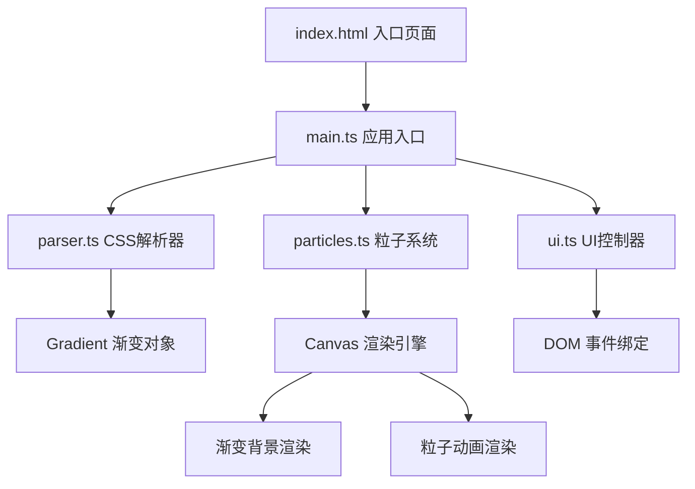

## 1. 架构设计



## 2. 技术描述
- **前端**：TypeScript 5.x + Vite 5.x + 原生JavaScript（无第三方库）
- **构建工具**：Vite（ESModule模式，端口3000）
- **渲染引擎**：HTML5 Canvas 2D API
- **动画驱动**：requestAnimationFrame
- **无后端、无数据库**

## 3. 目录结构

```
auto77/
├── index.html                 # 入口页面，含HTML结构与内联样式
├── vite.config.js             # Vite构建配置
├── tsconfig.json              # TypeScript严格模式配置
├── package.json               # 依赖与脚本
└── src/
    ├── main.ts                # 应用入口，初始化各模块
    ├── parser.ts              # CSS渐变解析器
    ├── particles.ts           # 粒子系统核心逻辑
    └── ui.ts                  # UI组件与事件控制
```

## 4. 核心模块定义

### 4.1 parser.ts - CSS渐变解析器

```typescript
export interface GradientStop {
  color: string;       // #RRGGBB 或 rgb()/rgba()
  position: number;    // 0-1 百分比位置
}

export interface GradientConfig {
  type: 'linear' | 'radial' | 'conic';
  angle?: number;      // linear: 角度(deg), conic: 起始角度
  stops: GradientStop[];
  centerX?: number;    // radial: 中心X(0-1)
  centerY?: number;    // radial: 中心Y(0-1)
  radiusX?: number;    // radial: 半径X(0-1)
  radiusY?: number;    // radial: 半径Y(0-1)
  rawCss: string;      // 原始CSS代码
}

export interface ParseResult {
  success: boolean;
  gradient?: GradientConfig;
  error?: {
    line: number;
    column: number;
    message: string;
  };
}

export function parseGradient(css: string): ParseResult;
export function extractGradientColors(config: GradientConfig): string[];
```

### 4.2 particles.ts - 粒子系统

```typescript
export interface Particle {
  x: number;
  y: number;
  vx: number;
  vy: number;
  radius: number;
  color: string;
  alpha: number;
}

export interface ParticleConfig {
  count: number;       // 50-500, 默认200
  speed: number;       // 0.1-3.0, 默认0.8
  size: number;        // 2-10, 默认4
  alpha: number;       // 0.1-1.0, 默认0.6
}

export class ParticleSystem {
  constructor(canvas: HTMLCanvasElement, gradient: GradientConfig);
  setConfig(config: Partial<ParticleConfig>): void;
  setGradient(gradient: GradientConfig): void;
  start(): void;
  stop(): void;
  toggleLock(): boolean;  // 返回锁定状态
  isLocked(): boolean;
  getParticles(): Particle[];
  getGradient(): GradientConfig;
  renderFrame(): void;
}
```

### 4.3 ui.ts - UI控制器

```typescript
export interface Preset {
  name: string;
  css: string;
}

export class UIController {
  constructor(
    editor: HTMLTextAreaElement,
    particleSystem: ParticleSystem,
    onCodeChange: (css: string) => void
  );
  setupPresets(presets: Preset[]): void;
  setupSliders(config: ParticleConfig, onChange: (config: ParticleConfig) => void): void;
  setupExportButton(onExport: () => void): void;
  updateErrorMarkers(errors: ParseResult['error'][]): void;
  updateHighlight(css: string): void;
  toggleLockIcon(locked: boolean): void;
  showExportLoading(): void;
  hideExportLoading(): void;
}
```

### 4.4 main.ts - 应用入口

```typescript
import { parseGradient, extractGradientColors } from './parser';
import { ParticleSystem, ParticleConfig } from './particles';
import { UIController, Preset } from './ui';

// 预设渐变模板
const PRESETS: Preset[] = [
  { name: '极光梦境', css: 'linear-gradient(135deg, #00C9FF 0%, #92FE9D 100%)' },
  { name: '落日熔金', css: 'radial-gradient(circle, #F27121 0%, #E94057 50%, #8A2387 100%)' },
  { name: '深海幽蓝', css: 'linear-gradient(180deg, #0F2027 0%, #203A43 50%, #2C5364 100%)' },
  { name: '霓虹闪烁', css: 'conic-gradient(from 0deg, #ff0080, #ff8c00, #40e0d0, #ff0080)' },
  { name: '紫罗兰梦', css: 'linear-gradient(45deg, #834d9b 0%, #d04ed6 100%)' },
];

// 默认配置
const DEFAULT_CONFIG: ParticleConfig = {
  count: 200,
  speed: 0.8,
  size: 4,
  alpha: 0.6,
};
```

## 5. 性能优化策略

| 优化点 | 实现方案 |
|--------|----------|
| 代码解析防抖 | 100ms延迟合并快速输入，避免频繁重渲染 |
| 粒子对象池 | 复用粒子对象，避免频繁GC |
| 画布尺寸缓存 | 缓存canvas宽高，减少DOM读取 |
| 批量绘制 | 使用beginPath批量绘制粒子，减少状态切换 |
| 帧率监测 | 动态调整粒子渲染策略，保持30FPS+ |
| 离屏渲染 | 渐变背景缓存到离屏canvas，每帧只需绘制粒子 |

## 6. 关键算法

### 6.1 CSS渐变解析
- 使用正则表达式匹配 `linear-gradient`/`radial-gradient`/`conic-gradient`
- 解析角度参数（deg/rad/turn）
- 提取颜色停止点（color stop）及其位置
- 支持多渐变组合解析

### 6.2 粒子碰撞检测
- 边界检测：x - radius < 0 或 x + radius > width 时反弹vx
- 边界检测：y - radius < 0 或 y + radius > height 时反弹vy
- 反弹时随机调整速度方向（±20°）和大小（±2px）

### 6.3 SVG导出
- 将渐变转为 `<defs><linearGradient>/<radialGradient>` 定义
- 粒子转为 `<circle cx cy r fill opacity>` 元素
- 使用Blob URL触发下载
