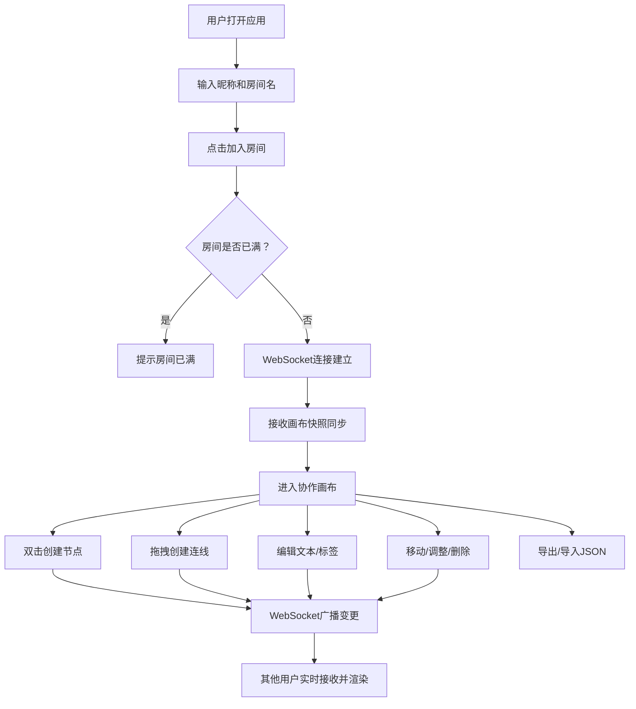

## 1. 产品概述

MindFlow 是一款面向远程团队的实时协作思维导图Web应用，解决远程会议中讨论缺乏视觉化记录与逻辑梳理、传统白板无法结构化保存节点连线关系的问题。通过无限画布+WebSocket实时同步，让最多10人同时在同一房间内进行头脑风暴，所有节点、连线、文字修改即时广播，确保团队思维可视化的高效协作。

- 目标用户：远程团队、产品经理、设计师、开发者等需要在线协作梳理思路的群体
- 核心价值：将口头讨论转化为可持久化、可结构化的视觉思维图谱，并支持实时多人协作与导出归档

## 2. 核心功能

### 2.1 用户角色

| 角色 | 加入方式 | 核心权限 |
|------|----------|----------|
| 协作者 | 输入昵称+房间名加入 | 创建/编辑/删除节点与连线、实时协作、导出导入 |

### 2.2 功能模块

1. **房间首页**：昵称输入、房间名输入、加入房间
2. **协作画布页**：无限画布（Canvas）、思维节点管理、有向连线、实时光标同步、工具面板、导出导入

### 2.3 页面详情

| 页面名称 | 模块名称 | 功能描述 |
|----------|----------|----------|
| 房间首页 | 加入表单 | 输入昵称（1-20字）和房间名（1-30字），点击"加入房间"进入画布，若房间已满（10人）提示"房间已满" |
| 协作画布页 | 无限画布 | 浅灰网格背景（间距40px，线宽0.5px，颜色#D3D3D3），支持鼠标拖拽平移与滚轮缩放（0.3x-3x），左上角显示房间名+在线人数徽标 |
| 协作画布页 | 思维节点 | 双击创建圆角矩形节点（200x80px，圆角8px，边框#4A90D9），支持文本输入（最多120字，14px，自动换行），选中显示8个控制手柄（3px蓝色圆点）拖拽调整大小，自由拖拽移动，Ctrl+D复制，Delete/右键菜单删除，创建时0→1弹簧动画 |
| 协作画布页 | 有向连线 | 从节点边缘拖拽到另一节点边缘创建箭头连线（默认#888，线宽2px），悬停高亮变蓝#4A90D9线宽4px，三种样式（直线/贝塞尔曲线/阶梯线），双击添加文字标签，生成时路径动画 |
| 协作画布页 | 实时协作 | WebSocket广播所有操作（创建/移动/调整/删除/连线/文字/标签），新用户加入同步完整画布JSON快照，每个用户光标为半透明彩色圆形（半径8px，随机色，0.6透明度，带昵称标签）实时移动广播 |
| 协作画布页 | 导出导入 | 右上角导出按钮下载JSON（房间名_时间戳.json），导入按钮选择JSON恢复画布（需二次确认） |
| 协作画布页 | 工具面板 | 底部左侧固定，半透明白色背景圆角12px阴影，三个工具按钮（创建节点/连线/删除模式），选中时背景#4A90D9白色图标 |
| 协作画布页 | 导航栏 | 顶部固定56px，半透明毛玻璃blur(8px)，左侧Logo（思维导图图标+"MindFlow"），中间房间号+在线人数，右侧导出导入按钮组 |

## 3. 核心流程

用户打开应用 → 输入昵称和房间名 → 点击"加入房间" → WebSocket连接建立 → 接收/同步当前画布状态 → 在画布上创建节点、连线、编辑文本 → 所有操作实时广播给房间内其他用户 → 其他用户看到光标移动和画布变更 → 可随时导出JSON归档或导入恢复

## 4. 用户界面设计

### 4.1 设计风格

- 主色：#4A90D9（蓝色），辅助色：#888（灰色连线）、#E2E8F0（按钮悬停）
- 按钮风格：圆角6px，悬停背景#E2E8F0，点击缩放0.95倍0.1秒过渡
- 字体：思维导图标题用粗体，节点文本14px，界面文字12-14px
- 布局风格：顶部导航+左侧工具面板+中央无限画布
- 图标风格：线条图标（lucide-react），简洁现代

### 4.2 页面设计概述

| 页面名称 | 模块名称 | UI元素 |
|----------|----------|--------|
| 房间首页 | 加入表单 | 居中卡片布局，渐变背景，圆角输入框，蓝色主按钮，微动效入场动画 |
| 协作画布页 | 导航栏 | 半透明毛玻璃背景，左侧图标+文字Logo，中间房间信息，右侧按钮组，56px高 |
| 协作画布页 | 无限画布 | 浅灰网格背景，Canvas全屏，左上角房间名+人数徽标，节点圆角矩形带阴影 |
| 协作画布页 | 工具面板 | 半透明白色背景，圆角12px，阴影，三个竖排图标+文字按钮，选中高亮 |
| 协作画布页 | 用户光标 | 半透明彩色圆形+昵称标签，0.6透明度，实时移动 |
| 协作画布页 | 节点 | 圆角矩形，边框#4A90D9，选中时8个蓝色手柄，创建弹簧动画 |
| 协作画布页 | 连线 | 箭头末端，悬停高亮变蓝，三种样式切换，双击标签 |

### 4.3 响应式适配

- 桌面优先设计，Canvas鼠标交互（双击、拖拽、滚轮缩放）
- 移动端：工具面板移至底部横条紧凑布局，Canvas改用触摸手势（双指缩放、单指拖拽），节点点击代替双击创建

### 4.4 性能目标

- 画布渲染帧率 ≥50FPS（200节点+300连线）
- WebSocket消息端到端延迟 ≤150ms
- 操作微动效0.2秒过渡
