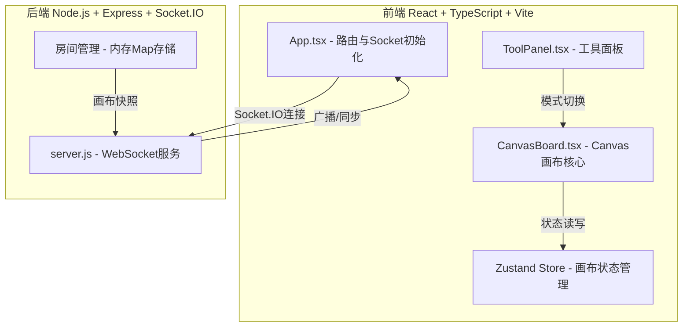
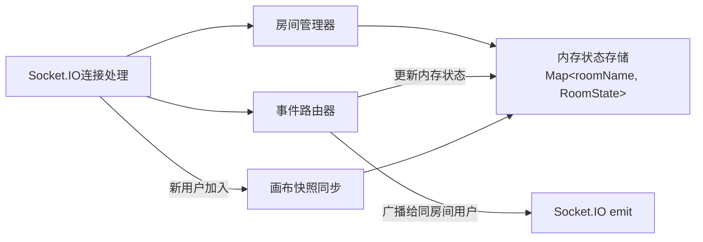
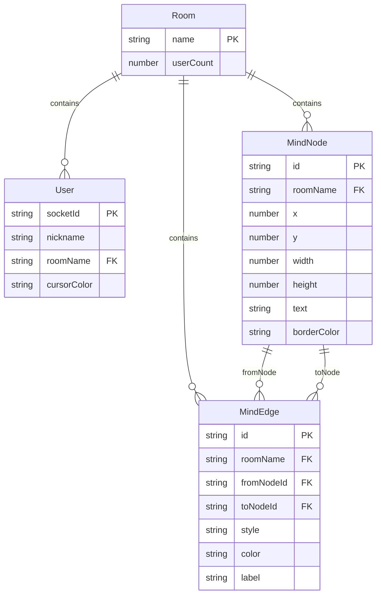

## 1. 架构设计



## 2. 技术说明

- 前端：React@18 + TypeScript + Vite + Tailwind CSS + Zustand
- 初始化工具：vite-init（react-express-ts模板）
- 后端：Express@4 + Socket.IO
- 数据库：无（内存Map存储房间状态）
- 实时通信：Socket.IO（WebSocket协议，自动降级）

## 3. 路由定义

| 路由 | 用途 |
|------|------|
| / | 房间首页，输入昵称和房间名 |
| /canvas | 协作画布页，无限画布+节点+连线+协作 |

## 4. API定义

### 4.1 Socket.IO事件定义

```typescript
interface ServerToClientEvents {
  "canvas:sync": (data: CanvasSnapshot) => void;
  "node:created": (node: MindNode) => void;
  "node:moved": (payload: { id: string; x: number; y: number }) => void;
  "node:resized": (payload: { id: string; width: number; height: number }) => void;
  "node:deleted": (payload: { id: string }) => void;
  "node:textUpdated": (payload: { id: string; text: string }) => void;
  "edge:created": (edge: MindEdge) => void;
  "edge:styleChanged": (payload: { id: string; style: EdgeStyle }) => void;
  "edge:labelAdded": (payload: { id: string; label: string }) => void;
  "edge:deleted": (payload: { id: string }) => void;
  "cursor:move": (payload: { userId: string; nickname: string; x: number; y: number; color: string }) => void;
  "user:joined": (payload: { nickname: string; userCount: number }) => void;
  "user:left": (payload: { nickname: string; userCount: number }) => void;
}

interface ClientToServerEvents {
  "room:join": (payload: { roomName: string; nickname: string }) => void;
  "node:create": (node: MindNode) => void;
  "node:move": (payload: { id: string; x: number; y: number }) => void;
  "node:resize": (payload: { id: string; width: number; height: number }) => void;
  "node:delete": (payload: { id: string }) => void;
  "node:updateText": (payload: { id: string; text: string }) => void;
  "edge:create": (edge: MindEdge) => void;
  "edge:changeStyle": (payload: { id: string; style: EdgeStyle }) => void;
  "edge:addLabel": (payload: { id: string; label: string }) => void;
  "edge:delete": (payload: { id: string }) => void;
  "cursor:move": (payload: { x: number; y: number }) => void;
}

type EdgeStyle = "straight" | "bezier" | "step";

interface MindNode {
  id: string;
  x: number;
  y: number;
  width: number;
  height: number;
  text: string;
  borderColor: string;
}

interface MindEdge {
  id: string;
  fromNodeId: string;
  toNodeId: string;
  style: EdgeStyle;
  color: string;
  label: string;
}

interface CanvasSnapshot {
  nodes: MindNode[];
  edges: MindEdge[];
}
```

## 5. 服务器架构图



## 6. 数据模型

### 6.1 数据模型定义



### 6.2 内存存储结构

房间状态存储在内存Map中，键为房间名，值为RoomState对象：

```typescript
interface RoomState {
  nodes: MindNode[];
  edges: MindEdge[];
  users: Map<string, { nickname: string; color: string }>;
}
```
