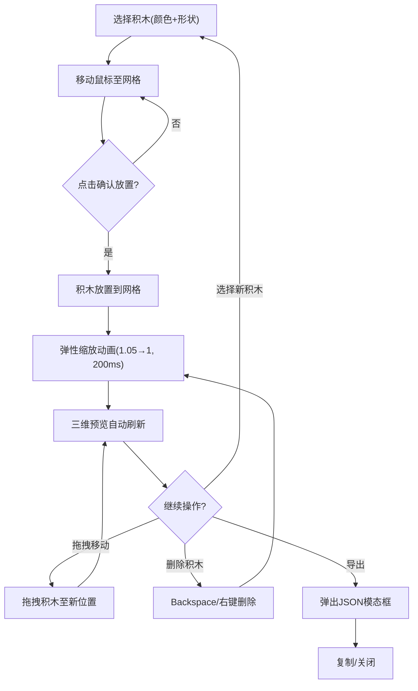

## 1. 产品概述

基于Canvas的交互式乐高积木拼搭与三维预览Web应用，让用户在二维网格上拖放不同颜色和形状的积木块，实时生成等轴测三维俯视预览，并支持导出拼搭结果为JSON格式。面向创意爱好者、儿童教育及积木设计人群。

## 2. 核心功能

### 2.1 功能模块

1. **主页面**：积木面板（左）+ 拼搭主Canvas（右）+ 三维预览Canvas（下）+ 顶部工具栏
2. **积木面板**：5种颜色×3种形状的积木选择，点击进入放置模式
3. **拼搭区域**：20×15网格的二维Canvas，支持放置、拖拽移动、删除积木
4. **三维预览**：基于等轴测投影的实时三维俯视预览
5. **导出功能**：将拼搭数据导出为JSON格式的模态框

### 2.2 页面详情

| 页面名称 | 模块名称 | 功能描述 |
|---------|---------|---------|
| 主页面 | 积木面板 | 列出5色3形状积木缩略块，悬停发光，选中高亮边框，点击进入放置模式 |
| 主页面 | 拼搭区域 | 20×15网格Canvas，半透明预览块跟随鼠标，点击放置，拖拽移动，右键/Backspace删除，弹性动画 |
| 主页面 | 三维预览 | 等轴测投影Canvas，积木顶部原色+侧面变暗30%，30度投影角，统一高度20px |
| 主页面 | 工具栏 | 导出按钮，点击弹出JSON模态框，带复制和关闭按钮 |

## 3. 核心流程

用户从积木面板选择颜色和形状 → 鼠标移至主Canvas显示半透明预览 → 点击放置积木 → 可拖拽移动已放置积木 → 可删除积木 → 三维预览自动刷新 → 点击导出按钮查看/复制JSON数据

## 4. 用户界面设计

### 4.1 设计风格

- 主色调：深色背景#1D1D1D搭配彩色积木块
- 辅助色：面板背景#2C2C2C，工具栏#333333，主Canvas背景#F5F5F5
- 按钮风格：白色文字，圆角4px
- 字体：系统字体栈，标题加粗
- 布局风格：左右+底部三栏布局，响应式适配
- 积木颜色：红#FF4136、蓝#0074D9、黄#FFDC00、绿#2ECC40、紫#B10DC9
- 积木形状：2×2方块、2×4长条、1×4长条

### 4.2 页面设计概述

| 页面名称 | 模块名称 | UI元素 |
|---------|---------|--------|
| 主页面 | 积木面板 | 深色#2C2C背景，积木缩略块带悬停外发光(0.5强度，颜色同积木)，选中白色边框高亮 |
| 主页面 | 拼搭Canvas | 浅色#F5F5背景，20×15网格，网格线#CCC 1px，积木间1px #999缝隙，积木填满格子 |
| 主页面 | 预览Canvas | 深色#1A1A背景，等轴测积木鲜艳色，侧面暗30% |
| 主页面 | 工具栏 | #333背景，白色文字按钮4px圆角，导出按钮 |
| 主页面 | 模态框 | 半透明黑色背景，白色圆角8px内容区，复制+关闭按钮 |

### 4.3 响应式设计

- 桌面优先设计，最小宽度900px
- 窄屏(<900px)时积木面板变为顶部横条
- 主Canvas和预览Canvas按比例缩放
- Canvas尺寸：主Canvas 800×600px，预览Canvas 400×300px

### 4.4 动画与交互

- 积木放置/删除弹性动画：缩放1.05→1，持续200ms
- 积木面板悬停发光：发光颜色与积木色一致，强度0.5
- 拖拽时积木跟随鼠标，其他块半透明遮挡
- 三维预览在100ms内自动刷新
- FPS不低于40帧，动画延迟低于200ms
