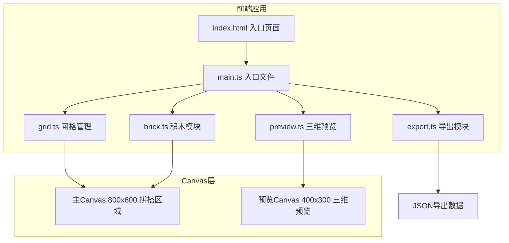

## 1. 架构设计



## 2. 技术说明

- 前端：TypeScript + 原生JavaScript + Canvas API
- 构建工具：Vite
- 初始化工具：手动创建项目结构（非React/Vue模板）
- 后端：无
- 数据库：无（纯前端应用）

## 3. 文件结构

| 文件 | 用途 |
|------|------|
| package.json | 项目依赖(typescript, vite)，启动脚本npm run dev |
| index.html | 入口页面，包含Canvas元素和布局结构 |
| vite.config.js | 构建配置，index.html作为入口，端口3000 |
| tsconfig.json | TypeScript严格模式，target ES2020 |
| src/main.ts | 入口文件，初始化Canvas和事件绑定 |
| src/grid.ts | 网格管理模块，20×15网格生成渲染，积木放置移除，网格状态管理 |
| src/brick.ts | 积木模块，定义颜色形状尺寸，积木创建和渲染 |
| src/preview.ts | 三维预览模块，等轴测投影绘制，自动刷新 |
| src/export.ts | 导出模块，JSON格式拼搭数据导出 |

## 4. 数据模型

### 4.1 积木数据结构

```typescript
interface Brick {
  id: string;
  x: number;
  y: number;
  width: number;
  height: number;
  color: string;
  shape: string;
}

interface GridState {
  bricks: Brick[];
  grid: (string | null)[][]; // 20x15 grid, null or brick id
}
```

### 4.2 积木定义

| 形状 | 尺寸(格) | 可选颜色 |
|------|---------|---------|
| 2x2方块 | 2×2 | 红#FF4136, 蓝#0074D9, 黄#FFDC00, 绿#2ECC40, 紫#B10DC9 |
| 2x4长条 | 2×4 | 红#FF4136, 蓝#0074D9, 黄#FFDC00, 绿#2ECC40, 紫#B10DC9 |
| 1x4长条 | 1×4 | 红#FF4136, 蓝#0074D9, 黄#FFDC00, 绿#2ECC40, 紫#B10DC9 |

## 5. 核心算法

### 5.1 等轴测投影

- 投影角度：30度
- 积木高度：统一20px
- 顶部颜色：与二维视图一致
- 侧面颜色：顶部颜色变暗30%
- 转换公式：
  - isoX = (gridX - gridY) * cos(30°) * cellSize/2 + offsetX
  - isoY = (gridX + gridY) * sin(30°) * cellSize/2 - height + offsetY

### 5.2 碰撞检测

- 网格占据检测：遍历积木覆盖的所有格子，检查是否已有其他积木
- 放置验证：确保积木完全在20×15网格范围内且不与已有积木重叠

### 5.3 拖拽逻辑

- mousedown检测点击位置是否在已放置积木上
- mousemove更新积木位置，实时重绘
- mouseup确认新位置或回退原位置
