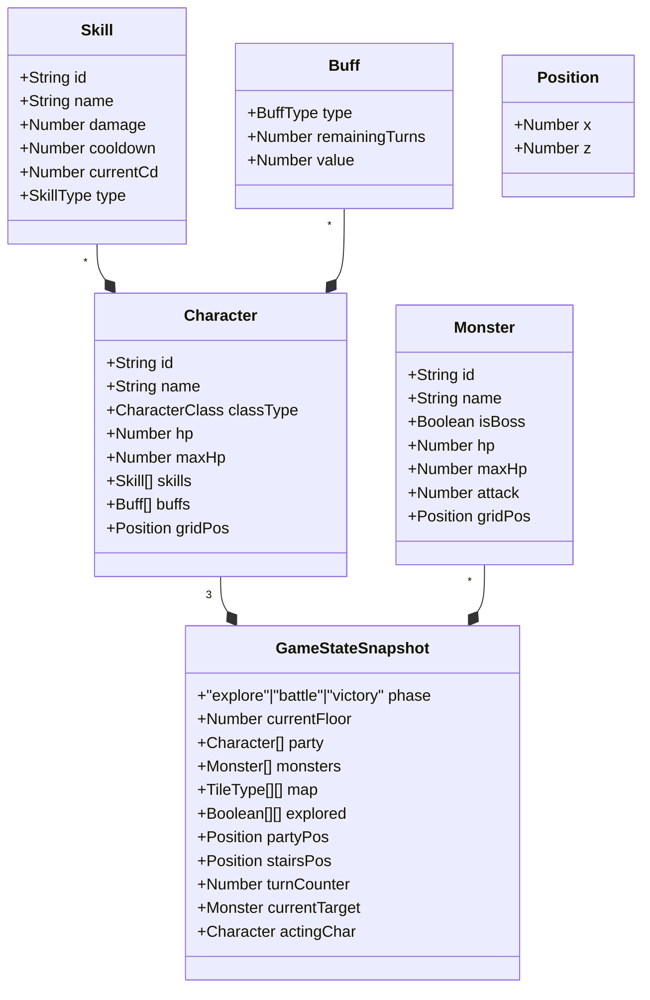

## 1. 架构设计

```mermaid
flowchart TD
    "index.html(入口页面)" --> "main.ts(游戏入口)"
    "main.ts(游戏入口)" --> "Renderer.ts(3D渲染)"
    "main.ts(游戏入口)" --> "PlayerController.ts(输入控制)"
    "main.ts(游戏入口)" --> "GameState.ts(状态管理)"
    "GameState.ts(状态管理)" --> "DungeonGenerator.ts(迷宫生成)"
    "GameState.ts(状态管理)" --> "BattleSystem.ts(战斗系统)"
    "GameState.ts(状态管理)" --> "LootSystem.ts(战利品系统)"
    "PlayerController.ts(输入控制)" --> "GameState.ts(状态管理)"
    "Renderer.ts(3D渲染)" --> "ParticleSystem.ts(粒子特效)"
    "Renderer.ts(3D渲染)" --> "UIManager.ts(UI层)"
```

**调用关系与数据流：**
- 键盘事件 → main.ts → PlayerController → GameState.update → Renderer重绘
- GameState → 订阅状态变化 → Renderer同步3D场景、UIManager同步界面
- DungeonGenerator → 返回二维地图数组 → GameState存储
- BattleSystem → 处理回合逻辑 → 更新GameState中角色/怪物HP
- ParticleSystem → 被Renderer调用，使用对象池复用粒子

## 2. 技术描述
- **前端框架**：原生TypeScript（无需React，游戏逻辑直接操作Three.js场景）
- **3D引擎**：Three.js @0.160
- **动画库**：GSAP @3.12（用于移动补间、UI过渡）
- **构建工具**：Vite @5（ESM热更新，index.html为入口）
- **语言**：TypeScript @5（严格模式strict:true，target ES2020）
- **后端**：无（纯前端单机游戏）
- **数据库**：无（状态内存管理）

## 3. 文件结构与模块职责

| 文件路径 | 职责说明 | 依赖模块 |
|-----------|-------------|-------------|
| `package.json` | 依赖声明：three, typescript, vite, @types/three, gsap；脚本npm run dev | - |
| `vite.config.js` | Vite构建配置，入口index.html | - |
| `tsconfig.json` | TS配置：strict:true, target:ES2020, module:ESNext | - |
| `index.html` | 入口页面：深色石纹渐变背景，居中Canvas，加载火把闪烁标题"地牢远征队"，UI层DOM | - |
| `src/main.ts` | 入口：初始化Renderer/Scene/Camera，加载各模块，requestAnimationFrame游戏循环调度，接收键盘事件分发 | Renderer, PlayerController, GameState, UIManager |
| `src/types.ts` | 全局类型定义：Character职业、Monster、TileType、GameStateSnapshot、Skill、Buff等 | 无（被所有模块依赖） |
| `src/GameState.ts` | 核心状态管理：三人小队、当前楼层地图、怪物列表、战斗回合计数器、探索迷雾。导出getState/setState/nextTurn/startBattle/endBattle方法 | types, DungeonGenerator |
| `src/DungeonGenerator.ts` | 递归回溯算法生成10x10迷宫：地板/墙壁/门(楼梯)/宝箱/怪物生成点(2-4个/层)。返回TileType二维数组 | types |
| `src/PlayerController.ts` | 玩家输入：WASD移动(每格+0.5s冷却)、空格交互、1/2/3技能、Tab切换目标。调用gsap做0.3s缓动移动。将操作指令传给GameState.update | types, GameState, gsap |
| `src/Renderer.ts` | Three.js渲染：创建Scene(环境光0.4+侧光0.8)、Camera(俯视45度跟随/战斗视角30度)、灯光。根据GameState绘制地面/墙壁/怪物(红色八面体)/宝箱(金色四棱锥)/小队模型(战士绿圆柱+蓝护盾、法师紫球+光点、盗贼暗红方块+虚线路径)。战斗时屏幕闪红+视角切换。 | types, three, ParticleSystem |
| `src/BattleSystem.ts` | 回合制战斗逻辑：玩家技能选择、伤害计算、技能CD、怪物AI(攻击前排/Boss范围伤害)、胜负判定 | types, GameState |
| `src/LootSystem.ts` | 战利品：击败怪物生成宝箱、宝箱交互随机药水(治疗/速度)、buff效果管理 | types, GameState |
| `src/ParticleSystem.ts` | 粒子对象池：猛击金色冲击波、火球橙色抛物轨迹、背刺暗影残影、胜利120金色粒子爆炸。复用粒子Mesh避免GC | three |
| `src/UIManager.ts` | DOM UI层：左上状态栏(头像👑🎩🎭+血条+buff)、右上楼层数(火焰动画)、左下操作提示、战斗界面、药水提示、胜利画面。使用CSS动画。 | types, GameState |

## 4. 数据模型

### 4.1 核心类型定义



### 4.2 枚举定义
- **CharacterClass**: WARRIOR(战士) | MAGE(法师) | ROGUE(盗贼)
- **TileType**: FLOOR(地板) | WALL(墙壁) | STAIRS(楼梯) | CHEST(宝箱) | EMPTY(空)
- **SkillType**: SMASH(猛击) | FIREBALL(火球) | BACKSTAB(背刺)
- **BuffType**: SPEED_BOOST(速度提升) | NONE(无)
- **PotionType**: HEAL(治疗药水) | SPEED(速度药水)

## 5. 性能策略

1. **帧率目标**：主循环requestAnimationFrame保持60FPS，移动/战斗动画允许30FPS但单帧<100ms
2. **粒子对象池**：ParticleSystem维护Mesh池，技能释放从池取，结束归还，避免频繁new/GC
3. **内存控制**：目标<200MB。迷宫数据用二维数组(10x10x5层=500格极小)，粒子最多200个常驻池
4. **加载优化**：无外部纹理资源，全部用程序化材质/颜色/几何体，Three.js+GSAP从CDN或npm打包，目标首屏<8秒
5. **渲染优化**：未探索区域用简单半透明方块不做复杂材质，战斗时CSS blur由DOM层处理不增加Three.js后处理开销
