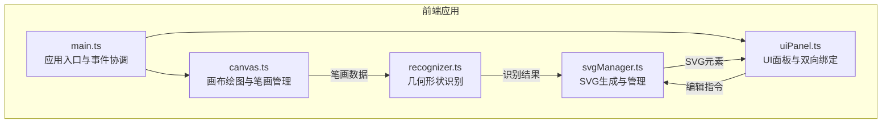

## 1. 架构设计



## 2. 技术说明
- 前端：TypeScript + 原生Canvas + SVG（无第三方UI库）
- 构建工具：Vite（HMR，端口3000）
- 模块通信：自定义事件总线
- 初始化工具：Vite vanilla-ts模板

## 3. 路由定义
无路由，单页应用

## 4. API定义
无后端API，纯前端应用

## 5. 数据模型

### 5.1 核心数据结构

```typescript
interface Point {
  x: number;
  y: number;
  timestamp: number;
  speed: number;
  pressure: number;
}

interface Stroke {
  id: string;
  points: Point[];
  width: number;
  color: string;
}

interface RecognizedShape {
  type: 'line' | 'rectangle' | 'circle' | 'ellipse' | 'triangle' | 'pentagon';
  x: number;
  y: number;
  width: number;
  height: number;
  rotation: number;
  points?: Point[];
}

interface SVGElement {
  id: string;
  shape: RecognizedShape;
  scale: number;
  rotation: number;
  fillColor: string;
  strokeColor: string;
  strokeWidth: number;
  isGroup: boolean;
  children?: string[];
  svgCode: string;
}

interface HistoryEntry {
  type: 'add' | 'edit' | 'delete' | 'group' | 'ungroup';
  data: any;
  timestamp: number;
}
```

### 5.2 文件组织
| 文件路径 | 职责 |
|----------|------|
| package.json | 依赖typescript/vite，脚本npm run dev |
| vite.config.js | 入口index.html，端口3000，HMR |
| tsconfig.json | 严格模式，target ES2020，moduleResolution bundler |
| index.html | 入口页面，标题"手绘转矢量 - Sketch to SVG" |
| src/main.ts | 应用入口，初始化Canvas和UI，绑定事件总线 |
| src/canvas.ts | Canvas绘图、笔触事件、笔画存储、撤销重做 |
| src/recognizer.ts | 几何形状识别算法，返回形状类型/位置/尺寸/旋转 |
| src/svgManager.ts | SVG生成、图形列表管理、组合分离、导出、编辑接口 |
| src/uiPanel.ts | 预览卡片网格、编辑面板、代码框DOM管理与双向绑定 |

## 6. 性能要求
- 笔画识别延迟 ≤ 1秒
- 编辑属性响应 < 50ms
- 100条笔画时保持 ≥ 30fps
- 代码框双向绑定响应 < 10ms
