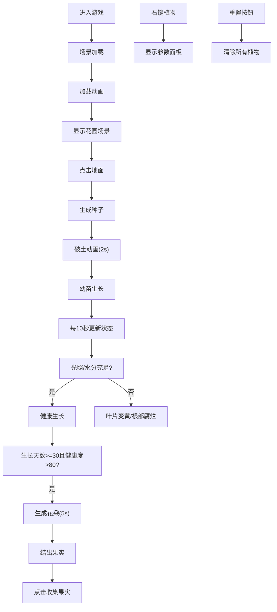

## 1. 产品概述

3D数字花园培育模拟游戏，玩家在虚拟花园中通过种植、浇水和光照操作培育出不同形态的虚拟植物，植物会根据光照、水分和养分参数模拟真实生长与衰败过程。

- 核心目的：提供沉浸式的3D虚拟园艺体验，让玩家感受植物生长的乐趣
- 目标用户：休闲游戏爱好者、自然爱好者、3D交互体验用户
- 产品价值：结合教育与娱乐，展示植物生长规律，提供治愈系交互体验

## 2. 核心功能

### 2.1 功能模块
1. **3D花园场景**：草绿色渐变地面、动态太阳光源、可交互视角
2. **植物生成与生长**：点击种植种子、破土动画、茎/叶/花逐步生长
3. **光照系统**：动态旋转太阳、可拖拽调节光照角度、影响植物生长方向
4. **水分系统**：键盘/工具浇水、水分值0-100、缺水/水分过多状态效果
5. **花朵与果实**：成熟期生成花朵（5片花瓣随机颜色、摆动动画）、花朵枯萎结果、果实点击收集
6. **交互系统**：左键种植、右键查看参数面板、工具切换
7. **数据统计与重置**：花园统计面板（总数/成熟数/果实数/平均健康度）、重置花园按钮

### 2.2 页面详情
| 页面名称 | 模块名称 | 功能描述 |
|---------|---------|---------|
| 主游戏页面 | 3D场景渲染 | Three.js场景、摄像机、渲染器初始化 |
| 主游戏页面 | 工具栏 | 水壶、太阳、种植工具切换按钮 |
| 主游戏页面 | 参数面板 | 右键植物显示：生长天数、高度、叶片数、花色、健康度 |
| 主游戏页面 | 统计面板 | 右下角显示：植物总数、成熟数、果实收集数、平均健康度 |
| 主游戏页面 | 重置按钮 | 清除所有植物重新开始 |

## 3. 核心流程

玩家进入游戏页面 → 3D场景加载完毕（显示加载动画）→ 点击地面种植种子 → 种子破土长成幼苗 → 定期光照（太阳旋转）和浇水（W键/水壶工具）→ 植物持续生长（每10秒根据参数调整）→ 成熟期生成花朵 → 花朵枯萎结果 → 点击收集果实 → 可随时右键查看植物参数 → 统计面板实时更新 → 可重置花园

## 4. 用户界面设计

### 4.1 设计风格
- **主色调**：深绿到翠绿渐变背景（#1B5E20 → #4CAF50）
- **地面色**：草绿色渐变（#4CAF50 到 #388E3C）
- **叶片色**：绿色渐变（#2E7D32 到 #66BB6A）
- **花色**：随机鲜艳色（粉红、黄色、紫色、橙色、蓝色等）
- **按钮风格**：圆角卡片样式，微阴影，悬停放大1.1倍+阴影加深，0.2s过渡
- **面板风格**：半透明毛玻璃（rgba(255,255,255,0.2) + blur(8px)），圆角8px
- **字体**：自然温暖的无衬线字体
- **页面内边距**：四周20px，最小宽度768px响应式

### 4.2 页面设计概述
| 页面名称 | 模块名称 | UI元素 |
|---------|---------|--------|
| 主游戏 | 加载动画 | 居中标题"数字花园"+简易加载旋转动画 |
| 主游戏 | 工具栏 | 左侧/上方圆角卡片工具按钮（种植、水壶、太阳） |
| 主游戏 | 参数面板 | 弹出式毛玻璃面板显示植物各项参数 |
| 主游戏 | 统计面板 | 右下角固定毛玻璃面板，实时数据展示 |
| 主游戏 | 重置按钮 | 统计面板内圆角按钮"重置花园" |

### 4.3 响应式
- 桌面端优先设计，最小适配宽度768px
- 工具栏在小屏幕上自动调整位置
- 统计面板保持固定右下角

### 4.4 3D场景指导
- **环境**：渐变天空背景（深绿→翠绿），雾效增强深度感
- **光照**：动态方向光模拟太阳，环绕Y轴旋转，默认45°倾角，环境光辅助
- **摄像机**：PerspectiveCamera，透视投影，支持鼠标拖拽旋转视角、滚轮缩放
- **构图**：地面居中占据下半部，天空在上半部，植物在地面上自然分布
- **交互**：Raycaster实现点击检测，工具切换影响交互模式
- **动画**：GSAP实现生长动画、花瓣摆动、破土动画等
- **性能**：最多50株植物，单株顶点数≤2000，更新频率≥30fps
