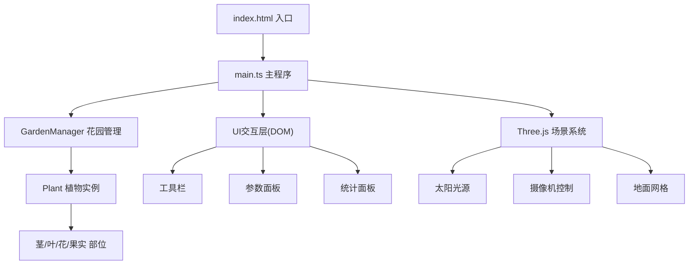

## 1. 架构设计



## 2. 技术描述

- **前端框架**：原生 TypeScript + Three.js
- **构建工具**：Vite（端口3000）
- **动画库**：GSAP
- **类型支持**：@types/three
- **后端**：无（纯前端项目）
- **数据存储**：内存状态管理

## 3. 文件结构

```
.
├── package.json
├── index.html
├── vite.config.js
├── tsconfig.json
└── src/
    ├── main.ts          # 程序入口，场景初始化，交互绑定
    ├── Plant.ts         # 植物类：生长逻辑、各部位生成、状态更新
    └── GardenManager.ts # 花园管理：植物实例集合、种植/浇水/光照、统计
```

## 4. 核心类定义

### 4.1 Plant 类

```typescript
interface PlantParams {
  position: THREE.Vector3;
  scene: THREE.Scene;
}

interface PlantStats {
  growthDays: number;      // 生长天数
  height: number;          // 高度
  leafCount: number;       // 叶片数
  flowerColor: number;     // 花色
  health: number;          // 健康度 0-100
  water: number;           // 水分 0-100
  mature: boolean;         // 是否成熟
}

class Plant {
  public stats: PlantStats;
  public group: THREE.Group;
  constructor(params: PlantParams);
  public update(delta: number, sunDirection: THREE.Vector3): void;
  public water(amount: number): void;
  public isAlive(): boolean;
  public dispose(): void;
}
```

### 4.2 GardenManager 类

```typescript
type Tool = 'plant' | 'water' | 'sun';

interface GardenStats {
  totalPlants: number;
  maturePlants: number;
  fruitsCollected: number;
  avgHealth: number;
}

class GardenManager {
  public plants: Plant[];
  public stats: GardenStats;
  public currentTool: Tool;
  constructor(scene: THREE.Scene, ground: THREE.Mesh);
  public plantSeed(position: THREE.Vector3): void;
  public waterPlant(plant: Plant): void;
  public updateAll(delta: number, sunDirection: THREE.Vector3): void;
  public collectFruit(): void;
  public reset(): void;
  public getPlantByRaycast(intersects: THREE.Intersection[]): Plant | null;
}
```

## 5. 性能约束

- **植物数量上限**：50株
- **单株植物顶点数**：≤2000
- **渲染帧率**：≥30fps
- **生长更新频率**：每10秒根据参数调整生长
- **动画帧率**：GSAP驱动，与渲染循环同步
