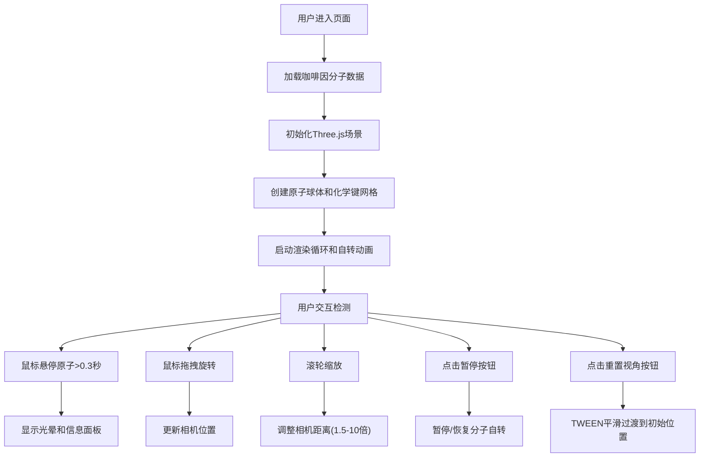

## 1. 产品概述

本项目是一个基于Web的3D分子结构与化学键动态可视化模拟器，专为化学学习者设计，帮助用户在浏览器中直观地观察和理解分子的三维结构。

- 主要用途：通过交互式3D可视化，让化学学习者能够自由旋转、缩放分子模型，观察原子排列和化学键连接方式
- 目标用户：化学学生、教师、化学爱好者
- 产品价值：将抽象的分子结构转化为直观可交互的3D模型，增强学习体验和理解深度

## 2. 核心功能

### 2.2 功能模块
1. **3D分子渲染模块**：原子球体渲染、化学键圆柱渲染、材质与颜色系统
2. **交互控制模块**：鼠标拖拽旋转、滚轮缩放、悬停信息展示
3. **动画系统模块**：分子自转、光晕动画、面板淡入、视角平滑过渡
4. **信息展示模块**：原子详情面板、分子统计信息、控制面板

### 2.3 页面详情
| 页面名称 | 模块名称 | 功能描述 |
|---------|----------|---------|
| 主页面 | 3D场景渲染 | 实时渲染咖啡因分子(C8H10N4O2)的3D模型，包含25个原子和28个化学键 |
| 主页面 | 相机交互 | 支持鼠标拖拽旋转(速度0.005，阻尼0.9)、滚轮缩放(1.5-10倍范围) |
| 主页面 | 分子自转 | Y轴为中心缓慢自转(0.002弧度/帧)，可暂停/恢复 |
| 主页面 | 悬停交互 | 鼠标悬停原子超0.3秒显示光晕和信息面板 |
| 主页面 | 信息面板 | 右上角显示原子详情（元素符号、中文名、原子序号、杂化方式、形式电荷） |
| 主页面 | 控制面板 | 右下角"暂停/恢复自转"和"重置视角"按钮 |
| 主页面 | 统计信息 | 左上角显示分子名称和原子、键总数统计 |

## 3. 核心流程

## 4. 用户界面设计

### 4.1 设计风格
- 主色调：深空渐变背景(#0B0E14到#1A2035)，深邃科技感
- 点缀色：原子元素颜色(碳-深灰、氢-白色、氮-蓝色、氧-红色)
- 控制面板：半透明深色卡片(rgba(20,20,30,0.75))
- 信息面板：半透明磨砂白背景
- 按钮样式：扁平无边框，点击缩放动画
- 字体：无衬线字体，信息面板行距1.8
- 整体风格：深色为主，鲜艳原子颜色点缀，细腻微动画交互

### 4.2 页面设计概述
| 页面名称 | 模块名称 | UI元素 |
|---------|----------|--------|
| 主页面 | 3D场景 | 原子球体(不同大小颜色)、化学键圆柱(单/双/三键)、环形网格辅助线、全局光照 |
| 主页面 | 信息面板(右上) | 280x180px，圆角10px，半透明磨砂白，深灰文字#333333，行距1.8，0.2秒淡入动画 |
| 主页面 | 统计文字(左上) | 浅灰#AAAAAA，字号14px，行高1.5，显示分子名和原子/键数量 |
| 主页面 | 控制面板(右下) | 160x140px，内边距12px，圆角半透明深色卡片，两个扁平按钮带点击动画 |
| 主页面 | 原子光晕效果 | 与原子同色，半径大0.15，悬停0.3秒触发 |
| 主页面 | 加载动画 | 居中显示，深空渐变背景 |

### 4.3 响应式设计
- 桌面端优先设计，1080p分辨率优化
- 相机交互适配鼠标操作
- 信息面板和控制面板固定定位，不随3D场景滚动
- 整体布局自适应窗口大小变化

### 4.4 3D场景设计
- 环境：深空渐变背景，无额外HDRI，简洁突出分子
- 光照：环境光+方向光组合，突出原子球体质感(roughness 0.3, metalness 0.1)
- 相机：初始位置距离4.5单位，上仰15度，透视投影
- 动画：分子持续Y轴自转，悬停光晕呼吸效果，视角重置TWEEN过渡0.8秒
- 性能：BufferGeometry优化，1080p下不低于50fps
- 辅助元素：分子下方环形网格(半径3，分段20，透明度0.15)增强深度感知
