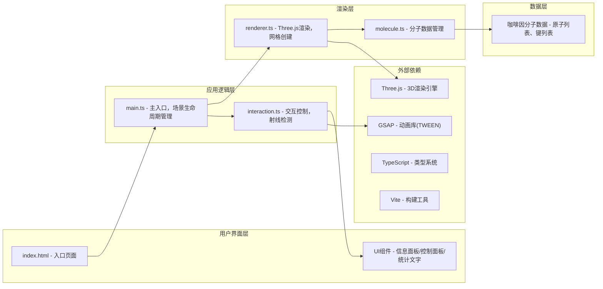

## 1. 架构设计



## 2. 技术描述
- 前端：TypeScript + Three.js + Vite
- 初始化工具：Vite vanilla-ts模板
- 动画库：GSAP (用于TWEEN平滑过渡动画)
- 无后端，纯前端Web应用
- 数据：内置咖啡因分子静态数据

## 3. 项目文件结构

```
auto88/
├── index.html                    # 入口页面
├── package.json                  # 依赖配置
├── vite.config.js                # Vite构建配置
├── tsconfig.json                 # TypeScript配置
└── src/
    ├── main.ts                   # 主入口文件
    ├── molecule.ts               # 分子数据模块
    ├── renderer.ts               # 3D渲染模块
    └── interaction.ts            # 交互控制模块
```

### 模块职责
- **main.ts**：初始化Three.js场景、相机、渲染器；加载分子数据；启动动画循环；协调各模块
- **molecule.ts**：定义Atom、Bond数据结构；内置咖啡因分子数据；提供数据查询函数
- **renderer.ts**：创建原子球体Mesh、化学键圆柱Mesh；应用材质颜色；管理分子组对象
- **interaction.ts**：射线检测；鼠标悬停/点击事件处理；信息面板显示；光晕效果控制

## 4. 数据模型定义

```typescript
interface Atom {
  id: number;
  element: 'C' | 'H' | 'N' | 'O';
  elementName: string;      // 中文名
  atomicNumber: number;     // 原子序号
  position: [number, number, number];  // x, y, z坐标
  hybridization: 'sp3' | 'sp2' | 'sp'; // 杂化方式
  formalCharge: number;     // 形式电荷
  radius: number;           // 原子半径
  color: string;            // 原子颜色
}

interface Bond {
  id: number;
  atom1Id: number;
  atom2Id: number;
  bondOrder: 1 | 2 | 3;     // 键级：单键、双键、三键
}

interface MoleculeData {
  name: string;
  formula: string;
  atoms: Atom[];
  bonds: Bond[];
}
```

## 5. 关键技术实现要点

### 5.1 性能优化
- 使用BufferGeometry创建原子和键的几何体，而非重复创建SphereGeometry/CylinderGeometry
- 同一元素类型的原子共享材质，减少draw call
- 射线检测使用Raycaster，每帧检测一次，0.3秒防抖触发信息面板
- 1080p分辨率下目标帧率≥50fps

### 5.2 交互实现
- 相机旋转：使用OrbitControls，设置旋转速度0.005，阻尼0.9
- 缩放范围：minDistance 1.5, maxDistance 10
- 悬停检测：鼠标静止0.3秒后触发，使用setTimeout防抖
- 光晕效果：创建额外的半透明球体，缩放动画实现呼吸效果

### 5.3 化学键渲染
- 单键：1根圆柱，半径0.08
- 双键：2根平行圆柱，间距0.12
- 三键：3根平行圆柱，间距0.1
- 颜色：浅灰色#CCCCCC
- 圆柱朝向计算：通过两个原子位置向量计算旋转四元数

### 5.4 动画系统
- 分子自转：每帧分子组rotation.y += 0.002
- 信息面板：opacity 0→1过渡0.2秒
- 按钮点击：scale 1→0.95→1，0.15秒过渡
- 视角重置：GSAP TWEEN动画，0.8秒平滑过渡

## 6. 依赖版本

```json
{
  "three": "^0.160.0",
  "@types/three": "^0.160.0",
  "gsap": "^3.12.4",
  "typescript": "^5.3.3",
  "vite": "^5.0.10"
}
```
