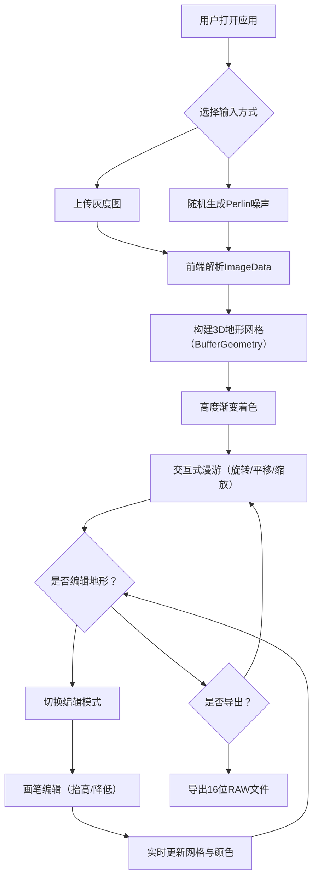

## 1. 产品概述

3D地形编辑器是一款基于Web的实时地形可视化与编辑工具，面向地理信息系统开发者、游戏场景搭建者和教育工作者，解决在缺乏专业GIS软件时难以快速预览和微调地形效果、反复导入导出数据的痛点。用户可通过上传灰度图或随机生成Perlin噪声地形，在浏览器中实时构建3D地形模型并进行交互式漫游与画笔编辑，最终导出16位RAW格式高度数据。

## 2. 核心功能

### 2.1 用户角色
| 角色 | 注册方式 | 核心权限 |
|------|----------|----------|
| 普通用户 | 无需注册 | 上传灰度图、随机生成地形、3D漫游、地形编辑、导出数据 |

### 2.2 功能模块
1. **主页面**：左侧控制面板（文件上传、随机生成、编辑模式、画笔参数、导出）+ 右侧3D场景

### 2.3 页面详情
| 页面名称 | 模块名称 | 功能描述 |
|----------|----------|----------|
| 主页面 | 文件上传区 | 支持拖放/点击上传8位灰度图，尺寸上限1024x1024，纯前端解析 |
| 主页面 | 随机生成按钮 | 生成256x256 Perlin噪声灰度图，灰度0-255映射高度0-20单位 |
| 主页面 | 3D地形场景 | 根据灰度值构建BufferGeometry网格，高度渐变着色，支持鼠标旋转/平移/缩放 |
| 主页面 | 编辑模式 | 画笔式地形编辑，点击拖拽抬高/降低地形，影响半径可调1-8单位，强度0.1-1.0 |
| 主页面 | 天空与灯光 | 动态天空球（黄昏渐变）、200个云层粒子、方向光+环境光+Shadow Map |
| 主页面 | 导出功能 | 将当前高度数据导出为16位RAW格式，文件名含时间戳 |

## 3. 核心流程

用户打开应用 → 选择上传灰度图或点击随机生成 → 系统解析灰度值构建3D地形网格 → 用户通过鼠标交互漫游场景 → 切换编辑模式后使用画笔编辑地形 → 编辑完成后导出高度数据

## 4. 用户界面设计

### 4.1 设计风格
- **主色调**：深色科技感主题，主背景色 #1A1A2E
- **面板风格**：半毛玻璃效果（rgba(255,255,255,0.08) 背景，rgba(255,255,255,0.12) 边框，backdrop-filter: blur(6px)，圆角8px）
- **按钮风格**：蓝紫色渐变按钮（#6C63FF→#8E2DE2），悬停亮度提升10%，点击缩放弹性反馈
- **字体**：系统无衬线字体
- **布局**：左侧280px控制面板 + 右侧全屏3D场景
- **图标**：简约线性图标

### 4.2 页面设计概览
| 页面名称 | 模块名称 | UI元素 |
|----------|----------|--------|
| 主页面 | 文件上传区 | 虚线边框拖放区240x160px，圆角12px，边框色#4A4A6A，拖入时变亮#7C7CAA+绿色对勾 |
| 主页面 | 随机生成按钮 | 蓝紫渐变背景，悬停亮度+10%，0.1s缩放入弹动画 |
| 主页面 | 编辑模式控件 | 画笔半径滑块1-8，强度滑块0.1-1.0，切换按钮 |
| 主页面 | 3D场景区 | 全屏Canvas，初始俯视35度，距离15单位 |
| 主页面 | 提示条 | 编辑模式切换时顶部深蓝提示条，2秒淡出 |
| 主页面 | 导出按钮 | 右下角快捷导出 |

### 4.3 响应式设计
- 桌面端优先（≥768px）：左侧面板 + 右侧3D场景
- 移动端（<768px）：左侧面板折叠为顶部可展开抽屉式工具栏

### 4.4 3D场景设计
- **环境**：黄昏氛围天空球（蓝色到浅橙色渐变），200个半透明云层粒子缓慢漂移
- **灯光**：方向光#FFF5E6强度1.2（始终指向地形），环境光#404066强度0.3，Shadow Map 2048x2048
- **相机**：PerspectiveCamera FOV 45度，近裁面0.1远裁面100，初始俯视35度距离15单位
- **颜色映射**：低洼0-5单位→#F4E2C6沙黄，5-12单位→#7CB342草绿，12-20单位→#8D8D8D岩石灰，20+→#FFFFFF雪白，平滑插值
- **交互**：左键旋转（0.05 rad/px，阻尼0.9），右键平移（0.03单位/px），滚轮缩放（0.3-3倍，0.05单位/帧）
- **辅助**：GridHelper 20x20单位，每格1单位
