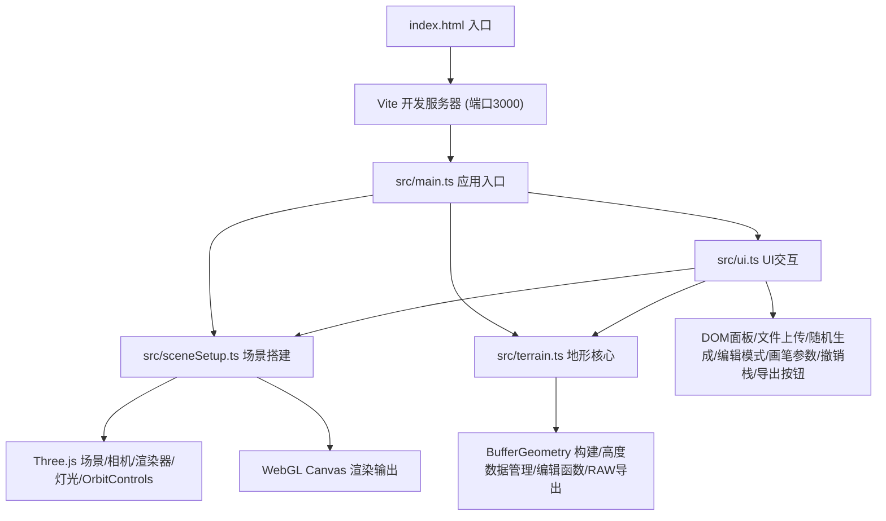
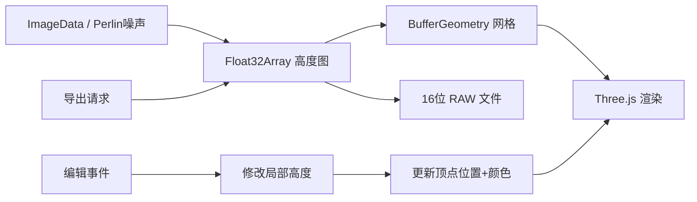

## 1. 架构设计

## 2. 技术说明
- **前端**：TypeScript + Three.js + Vite
- **构建工具**：Vite（端口3000，sourcemap + HMR）
- **3D渲染**：Three.js（WebGLRenderer, BufferGeometry, PerspectiveCamera, OrbitControls）
- **动画**：GSAP（用于UI动画效果）
- **后端**：无（纯前端应用）
- **数据库**：无（所有数据在内存中处理）

## 3. 文件结构与模块职责

| 文件 | 职责 |
|------|------|
| package.json | 依赖：three, typescript, vite, @types/three, gsap；脚本：npm run dev |
| index.html | 入口HTML，深色背景#1A1A2E，全屏Canvas容器，标题"3D地形编辑器"，加载沙漏图标 |
| vite.config.js | 入口index.html，端口3000，sourcemap，HMR |
| tsconfig.json | 严格模式，target ES2020，moduleResolution bundler |
| src/main.ts | 应用入口：初始化场景/相机/渲染器，加载UI，协调模块，键盘快捷键（空格切编辑、Ctrl+Z撤销、Ctrl+E导出） |
| src/terrain.ts | 地形核心：灰度图→Float32Array高度图→BufferGeometry，编辑函数（局部高度修改→顶点/颜色更新），16位RAW导出 |
| src/sceneSetup.ts | 场景搭建：场景（天空球渐变）、相机（FOV45）、渲染器（antialias, shadowMap, pixelRatio≤2）、OrbitControls（阻尼0.95）、灯光、GridHelper |
| src/ui.ts | UI交互：左侧面板DOM、文件上传/拖放、随机生成按钮、编辑模式切换、画笔半径/强度滑块、导出按钮、编辑模式状态、撤销栈（最多20步）、响应式布局 |

## 4. 数据流

## 5. 关键性能指标
- 256x256灰度图加载后首帧渲染 < 500ms
- 帧率稳定 ≥ 30fps（8GB RAM + 集成显卡）
- 地形编辑响应 < 200ms
- 导出操作 < 100ms
