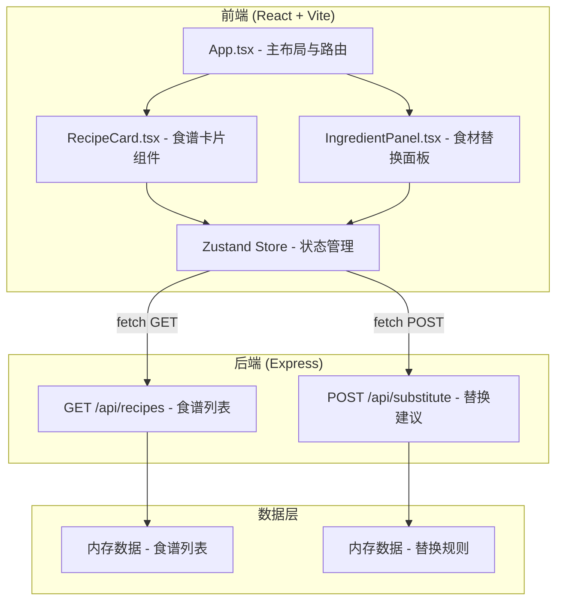
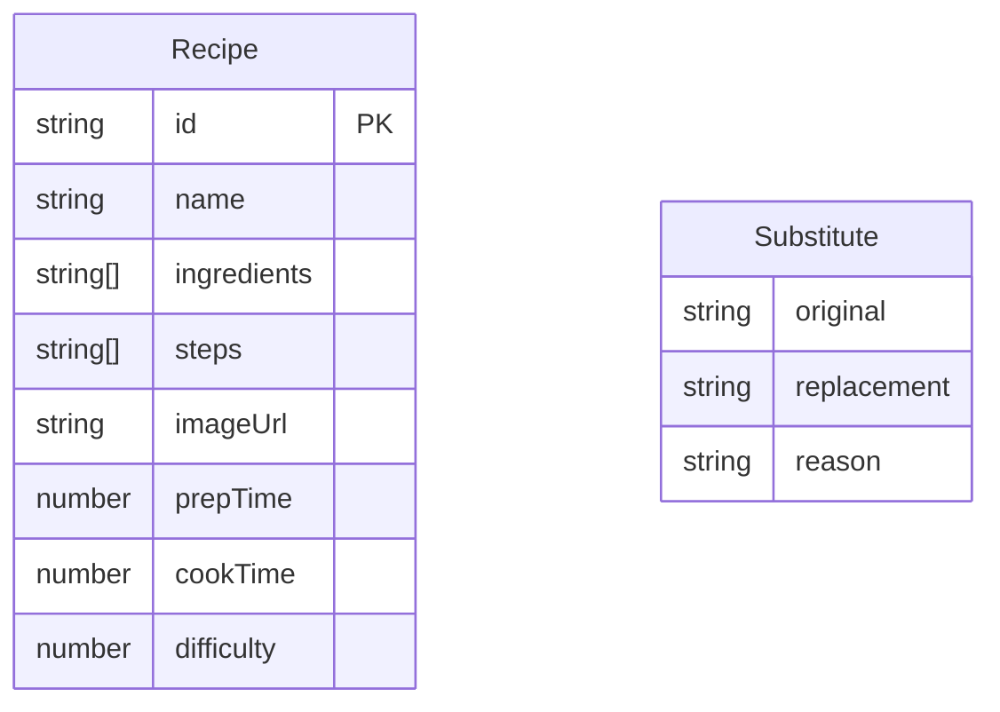

## 1. 架构设计



## 2. 技术说明
- 前端：React@18 + TypeScript + Vite + Tailwind CSS
- 初始化工具：vite-init（react-express-ts 模板）
- 后端：Express@4 + TypeScript
- 数据库：无，使用内存数据（预置食谱和替换规则）
- 状态管理：Zustand
- 图标库：lucide-react

## 3. 路由定义
| 路由 | 用途 |
|------|------|
| / | 主页，展示食谱网格、搜索筛选、收藏、历史和食材替换面板 |

## 4. API 定义

### 4.1 GET /api/recipes
返回所有食谱列表

响应类型：
```typescript
interface Recipe {
  id: string;
  name: string;
  ingredients: string[];
  steps: string[];
  imageUrl: string;
  prepTime: number;
  cookTime: number;
  difficulty: 1 | 2 | 3;
}
```

响应：`Recipe[]`

### 4.2 POST /api/substitute
接受食材列表和目标食谱ID，返回缺失食材的替换建议

请求类型：
```typescript
interface SubstituteRequest {
  recipeId: string;
  availableIngredients: string[];
}
```

响应类型：
```typescript
interface Substitute {
  original: string;
  replacement: string;
  reason: string;
}
```

响应：`Substitute[]`

## 5. 服务端架构图

```mermaid
flowchart LR
    "Controller" --> "Service" --> "Data (Memory)"
```

- Controller：处理HTTP请求，参数校验
- Service：业务逻辑，食材匹配与替换规则查询
- Data：内存中维护的食谱数据和替换规则

## 6. 数据模型

### 6.1 数据模型定义



### 6.2 共享类型定义 (src/types.ts)

```typescript
export interface Recipe {
  id: string;
  name: string;
  ingredients: string[];
  steps: string[];
  imageUrl: string;
  prepTime: number;
  cookTime: number;
  difficulty: 1 | 2 | 3;
}

export interface Substitute {
  original: string;
  replacement: string;
  reason: string;
}
```

### 6.3 预置数据

食谱（6+道）：
1. 番茄炒蛋
2. 麻婆豆腐
3. 意大利面
4. 红烧肉
5. 宫保鸡丁
6. 蔬菜沙拉
7. 蛋炒饭
8. 酸辣汤

替换规则（10+条）：
1. 猪肉 → 鸡腿肉（脂肪更低）
2. 牛奶 → 豆浆（植物蛋白）
3. 番茄 → 红甜椒（类似酸甜风味）
4. 鸡蛋 → 豆腐（增加蛋白质）
5. 黄油 → 橄榄油（更健康脂肪）
6. 面粉 → 杏仁粉（无麸质替代）
7. 白糖 → 蜂蜜（天然甜味）
8. 米饭 → 花椰菜米（低碳水）
9. 酱油 → 椰子氨基酸（无大豆替代）
10. 奶油 → 椰奶（乳制品替代）
11. 醋 → 柠檬汁（类似酸味）
12. 洋葱 → 大葱（类似风味）
