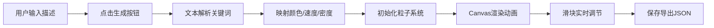

## 1. 产品概述
粒子动画背景生成器 - 根据文字描述自动生成全屏粒子动画背景的Web应用
- 解决开发者或个人主页用户需要动态、沉浸式网页背景时，缺乏直观设计工具、难以将文字意象转化为代码实现的痛点
- 目标用户：前端开发者、个人网站设计者、创意工作者
- 市场价值：降低动态背景设计门槛，让非专业用户也能快速生成高质量粒子动画

## 2. 核心功能

### 2.1 用户角色
无需注册，所有用户均可使用全部功能

### 2.2 功能模块
1. **主界面**：场景描述输入、生成触发、粒子画布渲染
2. **粒子系统**：Canvas渲染、粒子运动、连接线绘制、颜色渐变
3. **文本解析**：关键词匹配、参数映射（颜色、速度、密度）
4. **控制面板**：滑块调节、实时预览、参数导出
5. **性能监控**：FPS监控、粒子数量显示、主题名称展示

### 2.3 页面详情
| 页面名称 | 模块名称 | 功能描述 |
|-----------|-------------|---------------------|
| 主页面 | 输入区 | 居中输入框+生成按钮，毛玻璃卡片样式，支持中英文场景描述 |
| 主页面 | 粒子画布 | 全屏Canvas，100vw×100vh，深空灰背景，粒子动画渲染 |
| 主页面 | 控制面板 | 右下角固定，半透明毛玻璃，4个滑块+保存按钮，实时调节 |
| 主页面 | 性能监控 | 左下角固定，等宽字体，FPS/粒子数/主题名 |

## 3. 核心流程
用户输入场景描述（如"日落海面"）→ 点击生成按钮 → 文本解析模块提取关键词 → 映射到HSL颜色、速度倍数、密度倍数 → 粒子系统初始化/更新参数 → Canvas渲染粒子动画 → 用户可通过滑块微调 → 点击保存导出JSON配置

## 4. 用户界面设计

### 4.1 设计风格
- 主色调：深空灰 #1A1A2E，强调色 #FF6B35
- 整体风格：极简、科技感、沉浸式
- 毛玻璃效果：半透明+backdrop-filter blur
- 字体：等宽字体用于监控，无衬线字体用于交互
- 动画：0.3s ease-in-out过渡，按钮按下缩放0.95倍

### 4.2 页面设计概述
| 页面名称 | 模块名称 | UI元素 |
|-----------|-------------|-------------|
| 主页面 | 输入区卡片 | 圆角16px，padding24px，rgba(0,0,0,0.3)，居中位于前20%区域 |
| 主页面 | 输入框 | 宽60%，高50px，圆角8px，#333背景，#EEE文字 |
| 主页面 | 生成按钮 | 宽120px，高50px，圆角8px，#FF6B35背景 |
| 主页面 | 控制面板 | 右下角固定，圆角12px，rgba(255,255,255,0.1)背景，悬浮阴影 |
| 主页面 | 滑块 | 轨道4px高，圆角2px，圆形按钮16px直径 |
| 主页面 | 监控条 | 左下角，等宽12px，半透明白背景 |

### 4.3 响应式
- 桌面优先设计
- 屏幕<768px时：输入框宽90%，控制面板底部全宽高200px，滑块横排，监控字体10px
- 触控优化：滑块触控区域扩大

### 4.4 场景词库（至少15个）
日落、极光、森林、海洋、星空、火焰、冰雪、极光、沙漠、城市、樱花、雷电、彩虹、深海、晨曦、黄昏
