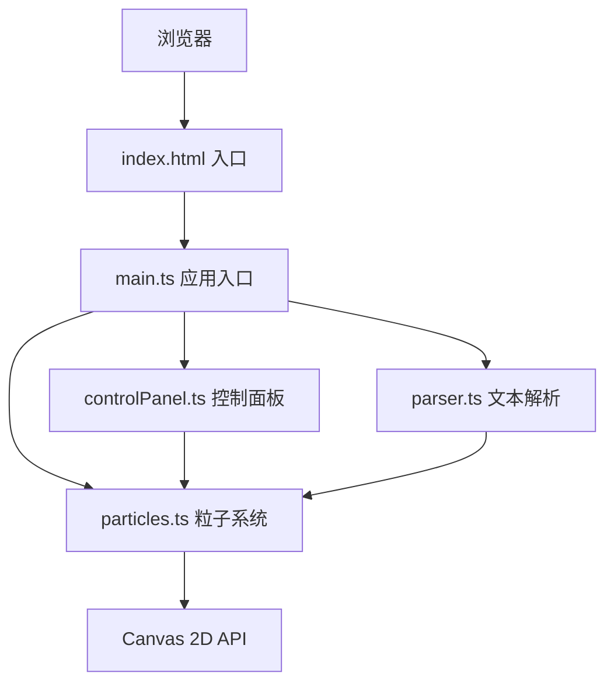

## 1. 架构设计



## 2. 技术描述
- 前端：TypeScript + 原生JavaScript（无框架）
- 构建工具：Vite
- 渲染：Canvas 2D API
- 样式：原生CSS + CSS变量
- 端口：3000

## 3. 文件结构
```
.
├── package.json          # 依赖：typescript, vite
├── index.html           # 入口HTML
├── vite.config.js      # Vite配置
├── tsconfig.json       # TS配置
└── src/
    ├── main.ts        # 应用入口
    ├── particles.ts    # 粒子系统核心
    ├── controlPanel.ts # UI控制面板
    └── parser.ts      # 文本解析模块
```

## 4. 核心数据结构

### 4.1 粒子类 (Particle)
```typescript
interface Particle {
  x: number;           // X坐标
  y: number;           // Y坐标
  vx: number;          // X方向速度
  vy: number;          // Y方向速度
  radius: number;       // 半径 3-8px
  color: string;          // 颜色
  hue: number;          // 色相值
}
```

### 4.2 解析结果 (ParseResult)
```typescript
interface ParseResult {
  hue: number;           // 主色相 HSL H值 0-360
  speedMultiplier: number; // 速度倍数 0.5-2.0
  densityMultiplier: number; // 密度倍数 0.5-2.0
  themeName: string;     // 主题名称
}
```

### 4.3 粒子配置 (ParticleConfig)
```typescript
interface ParticleConfig {
  count: number;        // 粒子数量 500-3000
  speed: number;        // 基础速度 0.1-3.0
  hueOffset: number;  // 色相偏移 0-360
  linkDistance: number; // 连接线距离 50-200
  description: string;  // 场景描述
}
```

## 5. 性能优化策略
1. 距离阈值限制连接线计算（只计算距离<200px的粒子对）
2. requestAnimationFrame 渲染循环
3. 粒子运动使用简单向量运算，避免复杂计算
4. 批量绘制优化：使用路径批量绘制连接线
