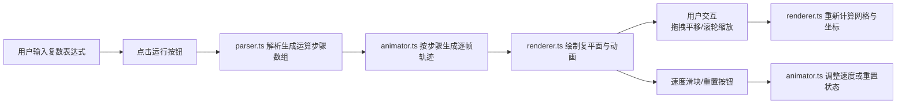

## 1. 产品概述
复平面演示器是一款面向数学教育工作者和图形学爱好者的Web教育工具，将用户输入的复数表达式（如 (2+3i)*(1-i) 或 z^3）实时映射为复平面上的动态点运动轨迹与辐角变化动画，直观展示复数的代数运算与几何意义。

- **主要用途**：数学教学辅助、复数概念可视化、复变函数入门演示
- **目标用户**：数学教师、学生、图形学爱好者、算法研究者
- **市场价值**：填补复数运算可视化工具的空白，提供交互式学习体验

## 2. 核心特性

### 2.1 用户角色
| 角色 | 注册方式 | 核心权限 |
|------|----------|----------|
| 访客用户 | 无需注册 | 输入表达式、观看动画、调整视角、控制速度 |

### 2.2 功能模块
1. **主页面**：标题区、输入控制区、Canvas画布区、控制栏
2. **表达式解析模块**：支持复数四则运算、幂运算、常数i
3. **动画引擎模块**：步骤动画、缓动函数、时间轴管理
4. **渲染模块**：复平面网格、坐标轴、轨迹线、辐角射线
5. **交互模块**：拖拽平移、滚轮缩放、重置视角、速度调节

### 2.3 页面详情
| 页面名称 | 模块名称 | 功能描述 |
|-----------|-------------|---------------------|
| 主页面 | 标题区 | 显示"复平面演示器"标题，居中对齐 |
| 主页面 | 输入控制区 | 复数表达式输入框（70%宽度）+ 运行按钮 |
| 主页面 | Canvas画布区 | 800x600复平面，网格线、坐标轴、轨迹、辐角射线 |
| 主页面 | 步骤说明 | 右上角显示当前运算步骤文字标签 |
| 主页面 | 控制栏 | 重置按钮 + 动画速度滑块（0.5x-3x） |

## 3. 核心流程
用户在输入框中输入复数表达式 → 点击运行按钮 → 解析器解析表达式生成运算步骤 → 动画引擎按步骤生成逐帧位置数据 → 渲染器绘制复平面、动态点轨迹、辐角射线 → 用户可拖拽/缩放调整视角 → 可通过滑块调整动画速度 → 可点击重置回到初始状态

## 4. 用户界面设计

### 4.1 设计风格
- **主色调**：GitHub暗色主题风格，深灰背景 #161B22
- **辅助色**：#58A6FF（蓝色）、#7EE787（绿色）、#FF7B72（红色）
- **面板卡片**：#21262D，圆角8px，微阴影
- **输入框聚焦**：渐变边框 #58A6FF → #7EE787
- **按钮样式**：圆角6px，悬停亮度提升10%，点击弹性缩放
- **字体**：JetBrains Mono 等宽字体，14px
- **图标风格**：简洁线条图标

### 4.2 页面设计概览
| 页面名称 | 模块名称 | UI元素 |
|-----------|-------------|-------------|
| 主页面 | 标题区 | 居中大字标题，星空背景 #0D1117 |
| 主页面 | 输入控制区 | 输入框（#252D3A背景，#C9D1D9文字）+ 蓝色运行按钮 |
| 主页面 | Canvas画布 | #161B22背景，径向渐变柔光边缘，灰色网格50px间距 |
| 主页面 | 轨迹渲染 | 发光曲线渐变青到紫，线宽2px |
| 主页面 | 辐角射线 | 红色虚线，长度与模长成正比 |
| 主页面 | 数值标注 | 模长#FF7B72红色，辐角#7EE787绿色 |
| 主页面 | 步骤标签 | 白色文字，半透明背景，右上角 |
| 主页面 | 控制栏 | 圆形重置按钮 + 横向速度滑块 |

### 4.3 响应式设计
- **桌面端**（≥768px）：输入框70%宽度，画布800x600px，控制栏水平排列
- **移动端**（<768px）：输入框90%宽度，画布高度400px，控制栏垂直排列右侧
- **触摸优化**：支持触摸拖拽平移，双指缩放

### 4.4 动画与过渡
- **按钮悬停**：亮度提升10%，时长0.2s
- **按钮点击**：弹性缩放 scale(0.95) → scale(1.05) → scale(1)，时长0.2s
- **点运动**：缓动函数 smoothstep，平滑过渡
- **轨迹绘制**：逐帧渐进，发光效果
- **画布边缘**：径向渐变柔光效果

## 5. 性能约束
- 动画帧率稳定60FPS（requestAnimationFrame）
- 复杂表达式解析耗时 < 50ms
- 脏矩形优化：仅重绘变化元素
