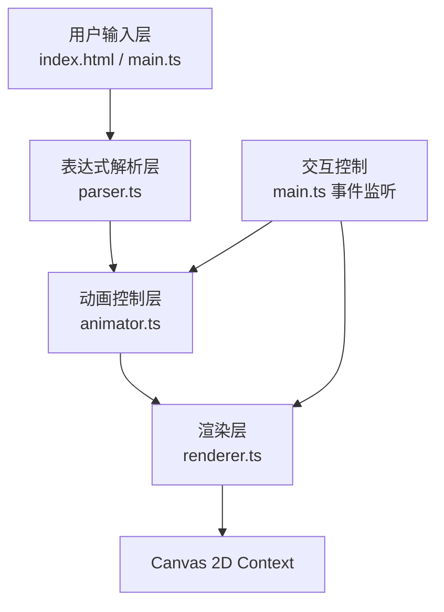

## 1. 架构设计



**数据流向说明**：
1. `main.ts` 接收用户输入，调用 `parser.ts` 解析表达式
2. `parser.ts` 返回复数运算步骤数组，传给 `animator.ts`
3. `animator.ts` 管理动画状态、时间轴、缓动函数，逐帧输出位置数据
4. `renderer.ts` 从 `animator.ts` 获取帧数据，绘制到 Canvas
5. `main.ts` 监听用户交互事件（拖拽、缩放、速度、重置），更新 `animator.ts` 和 `renderer.ts` 状态

## 2. 技术说明
- **前端框架**：原生 TypeScript（无框架）+ HTML5 Canvas 2D API
- **构建工具**：Vite
- **语言标准**：ES2020，TypeScript 严格模式
- **初始化工具**：Vite vanilla-ts 模板
- **后端**：无后端，纯前端应用
- **字体**：JetBrains Mono（Google Fonts CDN）

## 3. 文件结构与职责

| 文件 | 职责 | 输入 | 输出 | 依赖 |
|------|------|------|------|------|
| `package.json` | 项目配置、依赖声明 | - | - | - |
| `vite.config.js` | Vite构建配置，端口3000，index.html入口 | - | - | - |
| `tsconfig.json` | TypeScript编译配置，严格模式，target ES2020 | - | - | - |
| `index.html` | 入口页面，DOM结构、样式、Canvas容器 | - | DOM树 | - |
| `src/main.ts` | 应用入口，初始化UI/画布/事件监听，启动动画循环 | 用户输入DOM事件 | 调用各模块接口 | parser, animator, renderer |
| `src/parser.ts` | 解析复数表达式，生成运算步骤数组 | 表达式字符串 `string` | `OperationStep[]` | 无 |
| `src/animator.ts` | 管理动画状态，按步骤生成逐帧位置 | `OperationStep[]`, 速度倍率 | `FrameData` (当前点、轨迹点集) | 无 |
| `src/renderer.ts` | Canvas渲染：网格、坐标轴、轨迹、辐角射线 | `FrameData`, 视图变换参数 | Canvas像素输出 | 无 |

## 4. 核心数据结构定义

### 4.1 复数类型
```typescript
interface Complex {
  re: number; // 实部
  im: number; // 虚部
}
```

### 4.2 运算步骤类型
```typescript
interface OperationStep {
  description: string;    // 步骤说明文字
  input: Complex;         // 输入复数（移动起点）
  result: Complex;        // 运算结果（移动终点）
  duration: number;       // 动画持续时间（毫秒）
  pauseAfter: number;     // 到达后停留时间（毫秒）
  operationType: 'add' | 'sub' | 'mul' | 'div' | 'pow' | 'assign';
}
```

### 4.3 动画帧数据类型
```typescript
interface FrameData {
  currentPosition: Complex;       // 当前点坐标
  trailPoints: Complex[];         // 历史轨迹点集
  currentStepIndex: number;       // 当前步骤索引
  currentStepDescription: string; // 当前步骤说明
  showArgument: boolean;          // 是否显示辐角射线
  argumentPoint: Complex | null;  // 辐角射线终点
}
```

### 4.4 视图变换类型
```typescript
interface ViewTransform {
  offsetX: number;   // X轴平移量（±200）
  offsetY: number;   // Y轴平移量（±200）
  scale: number;     // 缩放比例（0.5-3）
  centerX: number;   // 缩放中心X
  centerY: number;   // 缩放中心Y
}
```

## 5. 模块接口定义

### 5.1 parser.ts 接口
```typescript
// 解析复数表达式，返回运算步骤数组
export function parseExpression(expr: string): OperationStep[];

// 辅助：计算复数模长
export function modulus(z: Complex): number;

// 辅助：计算复数辐角（度数）
export function argumentDeg(z: Complex): number;
```

### 5.2 animator.ts 接口
```typescript
// 初始化动画
export function initAnimation(steps: OperationStep[]): void;

// 每帧更新，返回当前帧数据
export function updateAnimation(deltaTime: number): FrameData;

// 设置动画速度倍率（0.5-3）
export function setSpeed(multiplier: number): void;

// 重置动画状态
export function resetAnimation(): void;

// 是否已完成
export function isAnimationComplete(): boolean;
```

### 5.3 renderer.ts 接口
```typescript
// 初始化渲染器
export function initRenderer(canvas: HTMLCanvasElement): void;

// 绘制一帧
export function renderFrame(frame: FrameData, view: ViewTransform): void;

// 设置视图变换
export function setViewTransform(view: ViewTransform): void;

// 重置视图到初始状态
export function resetView(): void;

// 获取当前视图变换
export function getViewTransform(): ViewTransform;
```

## 6. 性能优化策略

### 6.1 脏矩形优化
- 维护 `dirtyRegion` 矩形区域
- 静态元素（网格、坐标轴）仅在视图变换变化时重绘
- 动态元素（点、轨迹、射线）每帧重绘对应区域
- 离屏Canvas缓存静态图层

### 6.2 表达式解析优化
- 递归下降解析器，支持运算符优先级
- AST缓存：相同表达式不重复解析
- 最坏复杂度O(n)，n为表达式长度

### 6.3 渲染优化
- 轨迹点集增量渲染，不清空已绘制轨迹
- 使用 Path2D 对象缓存网格路径
- requestAnimationFrame 自动适配刷新率

## 7. 交互事件处理

| 事件 | 处理函数 | 数据更新 |
|------|----------|----------|
| 点击"运行"按钮 | main.ts | 调用parser → animator.initAnimation() |
| 鼠标按下（画布内） | main.ts | 记录拖拽起点，标记isDragging=true |
| 鼠标移动 | main.ts | isDragging时更新view.offsetX/Y（限制±200） |
| 鼠标释放 | main.ts | isDragging=false |
| 鼠标滚轮 | main.ts | 以鼠标位置为中心缩放view.scale（0.5-3） |
| 速度滑块input | main.ts | animator.setSpeed(value) |
| 点击重置按钮 | main.ts | animator.resetAnimation() + renderer.resetView() + 清空输入框 |

## 8. 兼容性要求
- 浏览器支持：Chrome 90+、Firefox 88+、Safari 14+、Edge 90+
- Canvas 2D API 标准特性，无WebGL依赖
- 输入表达式语法支持：+、-、*、/、^、括号、常数i、数字
