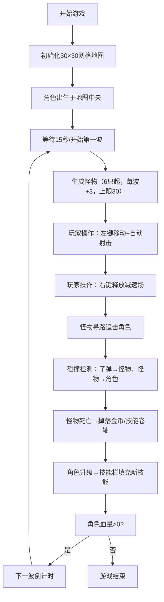

## 1. 产品概述

基于Canvas的2D生存类Roguelike网页小游戏，玩家在随机生成的网格地图上操控角色抵抗一波接一波的怪物进攻，每次击败怪物获得随机技能或属性升级，每次开局地图布局、怪物波次和掉落奖励完全不同，模拟《吸血鬼幸存者》式短时间高密度爽快战斗体验。

- 核心玩法：俯视角网格地图生存战斗，自动射击+鼠标点击移动，技能释放
- 目标用户：喜欢轻量级Roguelike生存游戏的网页用户
- 产品价值：无需下载、即开即玩的高重玩度浏览器小游戏

---

## 2. 核心功能

### 2.1 功能模块

1. **地图系统**：30×30网格随机生成（草地/石墙/宝箱），路径检测，俯视渲染
2. **角色系统**：移动寻路、自动射击、技能释放、血量/护盾、升级奖励
3. **怪物系统**：波次生成、三种怪物类型（小怪/刺客/坦克）、寻路追击、伤害计算
4. **战斗系统**：子弹物理、碰撞检测、减速技能场、伤害反馈
5. **UI界面**：顶部信息栏（波次/血量/金币）、底部技能栏、血条、暗黑地牢视觉风格

### 2.2 页面详情

| 页面名称 | 模块名称 | 功能描述 |
|---------|---------|---------|
| 游戏主界面 | 地图渲染区 | 30×30网格、40px格子、草地棋盘色、石墙、宝箱呼吸动画 |
| 游戏主界面 | 角色与光环 | 12px蓝色圆形角色、白色护盾光环 |
| 游戏主界面 | 怪物渲染 | 红色圆形小怪、黄色三角刺客、紫色方形坦克 |
| 游戏主界面 | 子弹与技能 | 白色子弹、蓝色减速场、屏幕闪光效果 |
| 游戏主界面 | 顶部信息栏 | 波次数、存活怪数、血量条+数值、金币数 |
| 游戏主界面 | 底部技能栏 | 4个60×60格子、技能图标旋转入场、金色高亮边框 |
| 游戏主界面 | 氛围覆盖层 | 左右黑暗渐变覆盖、深灰渐变背景 |

---

## 3. 核心流程

游戏主循环流程：初始化地图与角色 → 进入波次循环（每15秒一波） → 玩家点击移动/射击 → 怪物寻路追击 → 碰撞检测与伤害 → 击杀奖励/升级 → 技能获取 → 持续循环至角色死亡

---

## 4. 用户界面设计

### 4.1 设计风格

- **主色调**：深灰渐变背景 (#1A1A2E → #16213E)，暗黑地牢基调
- **辅助色**：草地绿 (#7EC850/#68A83E)、石墙褐 (#6B5B4A)、宝箱金 (#D4A017)、角色蓝、怪物红/黄/紫
- **字体**：无衬线粗体数字与文字，增强游戏感
- **布局**：全屏Canvas居中，顶部固定信息栏（hud），底部固定技能快捷栏，左右两侧黑暗渐变覆盖层
- **动效**：宝箱1秒周期呼吸闪光、技能图标0.5秒旋转入场、技能释放0.2秒屏幕蓝光闪烁

### 4.2 页面设计概览

| 区域 | 模块 | UI元素 |
|-----|-----|-------|
| 全屏背景 | 渐变背景 | #1A1A2E 垂直渐变至 #16213E |
| 左右边缘 | 黑暗覆盖层 | 透明度渐变（边缘→中间），模拟地牢烛光 |
| 顶部HUD | 信息栏 | 波次label+数字、存活怪数、血条(200×20红/深灰)、金币金色数字 |
| 中央 | 游戏Canvas | 1200×1200px (30×40)，俯视网格 |
| 底部 | 技能快捷栏 | 4个60×60格子，#2A2A3A背景，#555边框，可用时金色边框高亮 |

### 4.3 响应性

- 桌面端优先，Canvas固定尺寸1200×1200像素居中显示
- 窗口过小出现滚动条，不做自适应缩放（保证像素级渲染精度）
