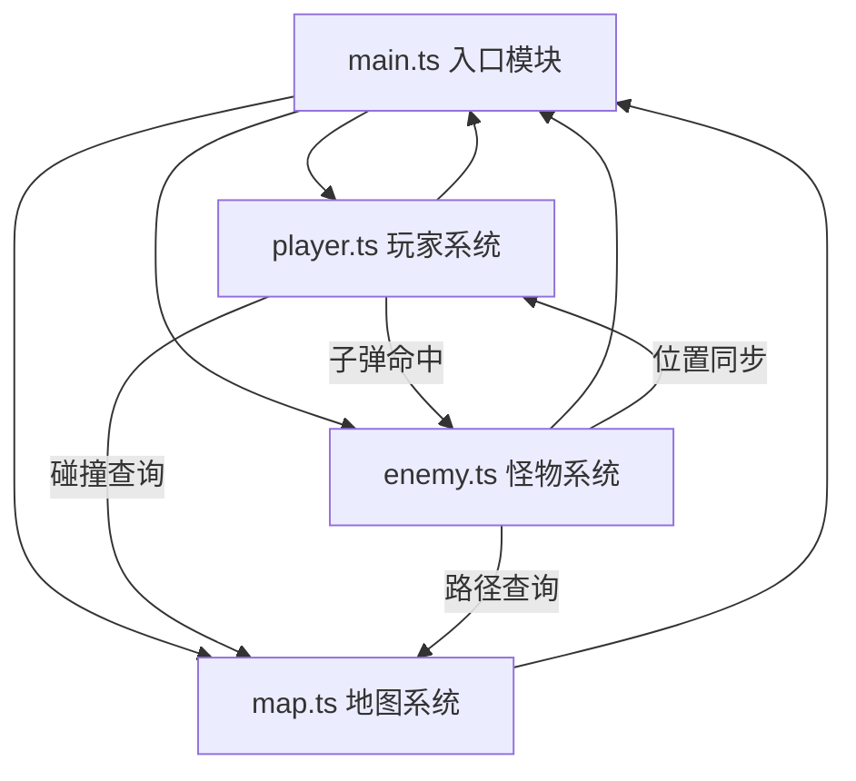

## 1. 架构设计

纯前端Canvas游戏，无后端服务，采用模块化TypeScript架构。



**模块职责：**
- `main.ts`：Canvas初始化、主游戏循环(requestAnimationFrame)、输入事件监听、模块协调
- `map.ts`：30×30网格随机生成、格子渲染、可通行性检测、宝箱交互
- `player.ts`：角色移动(A*寻路简化版)、自动射击计时器、减速技能CD、碰撞体、血量护盾、升级逻辑
- `enemy.ts`：波次计时器、怪物工厂、三种怪物AI、寻路移动、伤害计算

---

## 2. 技术说明

- **前端**：TypeScript 5.x + 原生Canvas 2D API (零游戏引擎依赖)
- **构建工具**：Vite 5.x (HMR热更新、ESBuild编译)
- **初始化**：手动创建配置文件，非脚手架生成
- **后端**：无
- **数据库**：无（纯客户端内存状态）

---

## 3. 文件清单

| 文件路径 | 作用 |
|---------|-----|
| `package.json` | 依赖：typescript、vite；脚本：npm run dev |
| `index.html` | 入口HTML，居中Canvas，深灰渐变背景，内联样式 |
| `vite.config.js` | 构建配置，index.html入口，port: 3000 |
| `tsconfig.json` | 严格模式 strict:true，target:ES2020，moduleResolution:bundler |
| `src/main.ts` | Canvas初始化、游戏循环、输入监听、模块协调 |
| `src/map.ts` | 网格生成、渲染、通行检测、宝箱管理 |
| `src/player.ts` | 移动、射击、技能、血量、碰撞、升级 |
| `src/enemy.ts` | 波次、怪物工厂、寻路、伤害、三种类型AI |

---

## 4. 性能优化策略

- **渲染层**：Canvas离屏缓存地图静态层（草地/石墙/宝箱），仅动态层（角色/怪物/子弹/技能场）每帧重绘
- **计算层**：寻路使用简化曼哈顿距离 + 网格直走（非A*，每帧仅计算方向向量），O(n)复杂度
- **碰撞层**：矩形网格空间分区，每帧只检测相邻格子内对象，O(k)而非O(n²)
- **对象池**：子弹和怪物使用对象池复用，避免频繁GC
- **帧率目标**：稳定60fps，20波×30怪物+10子弹场景下不低于30fps

---

## 5. 核心数据模型

### 5.1 类型定义

```typescript
// 格子类型
type CellType = 'grass' | 'wall' | 'chest';

// 地图格子
interface Cell {
  type: CellType;
  x: number;
  y: number;
  opened?: boolean;      // 宝箱是否已开
}

// 怪物类型
type EnemyType = 'normal' | 'assassin' | 'tank';

// 怪物实例
interface Enemy {
  id: number;
  type: EnemyType;
  x: number;
  y: number;
  hp: number;
  maxHp: number;
  speed: number;
  damage: number;
  size: number;
}

// 子弹
interface Bullet {
  id: number;
  x: number;
  y: number;
  vx: number;
  vy: number;
  damage: number;
  alive: boolean;
}

// 减速技能场
interface SlowField {
  x: number;
  y: number;
  radius: number;
  duration: number;  // 剩余秒数
}

// 技能类型
type SkillType = 'attack_up' | 'defense_up' | 'speed_up' | 'fire_rate_up';

// 玩家
interface Player {
  x: number;
  y: number;
  hp: number;
  maxHp: number;
  shield: number;
  coins: number;
  damage: number;
  fireRate: number;     // 每秒射击次数
  moveSpeed: number;
  skills: (SkillType | null)[];  // 技能栏 4 格
}
```

### 5.2 游戏常量

```
GRID_SIZE = 30
CELL_PX = 40
CANVAS_PX = 1200

WAVE_INTERVAL = 15 秒
BASE_ENEMY_COUNT = 6
ENEMY_PER_WAVE = +3
MAX_ENEMY_PER_WAVE = 30

PLAYER_RADIUS = 6
BULLET_RADIUS = 3
BULLET_SPEED = 6

SLOW_FIELD_RADIUS = 40
SLOW_FIELD_DURATION = 3 秒
SLOW_FIELD_COOLDOWN = 8 秒
SLOW_FACTOR = 0.5
```
