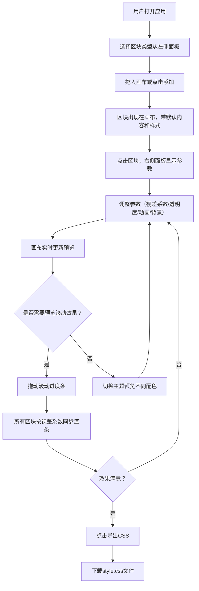

## 1. 产品概述

电商视觉差滚动布局生成器——帮助设计师在可视化画布中快速搭建电商商品页面的动态视觉差滚动布局，通过拖拽区块、实时调参和滚动预览，解决手动编写CSS时无法直观感知视差位移、透明度变化与缩放效果协同搭配的效率瓶颈。

- 目标用户：电商页面设计师、前端开发人员
- 核心价值：将反复修改CSS代码的试错流程，转化为可视化拖拽+实时预览的交互流程，大幅提升视觉差布局的产出效率

## 2. 核心功能

### 2.1 功能模块

1. **区块编辑器模块**：左侧面板提供6种预设区块类型（全屏Banner、三列图文、卡片网格、引用块、产品轮播、页脚），用户可拖入画布（最多6个），点击区块后右侧面板展示可配置参数（背景颜色/图片URL、视差滚动速度系数-0.5~0.5步长0.01、初始透明度0~1、进入动画类型下拉选择器），参数变更后画布实时更新
2. **滚动预览与导出模块**：画布下方水平滚动进度条（0%-100%），拖动滑块时所有区块根据各自视差系数和透明度同步渲染滚动效果；滑块上方显示当前百分比和模拟滚动条位置指示器；"导出CSS"按钮将每个区块的transform和opacity动画关键帧打包下载为style.css
3. **预设主题切换**：顶部工具栏三套配色方案（暗夜翡翠、极简白、暖阳橙），切换时所有区块文字和边框色0.4秒淡出再淡入过渡

### 2.2 页面详情

| 页面名称 | 模块名称 | 功能描述 |
|----------|----------|----------|
| 主编辑器 | 左侧区块工具栏 | 6种区块类型图标+名称列表，宽240px可折叠（折叠仅图标，hover 0.3s展开），拖拽至画布 |
| 主编辑器 | 中间画布区 | 模拟手机竖屏390x844px，背景#f1f5f9带20px点阵网格，区块上下间距24px虚线分隔，hover区块右上角显示编辑按钮 |
| 主编辑器 | 右侧参数面板 | 宽280px，背景色/图片URL输入、视差速度滑块、透明度滑块、动画类型下拉，圆角8px柔和阴影 |
| 主编辑器 | 滚动进度条 | 画布下方，圆形拖拽点20px（hover放大至24px变亮），上方百分比和位置指示器 |
| 主编辑器 | 顶部工具栏 | 主题切换按钮、导出CSS按钮 |

## 3. 核心流程

## 4. 界面设计

### 4.1 设计风格

- 主色调：跟随三套主题（暗夜翡翠/极简白/暖阳橙）动态切换
- 布局：三栏分割式，左侧工具栏240px+中间画布+右侧参数面板280px
- 圆角：输入框和滑块8px，编辑按钮圆形
- 阴影：柔和box-shadow应用于输入控件
- 字体：系统字体栈，清晰易读
- 交互：hover微动画、拖拽反馈、淡入淡出过渡

### 4.2 页面设计概览

| 页面名称 | 模块名称 | UI元素 |
|----------|----------|--------|
| 主编辑器 | 左侧工具栏 | 可折叠侧栏，区块类型卡片，拖拽手柄，折叠时图标居中 |
| 主编辑器 | 画布区 | 手机模拟框390x844，点阵网格，区块卡片，虚线分隔，hover编辑按钮 |
| 主编辑器 | 参数面板 | 表单控件组，颜色输入，URL输入，滑块，下拉选择器 |
| 主编辑器 | 滚动进度条 | 水平滑轨，圆形拖拽点，百分比标签 |
| 主编辑器 | 顶部工具栏 | 主题色按钮组，导出按钮 |

### 4.3 响应式

- 桌面优先，窗口<1024px时左右面板折叠为悬浮抽屉按钮
- 抽屉从侧边滑入（宽320px），遮罩层0.4s淡入
- 画布始终保持390x844比例

### 4.4 动画

- 主题切换：0.4s淡出再淡入
- 滚动预览：requestAnimationFrame节流，目标≥40fps
- 左侧面板折叠：hover 0.3s展开
- 区块进入动画：淡入/从左滑入/从下方飞入/缩放出现
