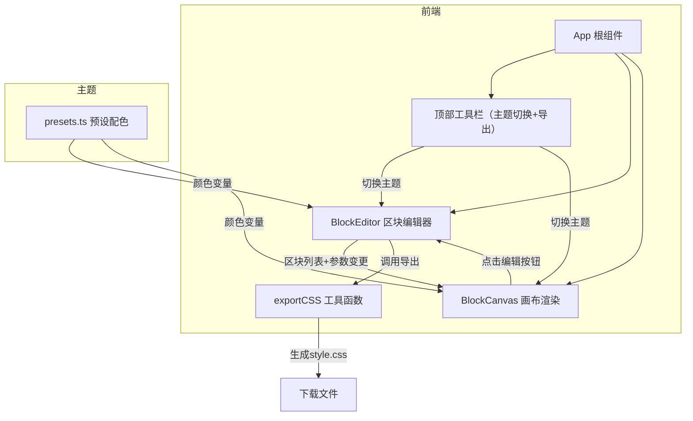

## 1. 架构设计



## 2. 技术说明

- 前端：React 18 + TypeScript + Vite
- 样式方案：纯React内联style / CSS-in-JS（不使用CSS框架）
- 状态管理：React useState/useCallback（组件间通过回调函数传递数据）
- 初始化工具：Vite
- 后端：无
- 数据库：无

### 依赖列表

| 依赖 | 版本 | 用途 |
|------|------|------|
| react | ^18 | UI框架 |
| react-dom | ^18 | DOM渲染 |
| vite | ^5 | 构建工具 |
| @types/react | ^18 | React类型定义 |
| @types/react-dom | ^18 | ReactDOM类型定义 |
| typescript | ^5 | 类型系统 |
| uuid | ^9 | 区块唯一ID生成 |

## 3. 路由定义

| 路由 | 用途 |
|------|------|
| / | 单页应用，所有功能集成在主编辑器页面 |

## 4. 文件结构

```
├── package.json
├── index.html
├── vite.config.js
├── tsconfig.json
└── src/
    ├── main.tsx
    ├── App.tsx
    ├── components/
    │   ├── BlockEditor.tsx
    │   └── BlockCanvas.tsx
    ├── utils/
    │   └── exportCSS.ts
    └── theme/
        └── presets.ts
```

## 5. 数据模型

### 区块配置（BlockConfig）

```typescript
interface BlockConfig {
  id: string;
  type: 'fullscreen-banner' | 'three-column' | 'card-grid' | 'quote-block' | 'product-carousel' | 'footer';
  bgColor: string;
  bgImageUrl: string;
  parallaxSpeed: number;      // -0.5 ~ 0.5
  initialOpacity: number;      // 0 ~ 1
  animationType: 'fade-in' | 'slide-left' | 'fly-up' | 'scale-in';
}
```

### 主题预设（ThemePreset）

```typescript
interface ThemePreset {
  name: string;
  background: string;
  accent: string;
  text: string;
}
```

## 6. 核心算法

### 视差滚动计算

- 滚动进度 progress: 0 ~ 1（对应0% ~ 100%）
- 区块transform: `translateY(${progress * parallaxSpeed * 100}px)`
- 区块opacity: `initialOpacity * (1 - progress * 0.3)`（根据进度衰减）

### 导出CSS关键帧

- 每个区块生成 `@keyframes block-{id}-parallax`
- 包含 `0%`、`50%`、`100%` 三个关键帧
- 外层包裹 `@media (prefers-reduced-motion: no-preference)` 查询
