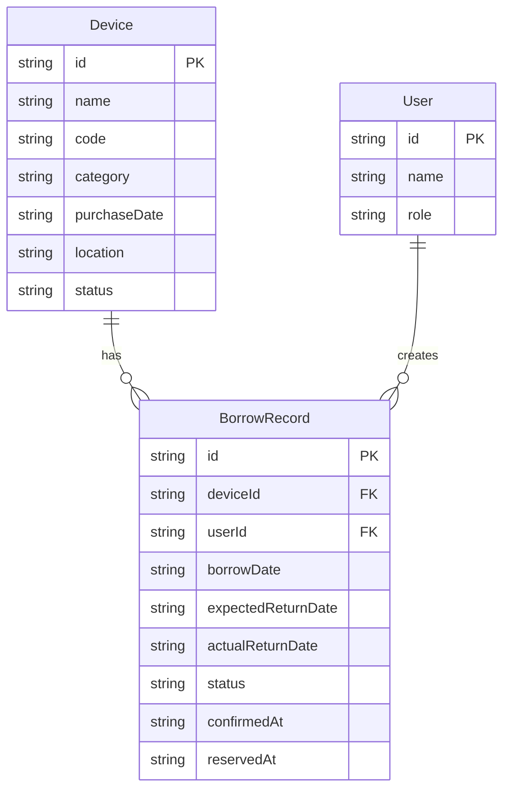

## 1. 架构设计

```mermaid
graph TB
    "React前端(Vite+TypeScript)" --> "Express后端(RESTful API)"
    "Express后端(RESTful API)" --> "内存数据存储"
    "React前端(Vite+TypeScript)" --> "Zustand状态管理"
    "React前端(Vite+TypeScript)" --> "React Router路由"
```

## 2. 技术说明
- 前端：React 18 + TypeScript + Vite（端口3000） + Tailwind CSS
- 状态管理：Zustand
- 后端：Express + TypeScript（端口3001）
- 数据存储：内存数据（mock data，服务重启后重置）
- HTTP通信：Axios
- 日期处理：date-fns
- ID生成：uuid
- 图标：lucide-react

## 3. 路由定义
| 路由 | 用途 |
|------|------|
| / | 统计概览面板首页，展示三大统计卡片 |
| /devices | 设备管理页面，设备列表+搜索筛选+详情 |
| /borrow/:id | 借用申请页面，含日期选择和冲突检测 |
| /history | 个人借阅历史页面 |

## 4. API定义

### 4.1 TypeScript类型定义

```typescript
interface Device {
  id: string;
  name: string;
  code: string;
  category: 'laptop' | 'camera' | 'projector' | 'headphone' | 'other';
  purchaseDate: string;
  location: string;
  status: 'available' | 'reserved' | 'borrowed';
}

interface BorrowRecord {
  id: string;
  deviceId: string;
  userId: string;
  borrowDate: string;
  expectedReturnDate: string;
  actualReturnDate: string | null;
  status: 'pending' | 'confirmed' | 'returned' | 'overdue' | 'cancelled';
  confirmedAt: string | null;
  reservedAt: string;
}

interface User {
  id: string;
  name: string;
  role: 'admin' | 'user';
}

interface Stats {
  totalDevices: number;
  borrowedDevices: number;
  overdueDevices: number;
}
```

### 4.2 API端点

| 方法 | 路径 | 请求体 | 响应 | 说明 |
|------|------|--------|------|------|
| GET | /api/devices | - | Device[] | 获取所有设备 |
| GET | /api/devices/:id | - | Device | 获取单个设备详情 |
| POST | /api/devices | Device(无id) | Device | 添加设备（管理员） |
| GET | /api/borrow | - | BorrowRecord[] | 获取所有借用记录 |
| POST | /api/borrow | {deviceId, userId, expectedReturnDate} | BorrowRecord | 提交借用申请 |
| PUT | /api/borrow/:id/confirm | - | BorrowRecord | 管理员确认借用 |
| PUT | /api/borrow/:id/return | - | BorrowRecord | 管理员确认归还 |
| GET | /api/borrow/user/:userId | - | BorrowRecord[] | 获取用户借阅历史 |
| GET | /api/borrow/conflicts/:deviceId | {startDate, endDate} | BorrowRecord[] | 检测冲突 |
| GET | /api/stats | - | Stats | 获取统计数据 |
| GET | /api/users | - | User[] | 获取用户列表 |

## 5. 服务端架构图

```mermaid
graph LR
    "Router(路由层)" --> "Controller(控制器层)"
    "Controller(控制器层)" --> "Service(业务逻辑层)"
    "Service(业务逻辑层)" --> "DataStore(内存数据层)"
```

## 6. 数据模型

### 6.1 数据模型定义



### 6.2 初始数据

系统预设以下初始数据：
- 2个用户（1管理员+1普通用户）
- 8台设备（涵盖笔记本电脑、相机、投影仪、耳机等类别）
- 3条借用记录（用于展示各种状态）
