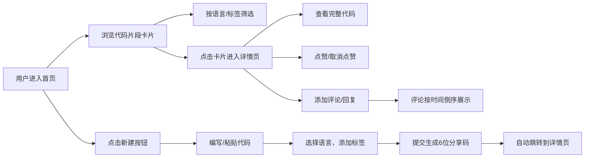

## 1. 产品概述
CodeShare 是一个在线协作代码片段分享与语法标注平台，开发者可以编写、分享代码片段，并对他人的代码进行语法高亮标注和评论讨论。
- 核心价值：为开发者提供轻量级的代码分享与协作工具，支持多语言语法高亮、实时预览和社区互动
- 目标用户：软件开发者、编程学习者、技术教育者

## 2. 核心特性

### 2.1 用户角色
| 角色 | 注册方式 | 核心权限 |
|------|---------|---------|
| 访客用户 | 无需注册 | 浏览代码片段、查看评论、复制代码 |
| 注册用户 | 模拟用户（默认提供） | 发布代码片段、添加评论、点赞、回复评论 |

### 2.2 功能模块
1. **首页**：代码片段卡片网格、语言/标签筛选、搜索功能、侧边栏折叠
2. **代码编辑器**：语法高亮编辑、实时预览、语言选择、标签添加、代码复制、生成6位分享码
3. **详情页**：完整代码展示（行号、可折叠）、评论区、点赞功能、标签筛选跳转
4. **评论系统**：评论展示（时间倒序）、添加评论（弹性动画）、回复功能

### 2.3 页面详情
| 页面名称 | 模块名称 | 功能描述 |
|---------|---------|---------|
| 首页 | 导航栏 | Logo展示、搜索框、用户头像、新建按钮 |
| 首页 | 侧边筛选栏 | 语言筛选（10种）、标签筛选、折叠动画 |
| 首页 | 卡片网格 | 响应式三列/两列/单列布局、卡片悬停抬起效果 |
| 首页 | 代码卡片 | 代码第一行预览、语言彩色标签、作者头像、点赞数 |
| 编辑器页 | 代码编辑区 | 语法高亮编辑、实时Prism风格预览 |
| 编辑器页 | 元信息表单 | 语言选择、标签输入、描述输入 |
| 编辑器页 | 操作按钮 | 复制代码、提交分享、生成分享码 |
| 详情页 | 代码展示区 | 完整代码、行号显示、长代码折叠 |
| 详情页 | 标签区 | 圆角标签、点击跳转筛选 |
| 详情页 | 评论区 | 评论列表、评论输入框（弹性动画）、回复功能 |
| 详情页 | 点赞按钮 | 红心动画、爱心扩散效果、点赞计数 |

## 3. 核心流程

## 4. 用户界面设计

### 4.1 设计风格
- **主色调**：蓝色 #1E90FF（强调色）、红色 #FF4757（点赞色）
- **中性色**：白色 #FFFFFF（背景）、浅灰 #F8F9FA（卡片）、深灰 #2D3436（文字）
- **标签色**：浅蓝 #E0F4FF（标签背景）、深蓝 #1E90FF（标签文字）
- **字体**：使用 JetBrains Mono 等宽字体用于代码展示，Inter 用于界面文字
- **按钮风格**：圆角 8px，悬停 0.2s ease-out 过渡，阴影增强
- **图标**：使用 lucide-react 图标库，线性风格

### 4.2 页面设计概览
| 页面名称 | 模块名称 | UI 元素 |
|---------|---------|---------|
| 首页 | 导航栏 | 固定顶部、高度 64px、Logo 左侧、搜索框居中、用户头像右侧 |
| 首页 | 侧边栏 | 宽度 240px、可折叠（0.3s 滑入动画）、语言彩色标签列表 |
| 首页 | 卡片网格 | 间距 16px、边缘留白 24px、桌面三列/平板两列/手机单列 |
| 首页 | 代码卡片 | 圆角 12px、悬停抬起 4px、阴影加深、语言彩色圆角标签 |
| 详情页 | 布局 | 左侧代码区（65%）、右侧评论区（35%）、顶部标签栏 |
| 详情页 | 代码区 | 深色背景、行号、Prism 高亮、长代码折叠按钮 |
| 详情页 | 评论输入 | 底部固定、提交时 0.2s 弹性放大动画 |
| 编辑器页 | 布局 | 上下分栏、上半部编辑区、下半部预览区 |

### 4.3 响应式设计
- **桌面端（≥1200px）**：三列卡片网格，侧边栏展开
- **平板端（768px-1199px）**：两列卡片网格，侧边栏可折叠
- **手机端（<768px）**：单列卡片网格，侧边栏默认隐藏，抽屉式展开
- **触摸优化**：按钮最小尺寸 44x44px，卡片点击区域充足

### 4.4 动画效果
- 卡片悬停：transform: translateY(-4px)，box-shadow 加深，0.2s ease-out
- 点赞按钮：灰色 → 红色 #FF4757，爱心图标扩散淡出（1s）
- 评论提交：输入框 scale(1.05) 弹性放大，0.2s
- 侧边栏折叠：width 从 240px → 0，0.3s 平滑过渡
- 页面加载：卡片交错淡入（staggered fade-in）
