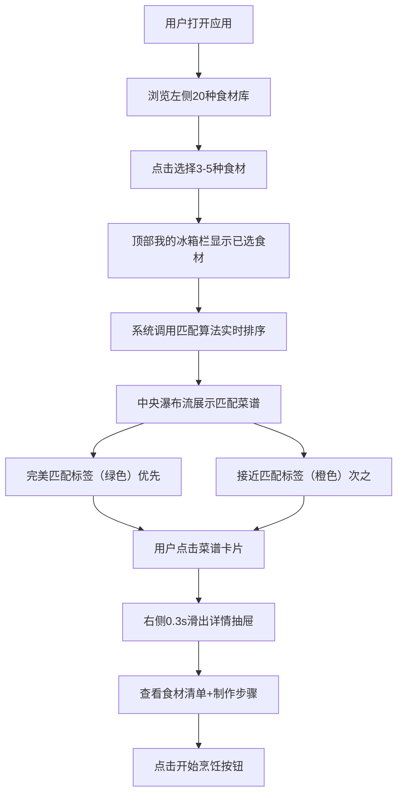

# 懒人菜谱灵感生成器 - 产品需求文档 (PRD)

## 1. 产品概述

懒人菜谱灵感生成器是一款基于用户现有食材智能推荐菜谱的Web应用，帮助用户在打开冰箱面对有限食材时快速找到可制作的菜品方案，解决"有食材不知道做什么"的日常困扰。

- 核心价值：将3-5种现有食材转化为具体可行的菜谱方案，降低做饭决策成本
- 目标用户：都市白领、厨房新手、不想花时间构思菜谱的家庭用户
- 产品定位：轻量级、即开即用的厨房灵感工具

## 2. 核心功能

### 2.1 功能模块

1. **食材选择区（左侧面板）**：20种常见食材卡片库、点击选择/取消
2. **我的冰箱（顶部栏）**：已选食材横向展示、支持快速移除
3. **菜谱匹配结果（中央瀑布流）**：根据已选食材智能匹配排序、50条内置菜谱
4. **菜谱详情抽屉（右侧面板）**：点击菜谱卡片滑出详情、食材清单+制作步骤

### 2.2 页面详情

| 页面名称 | 模块名称 | 功能描述 |
|---------|---------|---------|
| 主页面 | 左侧食材库面板 | 20种常见食材卡片（icon+名称）、点击0.15s缩放弹入动画、选中后右上角绿色对勾标记 |
| 主页面 | 我的冰箱顶部栏 | 已选食材横向排列显示、每个食材右侧X移除按钮、移除时0.2s横向滑出动画 |
| 主页面 | 中央菜谱瀑布流 | 3列自适应网格、完美匹配（含所有已选食材）优先显示、接近匹配（≥2种食材）次之 |
| 主页面 | 菜谱卡片 | 渐变色块+emoji占位图、菜名、匹配度彩色标签、预计时间、hover阴影2px→4px过渡 |
| 主页面 | 右侧详情抽屉 | 0.3s过渡滑出、320px宽带、大号渐变占位图、食材清单、步骤列表、开始烹饪按钮 |

## 3. 核心流程

用户打开应用 → 从左侧食材库点击选择3-5种冰箱现有食材 → 系统实时匹配50条菜谱库并排序展示 → 用户浏览匹配的菜谱卡片 → 点击感兴趣的菜谱卡片 → 右侧滑出详情面板查看完整食材和步骤 → 按需开始烹饪。

## 4. 用户界面设计

### 4.1 设计风格
- **主色调**：暖色系主色 `#FFE4B5`（浅橙米色），强调色 `#FF6347`（番茄红）
- **背景色**：左侧面板 `#FFF8DC` 带浅花纹纹理，中央区域 `#FAF0E6`（浅米色）
- **按钮样式**：圆角8px、渐变背景（`#FF6347` → `#FF4500`）、悬停亮度+10%、0.2s过渡
- **标签样式**：圆角8px彩色标签，完美匹配 `#32CD32` 绿底白字，接近匹配 `#FFA500` 橙底白字
- **阴影系统**：三档阴影（2px/4px/8px），卡片hover时从2px过渡至4px
- **字体**：中文优先使用系统圆体/黑体，字号层级清晰：菜名24px加粗，步骤14px#555

### 4.2 页面设计概述

| 页面名称 | 模块名称 | UI元素细节 |
|---------|---------|---------|
| 主页面 | 左侧食材库面板 | 宽度280px、浅米色背景+细腻纹理、食材卡片网格布局、icon 40px居中、选中卡片边框高亮+对勾标记 |
| 主页面 | 我的冰箱顶部栏 | 高度72px、白色背景+底部阴影、食材标签横向排列带圆角、X按钮24px浅灰底hover变红 |
| 主页面 | 菜谱瀑布流网格 | 3列布局、列间距16px、行间距20px、卡片圆角12px、卡片高度自适应 |
| 主页面 | 菜谱卡片 | 顶部渐变色块（按菜系配色）+ 食材emoji叠加、菜名18px加粗#333、标签+时间行 |
| 主页面 | 详情抽屉面板 | 固定右侧、宽度320px、白色背景圆角8px、关闭按钮40px圆形、内边距24px |
| 主页面 | 动画过渡 | 食材选中缩放0.15s、移除横向滑出0.2s、抽屉滑出0.3s、hover过渡0.15-0.3s统一 |

### 4.3 响应式适配

- **桌面端（≥1024px）**：左侧面板280px固定 + 中央3列瀑布流 + 右侧详情抽屉
- **平板端（768-1023px）**：左侧面板280px + 中央2列瀑布流
- **移动端（<768px）**：左侧面板折叠为顶部60px高度横条、食材卡片横向可滑动、菜谱网格变为2列
- **触控优化**：所有可点击元素最小尺寸44×44px、食材卡片增加点击热区

### 4.4 菜系渐变色参考

| 菜系风格 | 渐变色起止 | 典型emoji |
|---------|-----------|----------|
| 川菜 | `#FF4500` → `#DC143C` 红橙系 | 🌶️ |
| 日料 | `#F5F5DC` → `#DEB887` 米色系 | 🍣 |
| 粤菜 | `#FFE4B5` → `#FFA500` 暖橙系 | 🥢 |
| 西餐 | `#FFFACD` → `#FFD700` 金黄系 | 🍝 |
| 家常菜 | `#98FB98` → `#228B22` 绿系 | 🍲 |
