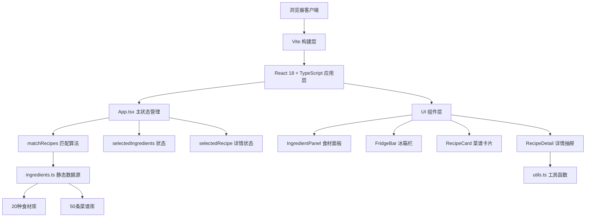

# 懒人菜谱灵感生成器 - 技术架构文档

## 1. 架构设计

纯前端单页应用，无后端服务。数据层采用静态JSON内置50条菜谱和20种食材，业务逻辑层由React组件通过自定义Hook和工具函数管理状态与匹配算法，视图层使用CSS变量管理主题、CSS过渡动画实现交互反馈。



## 2. 技术描述

- **前端框架**：React@18 + TypeScript（严格模式）
- **构建工具**：Vite@5（极速冷启动、HMR热更新）
- **样式方案**：原生CSS + CSS变量（无Tailwind依赖，保持轻量）
- **状态管理**：React Hooks（useState、useMemo、useCallback）
- **包管理器**：npm
- **类型系统**：TypeScript strict模式，interface定义数据模型

## 3. 项目文件结构

```
auto110/
├── package.json
├── index.html
├── vite.config.js
├── tsconfig.json
├── src/
│   ├── types.ts            # TypeScript类型定义
│   ├── ingredients.ts      # 食材库+菜谱库静态数据
│   ├── utils.ts            # 匹配算法+工具函数
│   ├── App.tsx             # 主组件+状态管理+布局
│   ├── RecipeCard.tsx      # 菜谱卡片组件
│   └── RecipeDetail.tsx    # 详情抽屉组件
└── .trae/documents/
    ├── PRD-懒人菜谱灵感生成器.md
    └── 技术架构-懒人菜谱灵感生成器.md
```

## 4. 类型定义（types.ts）

```typescript
export interface Ingredient {
  id: string;
  name: string;
  emoji: string;
  color: string; // 小圆点颜色
  category: 'meat' | 'vegetable' | 'seafood' | 'grain' | 'other';
}

export interface Recipe {
  id: string;
  name: string;
  cuisineStyle: 'sichuan' | 'japanese' | 'cantonese' | 'western' | 'home';
  gradientColors: [string, string]; // 卡片渐变色
  emoji: string; // 代表性emoji
  ingredients: string[]; // 所需食材ID数组
  cookTime: number; // 分钟
  steps: string[]; // 制作步骤
  difficulty: 'easy' | 'medium' | 'hard';
}

export interface MatchResult {
  recipe: Recipe;
  matchLevel: 'perfect' | 'close' | 'partial' | 'none';
  matchedCount: number;
  matchedIngredients: string[];
}

export type MatchLevel = 'perfect' | 'close' | 'partial' | 'none';
```

## 5. 匹配算法设计（utils.ts）

### 5.1 核心函数

```typescript
/**
 * 菜谱匹配排序算法
 * @param selectedIds 已选食材ID数组
 * @param allRecipes 全部菜谱数组
 * @returns 排序后的匹配结果数组
 */
export function matchRecipes(
  selectedIds: string[],
  allRecipes: Recipe[]
): MatchResult[]
```

### 5.2 匹配规则优先级

| 优先级 | 匹配等级 | 判定条件 | 标签颜色 |
|-------|---------|---------|---------|
| 1 | perfect（完美匹配） | 菜谱食材包含所有已选食材 | #32CD32 绿色 |
| 2 | close（接近匹配） | 匹配食材数 ≥ 2种 | #FFA500 橙色 |
| 3 | partial（部分匹配） | 匹配食材数 = 1种 | 无标签/灰色 |
| 4 | none（无匹配） | 无匹配食材 | 不展示 |

### 5.3 排序逻辑
1. 按匹配等级分组（perfect → close → partial）
2. 同等级内按匹配食材数降序
3. 匹配数相同时按烹饪时间升序（优先推荐快手菜）

## 6. 性能优化方案

### 6.1 渲染性能
- **useMemo缓存匹配结果**：只有selectedIds变化时才重新执行matchRecipes
- **useCallback包装事件处理器**：避免子组件无谓重渲染
- **React.memo包装RecipeCard**：相同props的卡片跳过渲染
- **CSS transform优先**：动画使用translate/scale而非重排属性

### 6.2 动画性能
- 抽屉滑出使用 `transform: translateX()` + `will-change: transform`
- 所有过渡时长控制在0.15-0.3秒，帧率目标≥55fps
- 使用CSS transition而非setTimeout驱动动画

### 6.3 首次加载性能
- 无外部网络请求，纯本地静态数据
- Vite生产构建启用代码压缩和Tree-shaking
- 初始渲染目标：<200ms（匹配算法O(n)复杂度，50条数据可忽略）

## 7. CSS变量主题系统

```css
:root {
  /* 主色调 */
  --color-primary: #FFE4B5;
  --color-accent: #FF6347;
  --color-accent-dark: #FF4500;
  
  /* 背景色 */
  --bg-sidebar: #FFF8DC;
  --bg-content: #FAF0E6;
  --bg-card: #FFFFFF;
  
  /* 文字色 */
  --text-title: #333333;
  --text-body: #555555;
  --text-light: #888888;
  --text-white: #FFFFFF;
  
  /* 匹配标签色 */
  --badge-perfect: #32CD32;
  --badge-close: #FFA500;
  
  /* 阴影系统 */
  --shadow-sm: 0 2px 4px rgba(0,0,0,0.08);
  --shadow-md: 0 4px 12px rgba(0,0,0,0.1);
  --shadow-lg: 0 8px 24px rgba(0,0,0,0.12);
  
  /* 圆角 */
  --radius-sm: 8px;
  --radius-md: 12px;
  --radius-lg: 16px;
}
```

## 8. 响应式断点

| 断点名称 | 宽度范围 | 布局调整 |
|---------|---------|---------|
| desktop | ≥1024px | 左侧280px + 中央3列网格 + 详情抽屉320px |
| tablet | 768px - 1023px | 左侧280px + 中央2列网格 |
| mobile | <768px | 左侧折叠为顶部横条（60px高）、食材横向滚动、菜谱2列网格 |
