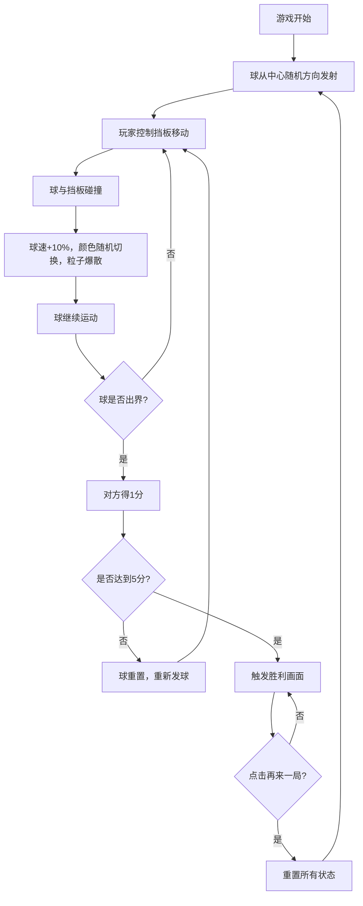

## 1. 产品概述

"弹球对决"是一款双人同屏2D物理弹球对战游戏，两名玩家在同一台电脑上分别控制左右挡板，将弹球来回击打，球速随回合数逐渐加快，配合丰富的视觉反馈，为线下聚会提供操作简单、气氛活跃的双人对抗体验。

- 核心目标：解决线下聚会时缺少操作简单但反馈丰富、能快速活跃气氛的双人同屏对抗游戏的问题
- 目标用户：朋友聚会、家庭娱乐等场景下的双人玩家
- 产品价值：零学习成本、即时反馈、强对抗性，快速带动现场气氛

## 2. 核心功能

### 2.1 用户角色
| 角色 | 操作方式 | 核心权限 |
|------|----------|----------|
| 玩家1（左方） | 键盘W/S键 | 控制左侧挡板上下移动 |
| 玩家2（右方） | 方向键↑/↓ | 控制右侧挡板上下移动 |

### 2.2 功能模块
1. **游戏主界面**：游戏画布、计分板、标题、操作提示
2. **物理弹球系统**：球的运动、碰撞检测、速度递增、颜色切换
3. **挡板控制系统**：键盘输入监听、挡板移动、边界限制
4. **粒子特效系统**：碰撞时粒子爆散、渐隐消失
5. **计分与胜负系统**：实时计分、胜利判定、胜利画面
6. **游戏重置机制**：再来一局、状态重置

### 2.3 页面详情
| 页面名称 | 模块名称 | 功能描述 |
|---------|----------|----------|
| 游戏主页面 | 游戏画布 | 800x500像素游戏区域，深蓝色渐变背景，白色虚线中轴线 |
| 游戏主页面 | 计分板 | 左右两侧计分板，技术风格数字，白色字体带黑色阴影 |
| 游戏主页面 | 挡板 | 15x80像素矩形，辉光效果，距边界20像素 |
| 游戏主页面 | 弹球 | 半径8像素圆形，辉光效果，六种颜色随机切换 |
| 游戏主页面 | 粒子特效 | 碰撞时15个粒子爆散，0.4秒渐隐消失 |
| 胜利画面 | 胜利遮罩 | 半透明黑色遮罩淡入，金色胜利者名称，滑动入场动画 |
| 胜利画面 | 再来一局按钮 | 点击重置所有状态，遮罩淡出 |

## 3. 核心流程

游戏开始后，球从中心向随机方向发射，玩家通过控制挡板将球击回对方场地。每次击球后球速增加10%且颜色随机变化。球从一侧出界后，对方得1分，球重置到中心并重新发射。首先达到5分的玩家获胜，触发胜利画面，可点击"再来一局"重新开始。

## 4. 用户界面设计

### 4.1 设计风格
- **主色调**：深蓝色渐变背景（#0a0a2e 到 #1a1a4e）
- **强调色**：六种球色（#FF6B6B红、#4ECDC4青、#45B7D1蓝、#96CEB4草绿、#FFEAA7浅黄、#DDA0DD淡紫）
- **胜利金色**：用于胜利文字
- **字体**：技术风格数字字体，28px计分，48px胜利文字，20px标题，12px操作提示
- **辉光效果**：挡板和球体使用阴影滤镜实现辉光，模糊半径4px
- **布局**：游戏区域居中，页面垂直水平居中，背景不可滚动

### 4.2 页面设计概述
| 页面名称 | 模块名称 | UI元素 |
|---------|----------|--------|
| 游戏主页面 | 背景 | 深蓝色径向/线性渐变，深太空氛围 |
| 游戏主页面 | 游戏区域 | 800x500居中画布，白色虚线中轴线 |
| 游戏主页面 | 标题 | "弹球对决" 20px白色，顶部居中 |
| 游戏主页面 | 计分板 | 左右两侧，技术数字风格，白色带黑阴影 |
| 游戏主页面 | 挡板 | 矩形，辉光效果，与球同色系统 |
| 游戏主页面 | 弹球 | 圆形，辉光，颜色动态变化 |
| 游戏主页面 | 操作提示 | 底部12px半透明白色文字 |
| 胜利画面 | 遮罩 | 半透明黑色，0.5秒淡入 |
| 胜利画面 | 胜利文字 | 金色48px，从左到右滑动入场 |
| 胜利画面 | 按钮 | "再来一局"，点击触发重置 |

### 4.3 响应式
- 桌面端优先，游戏区域固定800x500像素
- 所有UI元素在窗口缩放时保持比例不变
- 页面使用flex布局垂直水平居中
- 超出部分隐藏，背景不可滚动

### 4.4 动效设计
- 球颜色切换：0.1秒快速闪烁过渡
- 粒子特效：碰撞位置爆散，0.4秒渐隐消失
- 胜利遮罩：0.5秒淡入，重置时0.3秒淡出
- 胜利文字：从左到右滑动入场动画
- 整体帧率：稳定60FPS
