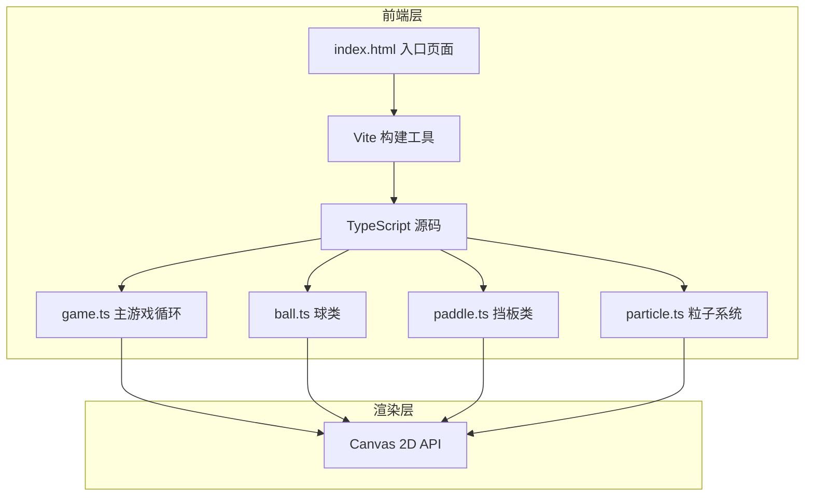

## 1. 架构设计



## 2. 技术描述

- **前端框架**：原生 TypeScript + Canvas 2D API，无第三方游戏引擎
- **构建工具**：Vite@5 + TypeScript@5
- **渲染方式**：Canvas 2D 原生绘制，requestAnimationFrame 驱动主循环
- **物理系统**：自定义实现 AABB 碰撞检测、圆与矩形分离轴算法
- **粒子系统**：对象池模式管理粒子创建与回收
- **样式方案**：内联 CSS + Canvas 绘制，无外部 UI 框架

## 3. 项目文件结构

| 文件路径 | 作用 |
|---------|------|
| `package.json` | 项目依赖与脚本配置（typescript, vite） |
| `index.html` | 入口页面，包含 canvas 元素与居中布局 |
| `vite.config.js` | Vite 构建配置，启用 TypeScript 支持 |
| `tsconfig.json` | TypeScript 编译配置（严格模式，ES2020） |
| `src/game.ts` | 主游戏类，初始化 Canvas，驱动 update/render，处理键盘事件 |
| `src/ball.ts` | 球类，位置/速度/颜色管理，碰撞检测，辉光绘制 |
| `src/paddle.ts` | 挡板类，按键输入处理，移动范围限制，辉光绘制 |
| `src/particle.ts` | 粒子类 + 粒子池管理，爆散效果，渐隐消失 |

## 4. 核心数据结构

### 4.1 球 (Ball)
```typescript
interface Ball {
  x: number;           // 球心 x 坐标
  y: number;           // 球心 y 坐标
  vx: number;          // x 方向速度
  vy: number;          // y 方向速度
  radius: number;      // 半径 (8px)
  color: string;       // 当前颜色
  flashTimer: number;  // 闪烁过渡计时器
  isFlashing: boolean; // 是否处于闪烁状态
}
```

### 4.2 挡板 (Paddle)
```typescript
interface Paddle {
  x: number;           // x 坐标
  y: number;           // y 坐标（顶部）
  width: number;       // 宽度 (15px)
  height: number;      // 高度 (80px)
  speed: number;       // 移动速度
  side: 'left' | 'right'; // 左侧/右侧
}
```

### 4.3 粒子 (Particle)
```typescript
interface Particle {
  x: number;           // x 坐标
  y: number;           // y 坐标
  vx: number;          // x 方向速度
  vy: number;          // y 方向速度
  color: string;       // 颜色
  life: number;        // 剩余存活时间
  maxLife: number;     // 最大存活时间 (0.4s)
  size: number;        // 尺寸 (3px)
  active: boolean;     // 是否活跃
}
```

### 4.4 游戏状态 (GameState)
```typescript
interface GameState {
  leftScore: number;   // 左方得分
  rightScore: number;  // 右方得分
  winningScore: number; // 胜利分数 (5)
  gameOver: boolean;   // 游戏是否结束
  winner: string | null; // 胜利者名称
  winMaskAlpha: number; // 胜利遮罩透明度
}
```

## 5. 核心算法

### 5.1 碰撞检测（圆与矩形）
使用分离轴定理 (SAT) 的简化版本：
1. 找到矩形上距离圆心最近的点
2. 计算圆心到该点的距离
3. 若距离小于半径，则发生碰撞
4. 根据碰撞位置计算反弹角度

### 5.2 粒子系统
- 对象池模式：预分配粒子对象，避免频繁 GC
- 粒子淘汰：超过 200 个粒子时舍弃最旧粒子
- 渐隐效果：透明度 = 剩余生命 / 最大生命

### 5.3 主循环
- requestAnimationFrame 驱动
- 固定时间步长或基于 deltaTime 的更新
- 每帧一次碰撞检测
- 更新 → 渲染 两阶段分离

## 6. 性能优化

- **帧率目标**：稳定 60FPS
- **碰撞检测**：每帧最多计算一次，AABB 快速排除
- **粒子管理**：对象池复用，上限 200 个，超出淘汰最旧
- **渲染优化**：Canvas 2D 原生绘制，避免频繁状态切换
- **输入处理**：按键状态标志位，事件驱动更新
