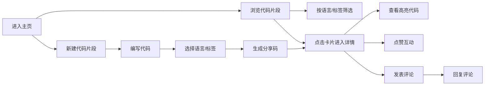

## 1. 产品概述

CodeShare 是一个在线协作代码片段分享与语法标注平台，用户可以编写、分享代码片段，并对他人片段进行语法高亮标注和评论讨论。

- **核心价值**：为开发者提供快速分享和讨论代码的轻量级平台
- **目标用户**：软件开发者、编程学习者、技术团队
- **主要功能**：代码编辑、语法高亮、片段分享、评论讨论、点赞收藏

## 2. 核心功能

### 2.1 用户角色

| 角色 | 注册方式 | 核心权限 |
|------|----------|----------|
| 访客 | 无需注册 | 浏览代码片段、查看评论 |
| 注册用户 | 本地用户系统 | 发布代码片段、添加评论、点赞、回复 |

### 2.2 功能模块

1. **主页**：代码片段卡片网格、筛选栏、搜索、导航
2. **代码编辑器**：语法高亮编辑、语言选择、标签添加、分享码生成
3. **代码详情页**：完整代码展示、行号显示、评论区、点赞功能
4. **评论系统**：评论展示、回复功能、时间排序

### 2.3 页面详情

| 页面名称 | 模块名称 | 功能描述 |
|---------|---------|---------|
| 主页 | 导航栏 | Logo、搜索框、用户头像、新建按钮 |
| 主页 | 筛选侧边栏 | 语言筛选、标签筛选、侧边栏折叠动画 |
| 主页 | 卡片网格 | 代码片段卡片、悬停效果、响应式布局 |
| 编辑器页 | 代码编辑区 | 语法高亮、实时预览、代码复制 |
| 编辑器页 | 表单区 | 语言选择、标签输入、描述输入、提交按钮 |
| 详情页 | 代码展示区 | 高亮代码、行号、可折叠、复制功能 |
| 详情页 | 信息区 | 标签列表、作者信息、点赞按钮 |
| 详情页 | 评论区 | 评论列表、回复功能、评论输入框 |

## 3. 核心流程

### 3.1 分享代码片段流程

用户进入编辑器页面 → 编写/粘贴代码 → 选择编程语言 → 添加标签和描述 → 提交生成分享码 → 跳转到详情页

### 3.2 浏览与互动流程

用户进入主页 → 浏览代码片段卡片 → 使用筛选/搜索功能 → 点击卡片进入详情页 → 查看完整代码 → 点赞/添加评论/回复

## 4. 用户界面设计

### 4.1 设计风格

- **主色调**：蓝色 #1E90FF（强调色）、红色 #FF4757（点赞色）
- **背景色**：白色 #FFFFFF（主背景）、浅灰 #F8F9FA（卡片背景）
- **文字色**：深灰 #2D3436（主要文字）
- **标签色**：浅蓝背景 #E0F4FF，深蓝文字 #1E90FF
- **设计风格**：现代简洁、卡片式布局、浅色主题
- **按钮样式**：圆角矩形、0.2秒 ease-out 过渡
- **字体**：使用现代无衬线字体，代码区使用等宽字体

### 4.2 页面设计概述

| 页面名称 | 模块名称 | UI元素 |
|---------|---------|--------|
| 主页 | 导航栏 | 固定顶部、Logo、搜索框、用户头像（圆形2px灰色边框） |
| 主页 | 筛选侧边栏 | 语言列表、标签列表、折叠动画（0.3秒平滑滑入） |
| 主页 | 卡片网格 | 三列布局（桌面）、两列（平板）、单列（手机）、间距16px、边缘留白24px |
| 主页 | 代码卡片 | 代码预览第一行、语言标签（彩色圆角）、作者头像、点赞数、悬停抬起4px加深阴影 |
| 详情页 | 代码展示区 | Prism风格高亮、行号显示、可折叠长代码 |
| 详情页 | 标签区 | 圆角矩形标签、浅蓝背景、点击跳转筛选 |
| 详情页 | 点赞按钮 | 灰色→红色（#FF4757）、爱心扩散动画（1秒淡出） |
| 详情页 | 评论区 | 头像+昵称+时间+内容、时间倒序、回复功能、输入框弹性放大动画（0.2秒） |

### 4.3 响应式设计

- **桌面端**（≥1024px）：三列卡片网格，侧边栏展开
- **平板端**（768px-1023px）：两列卡片网格，侧边栏可折叠
- **手机端**（<768px）：单列卡片网格，侧边栏隐藏为抽屉
- 所有交互按钮带有 0.2 秒 ease-out 过渡效果
- 侧边栏折叠带有 0.3 秒平滑滑入动画

### 4.4 动效设计

- **卡片悬停**：向上抬起 4px，阴影加深
- **点赞按钮**：颜色从灰变红，爱心图标向外扩散淡出（1秒）
- **评论输入框**：提交时 0.2 秒弹性放大动画
- **侧边栏折叠**：0.3 秒平滑滑入/滑出
- **页面加载**：使用 React.lazy + Suspense 实现代码分割和加载状态
