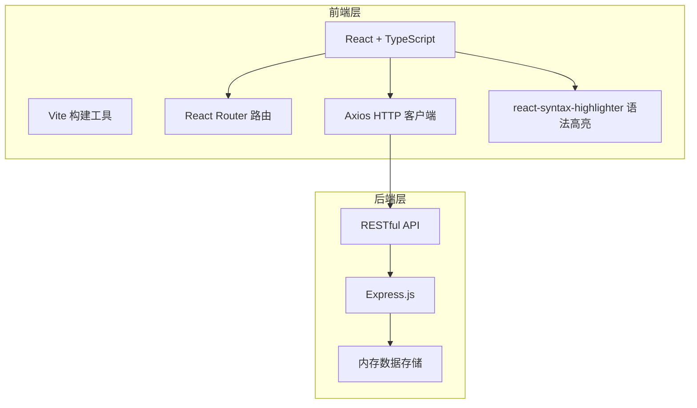
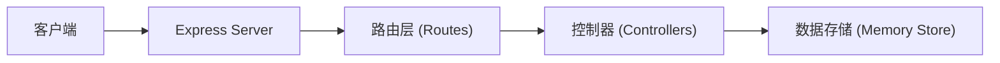
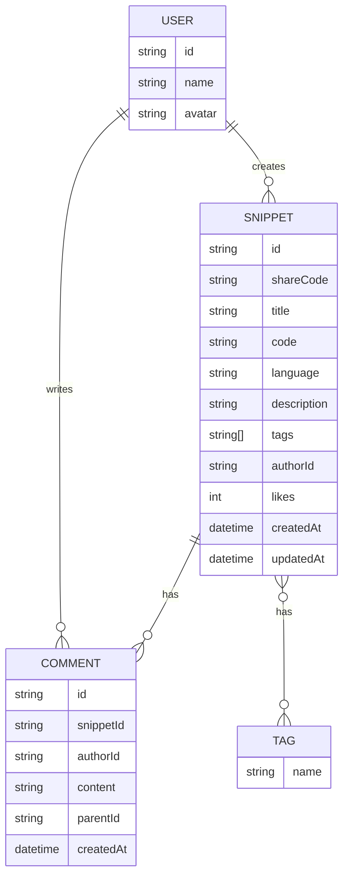

## 1. 架构设计



## 2. 技术描述

- **前端框架**：React 18 + TypeScript
- **构建工具**：Vite 5
- **路由管理**：React Router DOM 6
- **HTTP 客户端**：Axios
- **语法高亮**：react-syntax-highlighter (Prism 风格)
- **后端框架**：Express.js 4
- **跨域处理**：cors
- **唯一ID生成**：uuid
- **数据存储**：内存存储（开发阶段）

## 3. 路由定义

| 路由 | 页面 | 功能 |
|------|------|------|
| `/` | 首页 | 代码片段列表、筛选、搜索 |
| `/snippet/:id` | 详情页 | 代码展示、评论、点赞 |
| `/create` | 编辑器页 | 新建代码片段 |

## 4. API 定义

### 4.1 代码片段接口

```typescript
// 代码片段类型定义
interface CodeSnippet {
  id: string;
  shareCode: string;
  title: string;
  code: string;
  language: string;
  description: string;
  tags: string[];
  author: {
    id: string;
    name: string;
    avatar: string;
  };
  likes: number;
  likedByMe: boolean;
  createdAt: string;
  updatedAt: string;
}

// 评论类型定义
interface Comment {
  id: string;
  snippetId: string;
  author: {
    id: string;
    name: string;
    avatar: string;
  };
  content: string;
  parentId: string | null;
  createdAt: string;
}
```

### 4.2 接口列表

| 方法 | 路径 | 功能 | 请求参数 | 响应 |
|------|------|------|---------|------|
| GET | `/api/snippets` | 获取代码片段列表 | language?, tag?, search? | CodeSnippet[] |
| GET | `/api/snippets/:id` | 获取单个代码片段 | - | CodeSnippet |
| POST | `/api/snippets` | 创建代码片段 | { code, language, description, tags, title } | CodeSnippet |
| POST | `/api/snippets/:id/like` | 点赞/取消点赞 | - | { likes: number, liked: boolean } |
| GET | `/api/snippets/:id/comments` | 获取评论列表 | - | Comment[] |
| POST | `/api/snippets/:id/comments` | 添加评论 | { content, parentId? } | Comment |

## 5. 服务器架构



## 6. 数据模型

### 6.1 数据模型定义



### 6.2 支持的编程语言

1. JavaScript
2. TypeScript
3. Python
4. Java
5. C++
6. Go
7. Rust
8. PHP
9. Ruby
10. Swift

## 7. 项目结构

```
.
├── package.json
├── index.html
├── vite.config.js
├── tsconfig.json
├── src/
│   ├── App.tsx
│   ├── api.ts
│   ├── components/
│   │   ├── CodeEditor.tsx
│   │   ├── CodeSnippetList.tsx
│   │   └── CommentSection.tsx
│   └── pages/
│       ├── Home.tsx
│       ├── SnippetDetail.tsx
│       └── CreateSnippet.tsx
└── src/server/
    └── index.js
```

## 8. 性能优化

- **代码分割**：使用 React.lazy + Suspense 实现路由级代码分割
- **响应式优化**：列表渲染优化，保持 60FPS 滚动
- **服务端优化**：内存存储，响应时间 < 500ms
- **构建优化**：Vite 热更新、Tree Shaking
