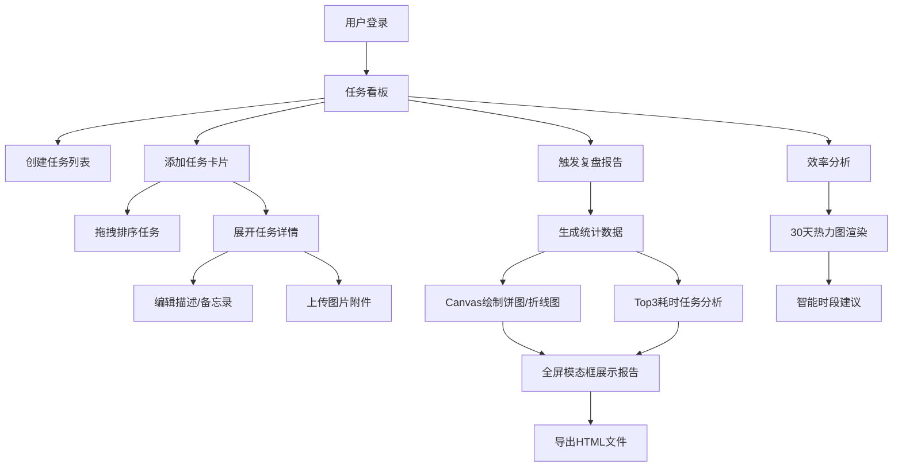

## 1. 产品概述

待办事项管理与每周复盘报告应用，面向小型团队或个人用户，解决杂乱任务列表中无法直观查看每周完成情况、反复延误任务识别及高效工作时段分析的问题。通过可视化复盘报告和效率热力图，帮助用户提升工作效率和自我认知。

## 2. 核心功能

### 2.1 用户角色
| 角色 | 注册方式 | 核心权限 |
|------|----------|----------|
| 普通用户 | 本地登录（模拟） | 创建管理任务列表、任务、查看复盘报告和效率分析 |

### 2.2 功能模块
1. **任务看板页**：侧边栏列表管理、任务卡片拖拽排序、任务详情编辑
2. **复盘报告模态框**：统计概览、优先级饼图、每日完成折线图、Top3耗时任务分析
3. **效率分析页**：30天热力图展示高效时段、智能建议

### 2.3 页面详情
| 页面名称 | 模块名称 | 功能描述 |
|----------|----------|----------|
| 任务看板 | 侧边栏列表 | 创建/删除任务列表，自定义名称和8种预设颜色，选中时左侧蓝色指示条动画 |
| 任务看板 | 任务卡片 | 拖拽排序（半透明影子+0.2s弹性吸附），展示标题/截止日期/优先级/状态 |
| 任务看板 | 任务详情面板 | 展开查看描述、备忘录文本编辑、图片附件上传（Base64存储） |
| 复盘报告 | 统计概览 | 本周完成总数/新增数/逾期数卡片展示 |
| 复盘报告 | 优先级饼图 | Canvas绘制完成/逾期/进行中三块区域动态比例 |
| 复盘报告 | 每日完成折线图 | 按日期展示本周每日完成任务数量 |
| 复盘报告 | Top3耗时任务 | 彩色圆角卡片展示耗时前三任务，底部显示用时百分比 |
| 效率分析 | 热力图 | 30天×24小时热力图，淡蓝#E0F7FA到深蓝#006064渐变 |
| 效率分析 | 智能建议 | 根据热力图数据生成个性化时段建议 |

## 3. 核心流程

用户登录后进入任务看板，可创建多个任务列表，在列表中添加任务卡片并拖拽排序。点击任务卡片展开详情，编辑描述、备忘录和上传图片附件。每周日22:00系统自动或用户手动触发生成HTML格式复盘报告，全屏模态框展示，支持导出HTML文件。用户可查看效率分析热力图了解个人高效工作时段。

## 4. 用户界面设计

### 4.1 设计风格
- 主背景：#1E1E1E，卡片背景：#2D2D2D，文字主色：#E0E0E0，强调色：#64B5F6蓝色
- 卡片：8px圆角、2px边框#3A3A3A、0 2px 8px rgba(0,0,0,0.3)阴影
- 按钮：悬停时背景亮度变化10%，0.2秒过渡动画
- 优先级：P1红/P2橙/P3蓝/P4灰
- Material Design风格，8px网格系统

### 4.2 页面设计概述
| 页面名称 | 模块名称 | UI元素 |
|----------|----------|--------|
| 任务看板 | 侧边栏 | 深色背景、列表项hover效果、选中项左侧3px蓝色指示条0.3s展开动画 |
| 任务看板 | 任务卡片 | 半透明拖拽影子、弹性吸附动画、优先级色标、状态标签 |
| 任务看板 | 详情面板 | 滑入动画、文本编辑区、图片上传按钮预览 |
| 复盘报告 | 模态框 | 全屏黑色半透明遮罩、内容区居中、导出按钮 |
| 复盘报告 | 图表卡片 | Canvas自适应宽高、圆角边框、统计数字大号字体 |
| 效率分析 | 热力图 | Canvas绘制单元格渐变色、坐标轴标签、悬停提示 |

### 4.3 响应式
桌面端左右分栏布局，手机端（<768px）上下滚动布局替代左右分栏，饼图折线图热力图Canvas自适应宽高比例。
