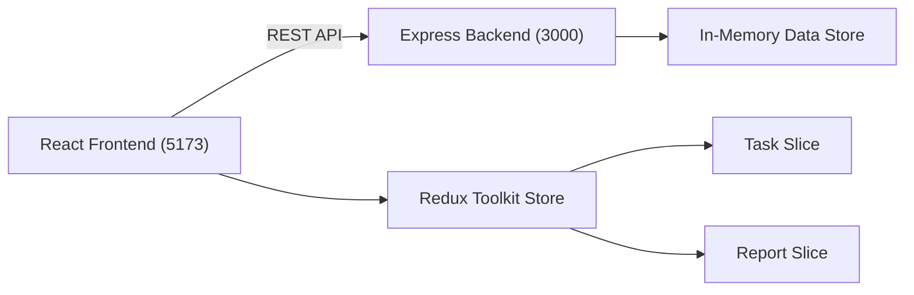
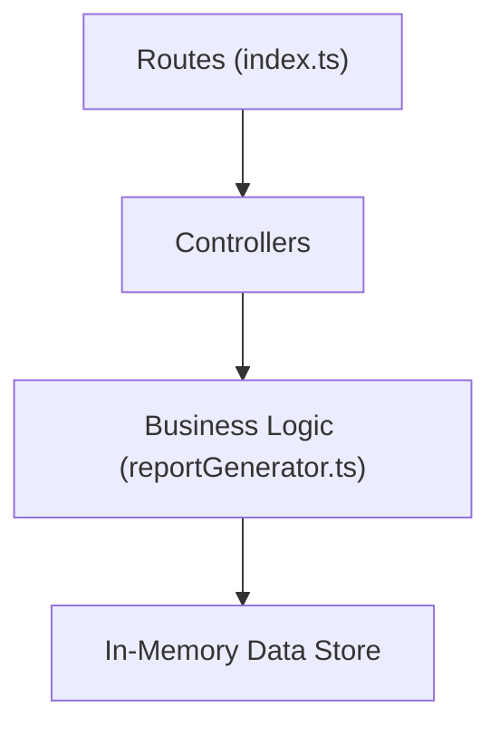
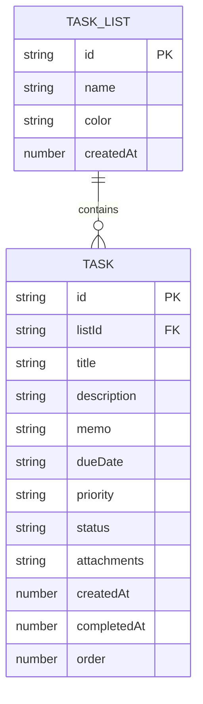

## 1. 架构设计



## 2. 技术描述

- 前端：React 18 + TypeScript + Vite + Redux Toolkit + react-beautiful-dnd + Chart.js
- 后端：Node.js + Express + TypeScript + uuid
- 数据存储：内存存储（开发阶段）
- 构建工具：Vite，代理/api到本地3000端口

## 3. 路由定义
| 路由 | 用途 |
|------|------|
| / | 任务看板主页 |
| /efficiency | 效率分析页面 |

## 4. API定义

```typescript
// 任务列表类型
interface TaskList {
  id: string;
  name: string;
  color: string;
  createdAt: number;
}

// 任务类型
interface Task {
  id: string;
  listId: string;
  title: string;
  description: string;
  memo: string;
  dueDate: string | null;
  priority: 'P1' | 'P2' | 'P3' | 'P4';
  status: 'todo' | 'in-progress' | 'done';
  attachments: string[];
  createdAt: number;
  completedAt: number | null;
  order: number;
}

// 报告统计类型
interface ReportStats {
  completedCount: number;
  newCount: number;
  overdueCount: number;
  priorityDistribution: { completed: number; overdue: number; inProgress: number };
  dailyCompleted: { date: string; count: number }[];
  topTimeConsuming: { task: Task; durationHours: number; percentage: number }[];
}

// 效率分析类型
interface EfficiencyData {
  heatmap: number[][];
  suggestion: string;
}
```

### API端点
| 方法 | 路径 | 描述 |
|------|------|------|
| GET | /api/lists | 获取所有任务列表 |
| POST | /api/lists | 创建任务列表 |
| DELETE | /api/lists/:id | 删除任务列表 |
| GET | /api/tasks | 获取所有任务 |
| POST | /api/tasks | 创建任务 |
| PUT | /api/tasks/:id | 更新任务 |
| DELETE | /api/tasks/:id | 删除任务 |
| PUT | /api/tasks/reorder | 重新排序任务 |
| GET | /api/report/weekly | 获取每周复盘报告数据 |
| GET | /api/efficiency | 获取效率分析数据 |

## 5. 服务器架构图



## 6. 数据模型

### 6.1 数据模型定义



### 6.2 文件组织

```
.
├── package.json
├── index.html
├── vite.config.js
├── tsconfig.json
└── src/
    ├── client/
    │   ├── App.tsx
    │   ├── store/
    │   │   └── taskSlice.ts
    │   └── components/
    │       ├── TaskBoard.tsx
    │       └── ReportModal.tsx
    └── server/
        ├── index.ts
        └── reportGenerator.ts
```
