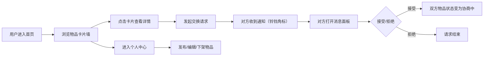

## 1. 产品概述

闲置换物小站是一个轻量级的闲置物品交换平台，旨在帮助用户便捷地发布、浏览和交换家中闲置物品，避免复杂的电商流程。

- 核心目标：提供极简的闲置物品交换体验，让闲置物品流转到有需要的人手中
- 目标用户：希望处理家中闲置物品、同时希望获取他人闲置物品的普通用户
- 市场价值：填补传统电商平台在轻量级物品交换场景中的空白，降低物品流转门槛

## 2. 核心功能

### 2.1 用户角色

| 角色 | 注册方式 | 核心权限 |
|------|----------|----------|
| 普通用户 | 模拟登录（演示用） | 发布物品、浏览物品、发起交换请求、管理个人物品、处理交换请求 |

### 2.2 功能模块

1. **首页（卡片墙）**：物品展示卡片墙、虚拟列表渲染、详情模态框
2. **个人中心**：发布物品、编辑物品、下架物品、我的物品列表
3. **消息面板**：交换请求通知、铃铛角标、请求列表、接受/拒绝操作

### 2.3 页面详情

| 页面名称 | 模块名称 | 功能描述 |
|---------|----------|----------|
| 首页 | 导航栏 | 固定顶部导航，包含Logo、首页链接、个人中心链接、消息铃铛 |
| 首页 | 状态指示点 | 卡片左上角显示交换状态：绿色(可交换)、橙色(协商中)、红色(已换出) |
| 首页 | 物品卡片 | 展示缩略图（正方形裁剪、圆角8px）、物品名称、成色、发布者昵称，悬停上抬4px + 阴影加深 |
| 首页 | 详情模态框 | 展示完整图片、详细描述、期望交换物品种类、发起交换按钮 |
| 首页 | 虚拟列表 | 仅渲染可视区域卡片，优化大量数据的渲染性能 |
| 个人中心 | 物品列表 | 展示用户发布的所有物品，支持编辑和下架操作 |
| 个人中心 | 发布表单 | 图片上传（Base64存储）、物品名称、成色选择、类别选择、期望交换物品，提交缩放反馈 |
| 消息面板 | 铃铛角标 | 右上角显示未读请求数量的红色数字角标 |
| 消息面板 | 请求列表 | 展示发起人头像（圆形40px蓝色边框）、请求时间、物品名称、接受/拒绝按钮 |

## 3. 核心流程

用户访问首页浏览物品卡片墙，点击感兴趣的物品查看详情，通过"发起交换"按钮向对方发送请求。被请求方通过右上角铃铛查看消息列表，可以接受或拒绝请求。接受后双方物品状态变为协商中。用户也可以在个人中心发布、编辑或下架自己的物品。

## 4. 用户界面设计

### 4.1 设计风格

- **主色调**：#F5A623（暖橙色）
- **辅助色**：#4A90D9（蓝色）
- **背景色**：#FAFAFA（浅灰白色）
- **卡片样式**：圆角、阴影、悬停过渡动画
- **按钮样式**：圆角、按下反馈动画（0.15秒）
- **布局风格**：顶部固定导航栏 + 三列自适应网格卡片墙
- **动画风格**：0.2-0.3秒过渡动画，底部小太阳云朵循环浮动（3秒上下平移8px）

### 4.2 页面设计概览

| 页面名称 | 模块名称 | UI元素 |
|---------|----------|--------|
| 首页 | 卡片墙 | 三列网格(min-width:280px)，圆角卡片，状态圆点，悬停上抬+阴影加深 |
| 首页 | 详情模态框 | 居中弹窗，大图展示，详细信息，操作按钮 |
| 个人中心 | 发布表单 | 橙色主题表单，下拉选择框，图片上传区域，提交缩放反馈 |
| 消息面板 | 请求列表 | 蓝色边框圆形头像，请求时间，接受/拒绝按钮带按下反馈 |

### 4.3 响应式设计

- 桌面端：三列自适应网格布局（min-width: 280px）
- 平板端：自动切换为两列布局
- 移动端：自动切换为单列布局
- 所有交互元素支持触摸操作
