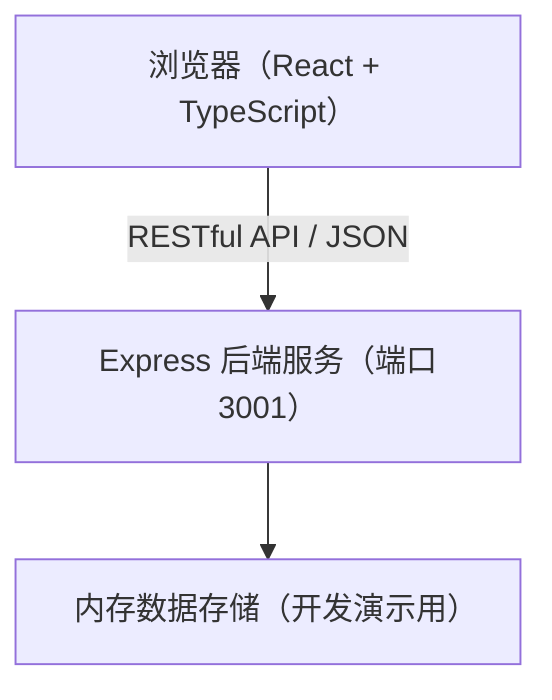
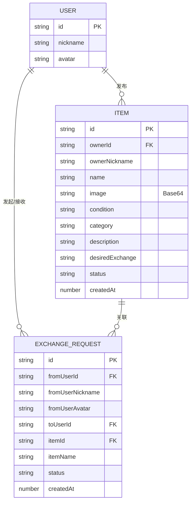

## 1. 架构设计



## 2. 技术说明

- **前端框架**：React 18 + TypeScript
- **构建工具**：Vite + @vitejs/plugin-react
- **路由管理**：react-router-dom
- **HTTP客户端**：axios
- **后端框架**：Express.js
- **CORS处理**：cors 中间件
- **ID生成**：uuid
- **数据存储**：内存存储（演示用），图片以Base64编码存储

## 3. 路由定义

| 路由 | 用途 |
|------|------|
| / | 首页 - 物品卡片墙展示 |
| /profile | 个人中心 - 我的物品管理和发布 |

## 4. API 定义

### 4.1 类型定义

```typescript
type ItemStatus = 'available' | 'negotiating' | 'exchanged';
type ItemCondition = '全新' | '九成新' | '八成新' | '七成以下';
type ItemCategory = '书籍' | '电子产品' | '家居' | '服饰' | '其他';

interface User {
  id: string;
  nickname: string;
  avatar: string;
}

interface Item {
  id: string;
  ownerId: string;
  ownerNickname: string;
  name: string;
  image: string; // Base64
  condition: ItemCondition;
  category: ItemCategory;
  description: string;
  desiredExchange: string;
  status: ItemStatus;
  createdAt: number;
}

interface ExchangeRequest {
  id: string;
  fromUserId: string;
  fromUserNickname: string;
  fromUserAvatar: string;
  toUserId: string;
  itemId: string;
  itemName: string;
  desiredItemId?: string;
  status: 'pending' | 'accepted' | 'rejected';
  createdAt: number;
}
```

### 4.2 接口列表

| 方法 | 路径 | 说明 |
|------|------|------|
| GET | /api/items | 获取所有可交换物品列表 |
| GET | /api/items/:id | 获取单个物品详情 |
| POST | /api/items | 发布新物品 |
| PUT | /api/items/:id | 更新物品信息 |
| DELETE | /api/items/:id | 下架/删除物品 |
| GET | /api/users/:userId/items | 获取用户发布的物品列表 |
| GET | /api/users/:userId/requests | 获取用户收到的交换请求 |
| POST | /api/requests | 发起交换请求 |
| PUT | /api/requests/:id/accept | 接受交换请求 |
| PUT | /api/requests/:id/reject | 拒绝交换请求 |

## 5. 服务端架构


## 6. 数据模型

### 6.1 ER 图



### 6.2 初始化数据

应用启动时自动注入模拟用户和示例物品数据，便于演示浏览功能。
