## 1. 产品概述

算法可视化学习平台是一个面向编程学习者的交互式教学工具，帮助用户直观理解算法执行过程、变量变化和内存状态，提升算法学习效率。

- 解决编程学习者在练习算法时缺乏直观展示工具的痛点，通过可视化方式呈现代码执行的每一步
- 目标用户：编程初学者、算法学习者、计算机科学专业学生
- 市场价值：填补算法教学可视化工具的空白，提供沉浸式学习体验

## 2. 核心功能

### 2.1 用户角色

| 角色 | 注册方式 | 核心权限 |
|------|----------|----------|
| 普通用户 | 无需注册，直接使用 | 编写/选择算法代码、逐步执行、查看可视化、使用所有学习功能 |

### 2.2 功能模块

1. **代码编辑器页面**：CodeMirror代码编辑器、算法库选择、主题切换、代码格式化
2. **执行控制模块**：逐步执行、自动播放、暂停、重置、速度调节
3. **数组可视化模块**：垂直条形图展示、比较/交换动画、进度回溯
4. **变量监视器模块**：变量表格展示、数组展开、对象JSON显示
5. **调用栈模块**：栈帧堆叠展示、当前执行帧高亮

### 2.3 页面详情

| 页面名称 | 模块名称 | 功能描述 |
|----------|----------|----------|
| 编辑器页面 | 顶部导航栏 | 深色主题导航，展示平台名称和操作按钮 |
| 编辑器页面 | 代码编辑器 | 支持语法高亮、自动补全、6种主题切换、Ctrl+S格式化 |
| 编辑器页面 | 算法选择器 | 预置5种排序算法（冒泡、选择、插入、快速、归并）和2种搜索算法（线性、二分） |
| 编辑器页面 | 执行控制面板 | 下一步、自动播放/暂停、重置按钮，速度选择（0.5x/1x/2x/4x） |
| 编辑器页面 | 数组可视化面板 | 垂直条形图展示数组状态，比较闪烁红色，交换移动变蓝色，已排序变绿色 |
| 编辑器页面 | 变量监视器 | 表格展示所有变量值，变化时黄色高亮闪烁，数组可展开 |
| 编辑器页面 | 调用栈面板 | 垂直列表展示栈帧，当前执行帧蓝色背景高亮 |
| 编辑器页面 | 进度回溯条 | 拖拽回溯到任意已执行步骤，所有面板同步回退 |

## 3. 核心流程

用户进入平台后，可选择预置算法或编写自定义代码，点击逐步执行或自动播放，后端逐行执行代码并通过WebSocket推送执行快照，前端实时更新所有可视化面板。

```mermaid
flowchart LR
    A["用户选择算法/编写代码"] --> B["点击逐步执行"]
    B --> C["前端发送代码到后端"]
    C --> D["后端逐行执行并收集快照"]
    D --> E["WebSocket推送快照数据"]
    E --> F["前端更新数组可视化"]
    F --> G["前端更新变量监视器"]
    G --> H["前端更新调用栈"]
    H --> I["等待用户下一步/自动播放"]
    I --> J["用户拖拽进度条回溯"]
    J --> K["所有面板同步回退状态"]
```

## 4. 用户界面设计

### 4.1 设计风格

- 主色调：深色编辑器风格，主背景 `#1e1e2e`，次要面板 `#2a2a3e`，代码区 `#181825`
- 文字色：`#cdd6f4`（浅紫白）
- 强调色：`#89b4fa`（蓝色渐变到 `#b4befe`），`#FF8C00`（橙色当前行），`#FF4444`（红色比较），`#4488FF`（蓝色交换），`#44BB44`（绿色已排序）
- 按钮样式：圆角6px，渐变背景（`#89b4fa` 到 `#b4befe`），悬停亮度提升10%，0.2秒过渡
- 字体：代码使用等宽字体（JetBrains Mono/Fira Code），UI使用现代无衬线字体
- 布局：左右两栏布局，中间可拖拽分隔条（8px宽，拖拽时变亮 `#89b4fa`）

### 4.2 页面设计概述

| 页面名称 | 模块名称 | UI元素 |
|----------|----------|--------|
| 编辑器页面 | 顶部导航栏 | 固定高度56px，深色背景`#1e1e2e`，白色文字，平台Logo和名称 |
| 编辑器页面 | 左侧编辑器 | 约50%宽度，最小480px，CodeMirror编辑器，算法选择下拉，主题切换 |
| 编辑器页面 | 右侧可视化面板 | 约50%宽度，上方数组可视化（60%高度），下方变量监视器+调用栈（40%高度） |
| 编辑器页面 | 数组可视化 | 垂直条形图，条形宽度30px，最大高度250px，0.4秒ease-in-out动画 |
| 编辑器页面 | 变量监视器 | 表格布局，变量名列和值列，可展开数组元素 |
| 编辑器页面 | 调用栈面板 | 堆叠卡片样式，当前帧蓝色边框 |
| 编辑器页面 | 进度回溯条 | 底部进度条，可拖拽滑块，显示当前步骤/总步骤 |

### 4.3 响应式

- 桌面端（≥960px）：左右两栏布局，编辑器和可视化面板各占约50%
- 移动端（<960px）：上下布局，编辑器在上占50%高度，可视化面板在下占50%高度，各自占满宽度
- 触控优化：按钮最小尺寸44x44px，拖拽区域适当放大

### 4.4 动画与交互

- 数组交换：0.4秒ease-in-out过渡动画
- 变量变化：0.3秒黄色高亮闪烁
- 面板重置：0.3秒淡出动画后重新载入
- 按钮悬停：0.2秒背景过渡，亮度提升10%
- 分隔条拖拽：拖拽时颜色变亮`#89b4fa`
- 比较元素：红色闪烁动画
