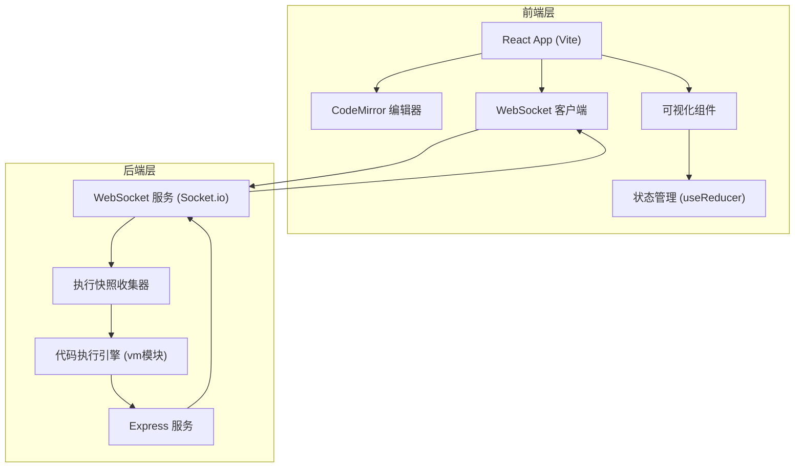
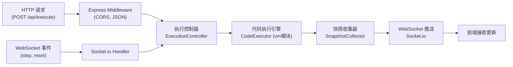

## 1. 架构设计

采用前后端分离架构，前端使用React + TypeScript + Vite构建，后端使用Node.js + Express + WebSocket提供代码执行和实时推送服务。前后端通过RESTful API和WebSocket进行通信。



## 2. 技术描述

- **前端**：React@18 + TypeScript + Vite@5 + React Router@6 + CodeMirror@6 + socket.io-client + axios
- **构建工具**：Vite@5（端口5173，代理转发到后端3000端口）
- **后端**：Express@4 + TypeScript + Socket.io@4 + Node.js vm模块 + uuid
- **包管理器**：npm
- **状态管理**：useReducer（复杂执行状态）+ React Context（全局状态）
- **样式方案**：CSS Modules + CSS变量（深色主题）

## 3. 目录结构

```
auto116/
├── package.json                 # 根级依赖和脚本
├── vite.config.js              # Vite配置，代理设置
├── tsconfig.json               # TypeScript配置
├── index.html                  # 入口HTML
├── .trae/documents/            # 文档目录
├── server/
│   └── src/
│       └── index.ts            # 后端入口，Express+WebSocket服务
├── client/
│   └── src/
│       ├── App.tsx             # 主应用组件，路由管理
│       ├── pages/
│       │   └── EditorPage.tsx  # 代码编辑器页面
│       ├── hooks/
│       │   └── useExecution.ts # 执行管理自定义Hook
│       ├── components/
│       │   └── Visualizer/
│       │       └── VisualizerPanel.tsx  # 可视化面板
│       ├── types/              # TypeScript类型定义
│       ├── utils/              # 工具函数
│       └── algorithms/         # 预置算法代码
└── shared/
    └── types.ts                # 前后端共享类型
```

**文件调用关系与数据流向：**
1. `client/src/App.tsx` → 路由 → `client/src/pages/EditorPage.tsx`
2. `EditorPage.tsx` → 调用 `useExecution.ts` Hook 管理WebSocket连接
3. `useExecution.ts` → 发送代码到 `server/src/index.ts` → WebSocket推送快照
4. `server/src/index.ts` → 执行代码 → 生成快照 → 通过WebSocket推送到前端
5. `EditorPage.tsx` → 传递快照数据到 `VisualizerPanel.tsx`
6. `VisualizerPanel.tsx` → 渲染数组可视化、变量监视器、调用栈

## 4. 路由定义

| 路由 | 页面 | 说明 |
|------|------|------|
| `/` | EditorPage | 编辑器主页，默认路由 |
| `/editor` | EditorPage | 代码编辑器页面（别名） |

## 5. API 定义

### 5.1 共享类型定义

```typescript
// shared/types.ts
export interface ExecutionSnapshot {
  step: number;
  lineNumber: number;
  variables: Record<string, any>;
  arrays: Record<string, Array<any>>;
  callStack: CallFrame[];
  comparing?: number[];
  swapping?: number[];
  sorted?: number[];
  currentArrayName?: string;
}

export interface CallFrame {
  functionName: string;
  lineNumber: number;
  arguments: Record<string, any>;
}

export interface ExecuteRequest {
  code: string;
  maxIterations?: number;
}

export interface ExecuteResponse {
  success: boolean;
  totalSteps?: number;
  error?: string;
}

export type WsMessageType = 'snapshot' | 'complete' | 'error';

export interface WsMessage {
  type: WsMessageType;
  payload: ExecutionSnapshot | { message: string };
}
```

### 5.2 RESTful API

| 方法 | 路径 | 请求体 | 响应 | 说明 |
|------|------|--------|------|------|
| POST | `/api/execute` | `{ code: string, maxIterations?: number }` | `{ success: boolean, totalSteps?: number, error?: string }` | 提交代码开始执行 |
| POST | `/api/stop` | - | `{ success: boolean }` | 停止当前执行 |
| POST | `/api/step` | - | `{ success: boolean }` | 执行下一步 |

### 5.3 WebSocket 消息

| 事件 | 方向 | 数据 | 说明 |
|------|------|------|------|
| `connect` | 前端→后端 | - | 建立连接 |
| `execute` | 前端→后端 | `{ code: string }` | 发送代码开始执行 |
| `snapshot` | 后端→前端 | `ExecutionSnapshot` | 推送执行快照 |
| `complete` | 后端→前端 | `{ totalSteps: number }` | 执行完成 |
| `error` | 后端→前端 | `{ message: string }` | 执行错误 |
| `step` | 前端→后端 | - | 请求执行下一步 |
| `reset` | 前端→后端 | - | 重置执行状态 |

## 6. 服务器架构



## 7. 核心模块说明

### 7.1 后端代码执行引擎
- 使用 Node.js `vm` 模块在沙箱环境中执行代码
- 对代码进行AST分析，注入逐行执行钩子
- 限制循环迭代次数不超过1000次防止卡顿
- 每执行一行收集当前作用域变量、数组状态、调用栈

### 7.2 前端执行状态管理
- `useExecution` Hook 使用 `useReducer` 管理复杂状态
- 状态包括：快照数组、当前步骤、执行状态、WebSocket连接状态
- 支持逐步执行、自动播放、暂停、重置、回溯操作

### 7.3 可视化渲染
- 数组可视化：CSS transform 实现平滑过渡动画
- 变量监视器：差异检测实现变化高亮
- 调用栈：栈帧堆叠展示，当前帧高亮
- 进度回溯：时间旅行模式，根据步骤索引恢复状态

## 8. 性能优化

- WebSocket消息延迟控制在50ms以内
- 前端渲染总耗时控制在100ms以内
- 数组元素超过50个时自动切换紧凑模式（条形宽度12px）
- 自动播放1x速度下每秒执行3步
- 使用 `requestAnimationFrame` 优化动画性能
- 变量差异比较使用浅比较优化性能
