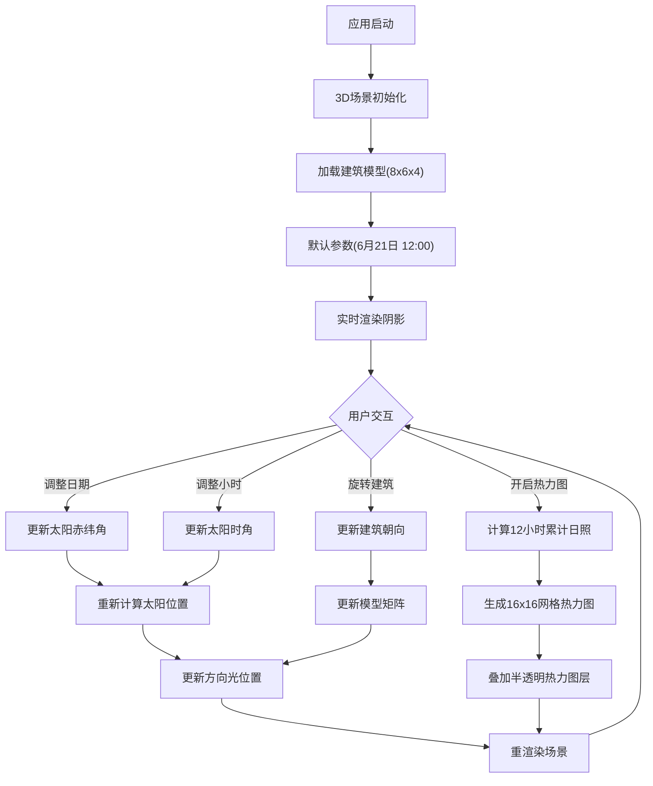

## 1. 产品概述

交互式建筑日照与阴影分析应用，面向建筑师、城市规划师和建筑系学生，提供直观的3D可视化工具来分析建筑在不同季节、不同时段的日照和阴影情况。通过实时调整参数，用户可以观察建筑阴影投射变化，量化各立面日照时长，辅助建筑设计决策。

## 2. 核心特性

### 2.1 用户角色
| 角色 | 注册方式 | 核心权限 |
|------|----------|----------|
| 普通用户 | 无需注册 | 免费使用所有功能，调整参数观察日照分析结果 |

### 2.2 功能模块
1. **3D场景主视图**：建筑模型渲染、阴影实时投射、地面网格辅助
2. **参数控制面板**：日期滑块、小时滑块、建筑旋转控制、热力图开关
3. **日照热力图**：各立面累计日照时长可视化、动态颜色图例
4. **实时数据反馈**：太阳高度角、方位角数值显示、参数变化实时更新

### 2.3 页面详情
| 页面名称 | 模块名称 | 功能描述 |
|----------|----------|----------|
| 主页面 | 3D场景模块 | 渲染可交互的建筑模型和地面，支持鼠标视角操控，实时阴影投射 |
| 主页面 | UI控制面板 | 左下角半透明面板，提供日期、时间、旋转、热力图等参数调节 |
| 主页面 | 热力图图例 | 右下角颜色渐变图例，显示日照时长与颜色对应关系 |
| 主页面 | 数据显示区 | 面板下方实时显示太阳高度角、方位角数值 |

## 3. 核心流程

用户进入应用 → 3D场景加载建筑模型和地面 → 默认显示夏至日正午日照效果 → 用户拖动日期滑块观察季节变化 → 用户拖动小时滑块观察一天中阴影移动 → 用户旋转建筑查看不同朝向的影响 → 开启热力图查看各立面累计日照时长 → 根据分析结果调整设计参数

## 4. 用户界面设计

### 4.1 设计风格
- **主色调**：#4A90D9（科技蓝），用于滑块、按钮、交互元素
- **背景色**：rgba(30,30,30,0.85)（深灰半透明）用于UI面板，营造毛玻璃效果
- **辅助色**：热力图渐变色带（蓝#2563EB → 青#06B6D4 → 黄#EAB308 → 红#DC2626）
- **按钮样式**：圆角8px，悬停时颜色加深15%，过渡动画0.15秒
- **字体**：采用现代无衬线字体，标题16px加粗，正文14px，数据显示12px等宽字体
- **布局风格**：浮动式UI层叠加在3D画布之上，无传统导航栏，沉浸式体验
- **图标风格**：简洁线性图标，与科技感主题统一

### 4.2 页面设计概览
| 页面名称 | 模块名称 | UI元素 |
|----------|----------|--------|
| 主页面 | 3D场景 | 50x50浅灰网格地面、8x6x4白色建筑模型、门窗细节、动态方向光、柔和阴影 |
| 主页面 | 控制面板 | 日期滑块(带刻度+文字"6月15日")、小时滑块(带刻度+文字"14:30")、旋转按钮组、热力图开关、参数数值显示 |
| 主页面 | 热力图图例 | 竖条渐变带(30x200px)、刻度标注(0/240/480/720分钟)、半透明背景 |
| 主页面 | 数据反馈 | 太阳高度角(°)、方位角(°)实时数值，位于面板底部 |

### 4.3 响应式设计
- **桌面端(≥768px)**：UI面板固定左下角，边距20px，字体14px；图例固定右下角，竖向排列
- **移动端(<768px)**：UI面板边距缩小为12px，字体缩小为12px；图例切换到底部横向排列，渐变条改为200x30px
- **触控优化**：滑块增加触控热区，按钮最小尺寸44x44px，支持双指缩放视角

### 4.4 3D场景指导
- **环境与氛围**：浅蓝渐变天空背景，浅灰色地面网格，无HDRI，保持简洁专业
- **光照设置**：主光源为动态方向光(模拟太阳)，位置跟随日期时间计算；环境光强度0.3提供基础照明，避免阴影区域全黑
- **相机设置**：初始位置在建筑东南上方45度俯视(距离建筑中心约15单位)，焦点锁定建筑中心；支持轨道控制器(左键旋转、右键平移、滚轮缩放)
- **构图与焦点**：建筑位于场景中心，地面网格提供空间参照，阴影投射方向随时间变化明显
- **交互与动画**：参数变化时光源位置平滑过渡(0.2秒)，热力图开启/关闭有淡入淡出效果
- **后处理效果**：PCF软阴影，边缘柔和，无bloom等过度效果，保持数据可视化的准确性
- **性能预算**：场景三角面控制在5000以内，热力图网格最多5个面x256单元=1280个，目标帧率60FPS

