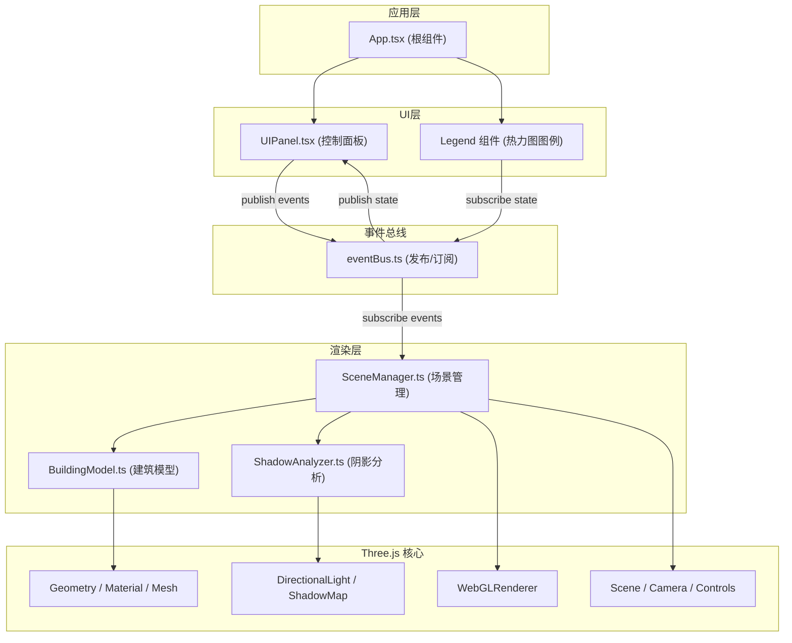

## 1. 架构设计

本应用采用分层解耦架构，通过自定义事件总线实现UI层与渲染层的通信隔离，确保模块职责单一且可独立演进。Three.js负责底层3D渲染，React负责UI交互，两者通过发布/订阅模式松耦合。



## 2. 技术栈说明

- **前端框架**：React@18 + TypeScript
- **3D渲染引擎**：Three.js@0.160 + @react-three/fiber@8 + @react-three/drei@9
- **构建工具**：Vite@5 + @vitejs/plugin-react@4
- **UI调试工具**：dat.gui@0.7（按需启用）
- **状态通信**：自定义EventBus（发布/订阅模式）
- **样式方案**：原生CSS + CSS变量，不引入Tailwind（保持Three.js项目轻量化）

## 3. 目录结构与文件定义

```
auto117/
├── package.json              # 项目依赖与脚本
├── index.html                # 入口HTML
├── vite.config.js            # Vite构建配置
├── tsconfig.json             # TypeScript配置
├── .trae/
│   └── documents/
│       ├── PRD.md
│       └── Tech_Architecture.md
└── src/
    ├── main.tsx              # React入口文件
    ├── App.tsx               # 根组件
    ├── components/
    │   ├── SceneManager.ts   # Three.js场景管理(非React)
    │   ├── BuildingModel.ts  # 建筑模型生成(非React)
    │   ├── ShadowAnalyzer.ts # 阴影分析与热力图(非React)
    │   └── UIPanel.tsx       # React UI控制面板
    └── utils/
        └── eventBus.ts       # 自定义事件总线
```

### 核心文件职责

| 文件 | 职责 | 关键方法/类型 |
|------|------|--------------|
| `SceneManager.ts` | 场景生命周期管理、相机控制、光照更新、渲染循环 | init(), updateSunPosition(), rotateBuilding(), toggleHeatmap(), dispose() |
| `BuildingModel.ts` | 建筑几何体生成、门窗开孔、材质定义 | createBuilding(), updateRotation(), getWallFaces() |
| `ShadowAnalyzer.ts` | 太阳位置计算、阴影配置、热力图数据生成 | calculateSunPosition(), computeHeatmapData(), updateShadowLight() |
| `UIPanel.tsx` | 参数滑块、按钮、数据显示的React组件 | 日期/小时滑块、旋转按钮、热力图开关、数值显示 |
| `eventBus.ts` | 跨模块事件通信 | publish(), subscribe(), unsubscribe() |
| `App.tsx` | 组合3D画布与UI层，管理事件订阅 | 挂载Canvas容器，注册事件处理器 |

## 4. 事件总线定义

### 事件类型

```typescript
// 事件名常量
enum Events {
  DATE_CHANGED = 'date:changed',
  HOUR_CHANGED = 'hour:changed',
  ROTATION_CHANGED = 'rotation:changed',
  HEATMAP_TOGGLED = 'heatmap:toggled',
  SUN_POSITION_UPDATED = 'sun:position:updated',
  HEATMAP_DATA_UPDATED = 'heatmap:data:updated',
}

// 事件数据类型
interface DateChangedEvent { dayOfYear: number; dateText: string; }
interface HourChangedEvent { hour: number; hourText: string; }
interface RotationChangedEvent { rotationY: number; }
interface HeatmapToggledEvent { enabled: boolean; }
interface SunPositionData { altitude: number; azimuth: number; }
interface HeatmapCellData { faceIndex: number; gridX: number; gridY: number; duration: number; }
```

### 通信流程

1. **UI → 渲染层**：UIPanel发布参数变更事件 → SceneManager订阅并更新场景
2. **渲染层 → UI**：SceneManager发布太阳位置/热力图数据 → UIPanel订阅并更新显示

## 5. 核心算法

### 5.1 太阳位置计算

```typescript
// 输入: dayOfYear (1-365), hour (6-18, 支持小数)
// 输出: 太阳高度角(altitude), 方位角(azimuth), 光源位置向量
function calculateSunPosition(dayOfYear: number, hour: number) {
  // 1. 计算太阳赤纬角 (-23.5° ~ +23.5°)
  const declination = 23.45 * Math.sin((360 / 365) * (dayOfYear - 81) * Math.PI / 180);
  
  // 2. 计算时角 (15°/小时, 正午为0)
  const hourAngle = (hour - 12) * 15;
  
  // 3. 纬度设为39.9°(北京, 可配置)
  const latitude = 39.9;
  
  // 4. 高度角计算
  const sinAltitude = Math.sin(latitude * Math.PI / 180) * Math.sin(declination * Math.PI / 180) +
                     Math.cos(latitude * Math.PI / 180) * Math.cos(declination * Math.PI / 180) * Math.cos(hourAngle * Math.PI / 180);
  const altitude = Math.asin(sinAltitude) * 180 / Math.PI;
  
  // 5. 方位角计算(从正南顺时针为正)
  const cosAzimuth = (Math.sin(declination * Math.PI / 180) - Math.sin(latitude * Math.PI / 180) * sinAltitude) /
                    (Math.cos(latitude * Math.PI / 180) * Math.cos(Math.asin(sinAltitude)));
  const azimuth = (hour > 12 ? 1 : -1) * Math.acos(Math.max(-1, Math.min(1, cosAzimuth))) * 180 / Math.PI;
  
  // 6. 转换为Three.js坐标系的光源位置
  const distance = 50;
  const x = distance * Math.cos(altitude * Math.PI / 180) * Math.sin(azimuth * Math.PI / 180);
  const y = distance * Math.sin(altitude * Math.PI / 180);
  const z = distance * Math.cos(altitude * Math.PI / 180) * Math.cos(azimuth * Math.PI / 180);
  
  return { altitude, azimuth, position: new THREE.Vector3(x, y, z) };
}
```

### 5.2 热力图累计时长计算

```typescript
// 对每个立面(东/南/西/北/顶)的16x16网格, 计算6:00-18:00累计日照时长
function computeHeatmapData(dayOfYear: number, buildingRotation: number): HeatmapCellData[][] {
  const faces = ['east', 'south', 'west', 'north', 'roof'];
  const result: HeatmapCellData[][] = [];
  
  faces.forEach((face, faceIndex) => {
    const gridData: HeatmapCellData[] = [];
    const faceNormal = getFaceNormal(face, buildingRotation);
    
    for (let gx = 0; gx < 16; gx++) {
      for (let gy = 0; gy < 16; gy++) {
        let totalMinutes = 0;
        // 每10分钟采样一次, 共72次采样
        for (let t = 6 * 60; t <= 18 * 60; t += 10) {
          const hour = t / 60;
          const sunPos = calculateSunPosition(dayOfYear, hour);
          const sunDirection = sunPos.position.clone().normalize();
          
          // 检查太阳高度角 > 0 (已日出)
          if (sunPos.altitude > 0) {
            // 检查法线与阳光方向的夹角 < 90° (面朝向太阳)
            const dotProduct = faceNormal.dot(sunDirection);
            if (dotProduct > 0) {
              totalMinutes += 10; // 累计10分钟
            }
          }
        }
        gridData.push({ faceIndex, gridX: gx, gridY: gy, duration: Math.min(720, totalMinutes) });
      }
    }
    result.push(gridData);
  });
  return result;
}
```

### 5.3 颜色映射

```typescript
// 蓝(0分钟) → 青(240) → 黄(480) → 红(720分钟)
function getHeatmapColor(duration: number): THREE.Color {
  const t = Math.max(0, Math.min(1, duration / 720));
  const colorStops = [
    { t: 0.00, color: new THREE.Color(0x2563EB) }, // 蓝
    { t: 0.33, color: new THREE.Color(0x06B6D4) }, // 青
    { t: 0.66, color: new THREE.Color(0xEAB308) }, // 黄
    { t: 1.00, color: new THREE.Color(0xDC2626) }, // 红
  ];
  return interpolateColor(colorStops, t);
}
```

## 6. 渲染管线配置

### 阴影配置
- **阴影贴图分辨率**: 2048 x 2048
- **阴影类型**: THREE.PCFSoftShadowMap
- **阴影相机范围**: -30 ~ +30 (覆盖建筑和地面)
- **阴影相机近/远裁剪**: 0.5 ~ 100

### 性能优化
- 热力图计算缓存: 日期/旋转不变时复用缓存数据
- 节流更新: 参数变化后200ms防抖再计算热力图
- 几何体复用: 建筑模型Geometry不重复创建, 仅更新matrix
- LOD: 距离较远时降低热力图网格细分度

## 7. 类型定义

```typescript
// 建筑参数
interface BuildingParams {
  width: number;      // 8
  depth: number;      // 6
  height: number;     // 4
  rotationY: number;  // 0-360
}

// 太阳参数
interface SunParams {
  dayOfYear: number;  // 1-365
  hour: number;       // 6-18
}

// 热力图单元
interface HeatmapCell {
  position: THREE.Vector3;
  normal: THREE.Vector3;
  duration: number;
  color: THREE.Color;
}
```
