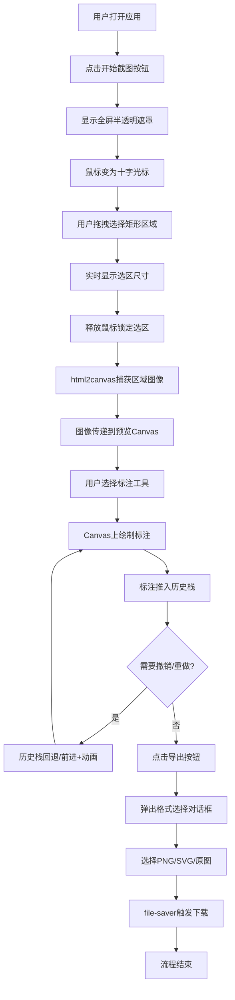

## 1. 产品概述

智能截图与屏幕标注面板应用，解决用户在PPT汇报和文档写作时快速提取并标注截图区域的需求。用户可通过拖拽截取屏幕区域，并在截图上添加箭头、矩形高亮、文字标注和模糊处理，最后导出为PNG或SVG格式。

- **核心价值**：一站式截图+标注工作流，消除系统与截图工具间频繁切换的低效问题
- **目标用户**：需要制作汇报材料、技术文档的职场人士和开发者

## 2. 核心功能

### 2.1 功能模块清单

1. **截图区域选择模块**：全屏半透明遮罩+十字光标+拖拽矩形选区+实时尺寸显示
2. **标注编辑面板模块**：Canvas画布+标注渲染+工具切换
3. **标注工具集模块**：箭头、矩形高亮、文字标签、模糊马赛克、自由画笔
4. **撤销重做模块**：最多20步历史栈，带动画过渡效果
5. **颜色与粗细配置模块**：ChromePicker风格颜色选择器+粗细滑块+实时预览
6. **导出模块**：PNG/SVG/原图三选一导出，自动命名+file-saver下载

### 2.2 页面详情

| 页面名称 | 模块名称 | 功能描述 |
|-----------|-------------|---------------------|
| 主应用页 | 启动入口 | "开始截图"按钮，点击后进入截图模式 |
| 主应用页 | 截图遮罩层 | 全屏半透明遮罩(0.3黑色)，十字光标，拖拽选区 |
| 主应用页 | 左侧预览区(70%) | Canvas画布，显示截图并承载所有标注渲染 |
| 主应用页 | 右侧工具栏(30%) | 五种工具图标+撤销/重做+颜色面板+粗细滑块+导出按钮 |
| 主应用页 | 响应式底栏(<768px) | 工具栏折叠到屏幕底部，单行横向滚动 |
| 主应用页 | Toast提示 | 操作成功/失败提示，3秒自动消失 |

## 3. 核心流程

### 3.1 主用户流程描述

1. 用户打开应用，主界面展示"开始截图"按钮
2. 点击开始截图 → 页面覆盖半透明遮罩，鼠标变为十字光标
3. 用户拖拽选择矩形区域 → 实时显示选区尺寸(宽x高 px)
4. 释放鼠标 → 锁定选区，通过html2canvas捕获该区域图像
5. 图像传递到左侧Canvas预览区，右侧工具栏激活
6. 用户选择标注工具 → 在Canvas上绘制箭头/矩形/文字/模糊/自由画笔
7. 每一步操作推入历史栈，撤销/重做可回退或恢复
8. 点击导出按钮 → 弹出格式选择对话框(PNG/SVG/原图)
9. 选择格式后自动下载，文件名格式 screenshot_YYYYMMDD_HHmmss

### 3.2 核心流程图

## 4. 用户界面设计

### 4.1 设计风格

- **主背景色**：#1e1e2e（深色深蓝灰）
- **面板背景色**：#2a2a3e（稍浅深灰蓝），8px圆角
- **主色调/选中色**：#4a9eff（明亮蓝色）
- **选区边框色**：#1890ff（蓝色虚线 2px）
- **成功提示色**：#52c41a（深绿色）
- **分隔线**：浅灰色 2px
- **矩形高亮**：半透明黄色

### 4.2 视觉元素

- **按钮风格**：Material Design风格图标(unicode或内联SVG)，选中时蓝色背景白色图标，0.15s缩放过渡
- **字体**：现代无衬线字体，等宽用于尺寸数字
- **布局**：Flex两栏布局(70%/30%)，移动端底栏固定
- **圆角**：工具面板8px，按钮4px
- **阴影**：面板轻微投影增加深度感

### 4.3 动画与交互

- **工具切换**：图标0.15s缩放过渡
- **撤销/重做**：标注元素0.1s淡出/淡入
- **Toast提示**：从顶部滑入，3秒后滑出
- **遮罩进入**：0.2s透明度渐入

### 4.4 响应式设计

- **桌面端(≥768px)**：左侧预览70%，右侧工具30%，Flex水平布局
- **移动端(<768px)**：预览区100%，工具栏折叠为底部固定栏，横向滚动工具图标，点击工具弹出配置面板（颜色/粗细）
- **触屏支持**：截图选区拖拽响应touch事件，自动适配view坐标

### 4.5 页面设计概述

| 页面名称 | 模块名称 | UI 元素描述 |
|-----------|-------------|-------------|
| 主应用页 | 启动区 | 居中大按钮，Material图标+文字"开始截图"，悬停上浮效果 |
| 主应用页 | 遮罩层 | 全屏fixed定位，rgba(0,0,0,0.3)，cursor: crosshair |
| 主应用页 | 选区矩形 | 2px dashed #1890ff边框，左上角尺寸标签(白底黑字圆角) |
| 主应用页 | 预览Canvas | 2px浅灰边框，居中显示，max-width 100% |
| 主应用页 | 工具栏 | 5个工具按钮+2个撤销重做按钮，网格排列，间距8px |
| 主应用页 | 颜色面板 | 左上12px圆点预览当前色，ChromePicker嵌入或弹出 |
| 主应用页 | 粗细滑块 | 1-8px范围，步长1，当前值数字显示 |
| 主应用页 | 导出对话框 | 模态框，三个单选卡片式选项，确认/取消按钮 |
| 主应用页 | Toast | fixed定位top:16px水平居中，深绿底白字圆角8px |
