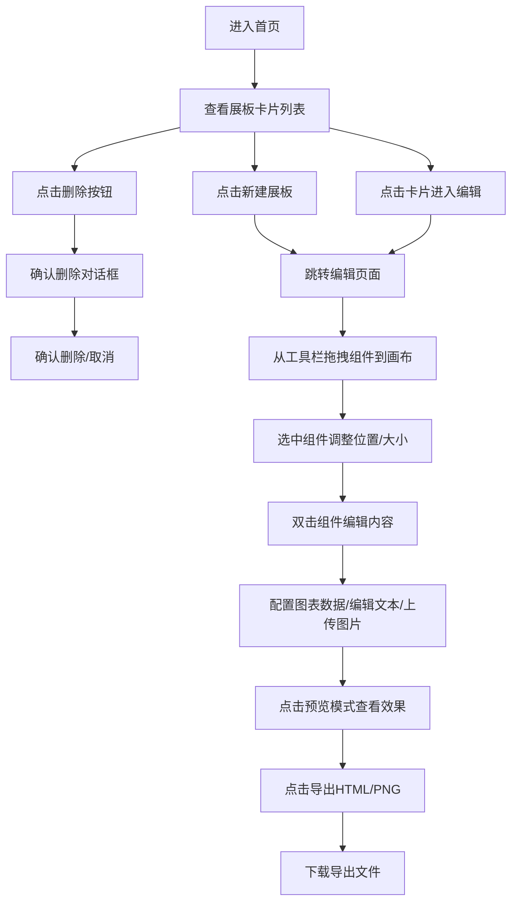

## 1. 产品概述

动态信息图表展板Web应用，帮助用户在汇报或教学场景中创建可交互的多组件数据展示页面。用户可以自由组合图表、文本和媒体素材，生成专业的可视化展板，并支持导出为独立HTML或图片。

- 核心价值：降低数据可视化制作门槛，提供拖拽式编辑体验，支持多种图表类型和导出格式
- 目标用户：教师、数据分析师、产品经理、汇报人员等需要制作数据展示的用户

## 2. 核心功能

### 2.1 功能模块

1. **首页（展板管理）**：卡片墙展示所有展板，支持创建新展板、编辑、删除操作
2. **编辑器页面**：三栏布局（左侧工具栏、中间画布、右侧属性面板），支持组件拖拽编辑
3. **图表渲染模块**：使用D3.js实现折线图、柱状图、饼图的自定义绘制和动画效果
4. **导出模块**：支持导出为独立HTML文件和PNG图片

### 2.2 页面详情

| 页面名称 | 模块名称 | 功能描述 |
|-----------|-------------|---------------------|
| 首页 | 卡片墙展示 | 以卡片形式展示所有展板，包含缩略图、标题、编辑时间、组件数量，支持随机柔和背景色、悬停动画、删除确认 |
| 首页 | 新建展板按钮 | 点击创建新的空白展板，自动跳转至编辑页面 |
| 编辑器 | 左侧工具栏 | 可折叠，展示图表、文本、图片三种组件类型，支持拖拽到画布添加 |
| 编辑器 | 中间画布 | 瀑布流布局（960px宽，居中），支持组件拖拽、选中、调整大小、吸附对齐、右键菜单 |
| 编辑器 | 右侧属性面板 | 显示选中组件的位置、尺寸、主题色等属性，支持输入修改 |
| 编辑器 | 顶部标题区 | 支持自定义展板标题和副标题，字体大小可调 |
| 编辑器 | 预览模式 | 隐藏编辑边框和手柄，纯展示模式，保留滚动和图表悬浮交互 |
| 编辑器 | 导出功能 | 导出HTML（样式脚本内嵌）和PNG（html2canvas截图），按钮带缩放动画 |

## 3. 核心流程

## 4. 用户界面设计

### 4.1 设计风格

- **主色调**：#4A90D9（深蓝），强调色 #F5A623（暖橙）
- **文本颜色**：默认 #333（深灰），次要文本 #888
- **毛玻璃效果**：半透明白色背景，背景模糊 10px
- **交互反馈**：统一 0.2 秒缓动过渡，点击缩放 0.97
- **边框样式**：选中组件显示蓝色虚线 2px 边框，四角拖拽手柄
- **卡片样式**：圆角 12px，四种柔和背景色随机分配，悬停抬起 6px 加深阴影

### 4.2 页面设计概述

| 页面名称 | 模块名称 | UI 元素 |
|-----------|-------------|-------------|
| 首页 | 卡片墙 | 网格布局卡片、柔和背景色、圆角12px、悬停过渡动画、删除确认对话框 |
| 编辑器 | 工具栏 | 可折叠侧边栏、组件图标列表、拖拽效果 |
| 编辑器 | 画布区域 | 960px固定宽度居中、组件拖拽、吸附对齐辅助线、右键菜单、0.4秒入场动画 |
| 编辑器 | 属性面板 | 数值输入框、颜色选择器、实时更新 |
| 编辑器 | 顶部操作区 | 标题输入、副标题输入、字体大小调节、预览/导出按钮 |

### 4.3 响应性

- 桌面端优先设计，主画布固定宽度 960px 居中
- 工具栏和属性面板可折叠以适应较小屏幕
- 触控优化：按钮最小尺寸 44x44px，拖拽手势支持

### 4.4 动效设计

- 组件入场：0.4秒从底部上升 + 透明度从0到1
- 导出按钮：点击时 0.2秒缩放弹入动画
- 卡片悬停：0.25秒过渡，向上抬起 6px，阴影加深
- 拖拽吸附：0.15秒弹性缓冲，显示对齐辅助线
- 饼图悬停：扇区向外弹出 5px，显示信息提示
