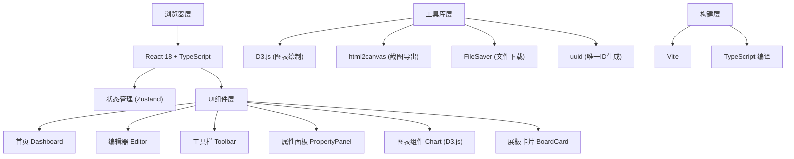

## 1. 架构设计



## 2. 技术描述

- **前端框架**：React 18 + TypeScript
- **构建工具**：Vite 5.x
- **状态管理**：Zustand（轻量级状态管理）
- **图表库**：D3.js 7.x（自定义图表绘制和动画）
- **导出工具**：html2canvas + file-saver
- **图标库**：lucide-react
- **样式方案**：Tailwind CSS 3.x + CSS 变量
- **ID生成**：uuid
- **数据存储**：localStorage（本地存储展板数据）

## 3. 路由定义

| 路由 | 页面 | 说明 |
|-------|------|------|
| `/` | 首页 Dashboard | 展板卡片列表，管理所有展板 |
| `/editor/:boardId` | 编辑器 Editor | 展板编辑页面，包含工具栏、画布、属性面板 |
| `/preview/:boardId` | 预览页 Preview | 展板纯展示模式（可选） |

## 4. 数据模型

### 4.1 核心类型定义

```typescript
// 组件类型
type ComponentType = 'line-chart' | 'bar-chart' | 'pie-chart' | 'text' | 'image';

// 基础组件接口
interface BoardComponent {
  id: string;
  type: ComponentType;
  x: number;
  y: number;
  width: number;
  height: number;
  zIndex: number;
  themeColor: string;
}

// 图表组件数据
interface LineChartData {
  labels: string[];
  values: number[];
  title: string;
}

interface BarChartData {
  labels: string[];
  series: { name: string; values: number[]; color: string }[];
  title: string;
}

interface PieChartData {
  labels: string[];
  values: number[];
  colors: string[];
  title: string;
}

// 文本组件
interface TextComponent extends BoardComponent {
  type: 'text';
  content: string;
  fontSize: number;
  fontWeight: 'normal' | 'bold';
}

// 图片组件
interface ImageComponent extends BoardComponent {
  type: 'image';
  src: string;
  alt: string;
}

// 展板数据
interface Board {
  id: string;
  title: string;
  subtitle: string;
  titleFontSize: number;
  subtitleFontSize: number;
  components: BoardComponent[];
  createdAt: number;
  updatedAt: number;
  backgroundColor: string;
}
```

### 4.2 预设色板

```typescript
const CHART_COLORS = [
  '#4A90D9', '#F5A623', '#7ED321', '#D0021B', '#9013FE',
  '#50E3C2', '#BD10E0', '#F8E71C', '#B8E986', '#4A4A4A'
];

const CARD_BACKGROUNDS = ['#e3f2fd', '#fce4ec', '#e8f5e9', '#fff3e0'];
```

## 5. 状态管理

### 5.1 Store 结构

```typescript
interface AppState {
  boards: Board[];
  currentBoardId: string | null;
  selectedComponentId: string | null;
  isPreviewMode: boolean;
  // Actions
  loadBoards: () => void;
  createBoard: () => string;
  deleteBoard: (id: string) => void;
  updateBoard: (id: string, updates: Partial<Board>) => void;
  setCurrentBoard: (id: string | null) => void;
  selectComponent: (id: string | null) => void;
  addComponent: (component: Omit<BoardComponent, 'id'>) => void;
  updateComponent: (id: string, updates: Partial<BoardComponent>) => void;
  deleteComponent: (id: string) => void;
  duplicateComponent: (id: string) => void;
  bringToFront: (id: string) => void;
  togglePreviewMode: () => void;
}
```

## 6. 项目文件结构

```
.
├── index.html
├── package.json
├── vite.config.js
├── tsconfig.json
├── tailwind.config.js
├── postcss.config.js
└── src/
    ├── main.tsx
    ├── App.tsx
    ├── index.css
    ├── store/
    │   └── useStore.ts
    ├── types/
    │   └── index.ts
    ├── utils/
    │   ├── chartData.ts
    │   ├── export.ts
    │   └── storage.ts
    ├── hooks/
    │   ├── useDrag.ts
    │   ├── useResize.ts
    │   └── useSnapping.ts
    ├── components/
    │   ├── Dashboard/
    │   │   ├── index.tsx
    │   │   └── BoardCard.tsx
    │   ├── Editor/
    │   │   ├── index.tsx
    │   │   ├── Canvas.tsx
    │   │   ├── Toolbar.tsx
    │   │   └── PropertyPanel.tsx
    │   ├── Chart/
    │   │   ├── LineChart.tsx
    │   │   ├── BarChart.tsx
    │   │   └── PieChart.tsx
    │   └── common/
    │       ├── ContextMenu.tsx
    │       ├── ConfirmDialog.tsx
    │       └── ExportButton.tsx
    └── pages/
        ├── DashboardPage.tsx
        └── EditorPage.tsx
```

## 7. 关键技术实现

### 7.1 拖拽与吸附
- 使用 Pointer Events 实现跨设备拖拽
- 计算组件边缘距离，10px 范围内触发吸附
- 0.15 秒弹性缓冲动画，使用 CSS transition 实现

### 7.2 D3.js 图表绘制
- 折线图：d3.line().curve(d3.curveMonotoneX) 平滑曲线，d3.area 实现渐变填充
- 柱状图：d3.scaleBand 分组比例尺，柱子顶端 text 标签
- 饼图：d3.pie + d3.arc，鼠标事件实现扇区弹出效果
- 入场动画：d3.transition().duration(400).ease(d3.easeCubicOut)

### 7.3 导出功能
- HTML 导出：序列化 DOM + 内联所有 CSS 样式和 JS 脚本
- PNG 导出：html2canvas 截图整个画布区域，FileSaver 下载
