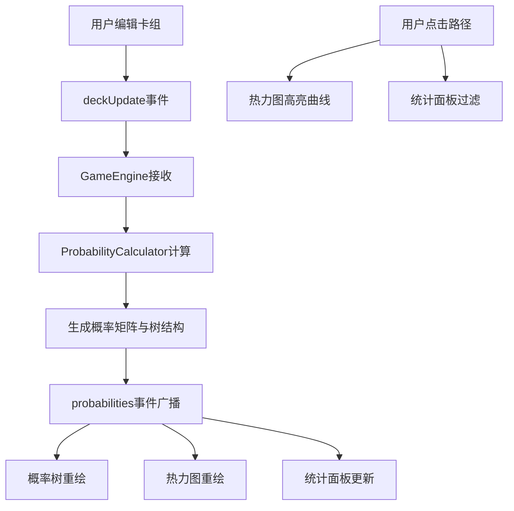

## 1. 产品概述
卡牌对战概率可视化沙盒应用，帮助玩家直观理解卡组中每张卡牌在不同回合被抽取的概率，以及出牌策略对后续手牌概率链的影响。
- 目标用户：即时对战卡牌游戏玩家、卡牌游戏策略研究者
- 产品价值：通过可视化手段降低卡牌概率学习门槛，辅助卡组构建与出牌决策优化

## 2. 核心功能

### 2.1 功能模块
1. **卡组编辑模块**：10张卡牌的费用/攻击力编辑、拖拽排序
2. **抽牌模拟模块**：10回合不放回抽牌的概率计算引擎
3. **概率树可视化模块**：D3.js渲染的概率路径树图
4. **热力图可视化模块**：回合×卡牌ID的概率热力矩阵
5. **统计摘要模块**：期望回合数、首抽分布柱状图

### 2.2 页面详情
| 页面名称 | 模块名称 | 功能描述 |
|-----------|-------------|---------------------|
| 主页面 | 卡组编辑器 | 10张卡牌的费用/攻击力下拉选择、鼠标拖拽排序（半透明影子+弹性吸附动画） |
| 主页面 | 概率树图 | 横轴回合、纵轴组合、节点大小表概率、悬停高亮路径 |
| 主页面 | 热力图 | 10×10矩阵，蓝→红渐变、悬停放大+tooltip、路径联动高亮 |
| 主页面 | 统计面板 | 平均抽到每卡的回合数、首抽回合分布柱状图 |

## 3. 核心流程
用户编辑卡组（修改属性或排序）→ 事件总线触发deckUpdate → GameEngine接收并调用ProbabilityCalculator → 计算生成10×10概率矩阵与概率树数据 → 通过probabilities事件发送给UI组件 → 各可视化组件联动渲染更新 → 用户点击概率树路径 → 热力图与统计面板过滤显示对应路径数据

## 4. 用户界面设计

### 4.1 设计风格
- 主背景色：#1a1a2e（深蓝黑）
- 卡片背景：#16213e（深蓝紫）
- 强调色：#e94560（珊瑚红）
- 辅助色：#0f3460（tooltip背景）、白色/橙色渐变（概率节点）
- 字体：显示字体用Space Grotesk，正文用Segoe UI，均采用深色对比
- 卡片圆角12px，卡牌间距8px，面板淡入动画（0.5s opacity+translateY）
- 交互：节点悬停0.3s过渡放大1.2倍，热力单元格悬停1.15倍缩放

### 4.2 页面设计概览
| 页面名称 | 模块名称 | UI元素 |
|-----------|-------------|-------------|
| 主页面 | 卡组编辑器 | 左栏320px宽，竖向卡片列表，费用/攻击力下拉框，拖拽把手 |
| 主页面 | 概率树图 | 右栏上部60%高，水平滚动，D3 SVG节点+连线，带概率标注 |
| 主页面 | 热力图 | 右栏中部20%高，CSS Grid矩阵，悬停tooltip |
| 主页面 | 统计面板 | 右栏下部20%高，数字摘要+水平柱状图 |

### 4.3 响应式
- Desktop优先（>900px）：左右双栏布局
- 移动端（≤900px）：左侧面板折叠为顶部水平滑动条，可视化区域占满宽度
- 触控优化：拖拽排序支持触摸事件，点击区域≥44px

## 5. 性能要求
- 10! ≈ 3.6M排列全量计算≤500ms，超时自动降级为10万次随机采样（误差±2%）
- D3动画帧率≥30fps
- 初次渲染≤2s
