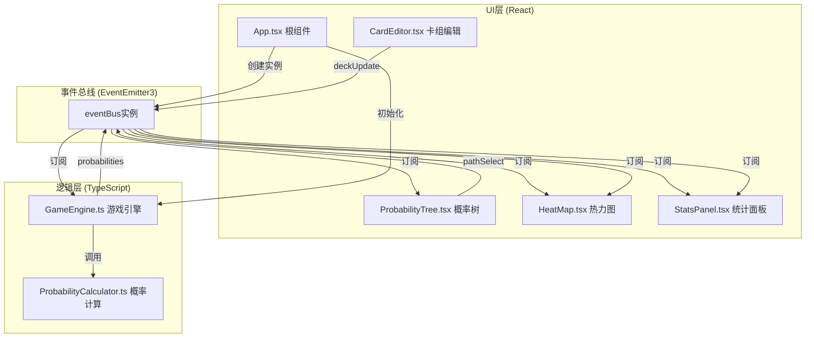

## 1. 架构设计



## 2. 技术描述
- 前端框架：React 18 + TypeScript（严格模式）
- 构建工具：Vite + @vitejs/plugin-react
- 事件通信：eventemitter3
- 可视化库：d3 v7
- 状态管理：React useState/useEffect + 事件总线解耦
- 样式方案：原生CSS（CSS Modules可选），CSS变量管理主题色
- 拖拽实现：HTML5 Drag and Drop API

## 3. 项目文件结构与调用关系

```
项目根目录/
├── package.json                          # 依赖与脚本配置
├── vite.config.js                        # Vite+React插件+端口配置
├── tsconfig.json                         # TS严格模式+ES模块
├── index.html                            # 入口HTML, 含#root挂载点
└── src/
    ├── App.tsx                           # [UI根] 创建eventBus和GameEngine, 布局, 订阅probabilities
    ├── GameEngine.ts                     # [逻辑核心] 管理卡组状态, 订阅draw/deckUpdate, 调用PC, 广播probabilities
    ├── ProbabilityCalculator.ts          # [工具模块] 被GE调用, 生成排列组合/采样, 返回概率矩阵+树
    ├── types.ts                          # [类型声明] Card/ProbMatrix/TreeNode等共享类型
    └── components/
        ├── CardEditor.tsx                # [UI组件] 渲染10卡列表, 编辑属性, 拖拽排序, 发送deckUpdate
        ├── ProbabilityTree.tsx           # [UI组件] D3渲染树图, 悬停高亮, 点击发送pathSelect事件
        ├── HeatMap.tsx                   # [UI组件] 渲染10x10热力矩阵, 悬停tooltip, 监听pathSelect高亮
        └── StatsPanel.tsx                # [UI组件] 计算期望回合数+首抽分布, 监听pathSelect过滤
```

**调用关系与数据流向：**
1. App.tsx → 实例化 EventEmitter → 实例化 GameEngine(bus) → 订阅 bus:probabilities → 分发数据给子组件
2. CardEditor.tsx → 用户修改/拖拽 → 构造 Card[10] → bus.emit('deckUpdate', cards)
3. GameEngine.ts → bus.on('deckUpdate') → 保存cards → 调用 ProbabilityCalculator.compute(cards, 10)
4. ProbabilityCalculator.ts → compute() → 返回 { matrix: number[10][10], tree: TreeNode[], usedSampling: boolean }
5. GameEngine.ts → bus.emit('probabilities', result)
6. ProbabilityTree.tsx → 接收 tree → D3 SVG渲染 → 节点点击 → bus.emit('pathSelect', path: number[])
7. HeatMap.tsx → 接收 matrix → Grid渲染 → bus.on('pathSelect') → 高亮对应行列
8. StatsPanel.tsx → 接收 matrix → 计算统计 → bus.on('pathSelect') → 过滤后重算

## 4. 核心数据模型 (types.ts)

```typescript
// 单张卡牌定义
export interface Card {
  id: number;           // 0-9 固定索引
  name: string;         // "卡牌 #id"
  cost: number;         // 1-10 费用
  attack: number;       // 1-10 攻击力
}

// 概率矩阵: matrix[round][cardId] = probability
export type ProbabilityMatrix = number[][];  // 10x10

// 概率树节点
export interface TreeNode {
  round: number;           // 回合号 0-9 (0为根)
  cardId: number | null;   // 本回合抽到的卡牌, 根为null
  probability: number;     // 到达该节点的累计概率
  parentIndex: number;     // 父节点在同层数组中的索引, 根为-1
  pathSoFar: number[];     // 已抽卡id序列 (不含根)
}

// 概率树按层分组
export type ProbabilityTree = TreeNode[][];  // 长度11, 每层为该回合所有组合节点

// 完整计算结果
export interface ProbabilityResult {
  matrix: ProbabilityMatrix;
  tree: ProbabilityTree;
  usedSampling: boolean;    // 是否启用了采样降级
  sampleCount?: number;     // 采样次数(如启用)
  computeTimeMs: number;    // 实际计算耗时
}

// 事件总线协议
export interface EventBusMap {
  deckUpdate: (cards: Card[]) => void;
  draw: () => void;
  probabilities: (result: ProbabilityResult) => void;
  pathSelect: (path: number[] | null) => void;  // null表示取消选择
}
```

## 5. 关键算法设计 (ProbabilityCalculator)

**策略：先全量枚举，超时自动降级采样**

```
compute(cards, rounds=10):
  start = now()
  // 尝试全量枚举: 逐层构建概率树 (动态规划, 每节点记录组合状态)
  // 每层节点数: C(10, round) × round! = P(10, round)
  // 累计总数: Σ(k=1..10) P(10,k) ≈ 9.8M, 但我们可以在500ms内增量构建
  try:
    tree = buildTreeFull(cards, rounds, deadline=start+500)
    matrix = extractMatrix(tree, rounds, 10)
    return { matrix, tree, usedSampling:false, ... }
  catch DeadlineExceeded:
    // 降级: 蒙特卡洛采样 100,000 次
    samples = []
    for i in 1..100000:
      path = shuffle(cards.ids).slice(0, rounds)
      samples.push(path)
    (matrix, treeApprox) = aggregateSamples(samples, rounds, 10)
    return { matrix, tree: treeApprox, usedSampling:true, sampleCount:100000, ... }

buildTreeFull(cards, rounds, deadline):
  // 第0层: 1个根节点, path=[], prob=1.0
  layers = [[ root(round=0, prob=1.0, parent=-1, path=[]) ]]
  for r in 1..rounds:
    prev = layers[r-1]
    cur = []
    for each node in prev:
      drawn = set(node.pathSoFar)
      remain = [cid for cid in 0..9 if cid ∉ drawn]
      transProb = 1 / remain.length
      for each cid in remain:
        if now() > deadline: throw DeadlineExceeded
        child = TreeNode(
          round=r,
          cardId=cid,
          probability = node.probability * transProb,
          parentIndex = indexOf(node in prev),
          pathSoFar = [...node.pathSoFar, cid]
        )
        cur.push(child)
    layers.push(cur)
  return layers

extractMatrix(layers, rounds, nCards):
  mat = zeros(rounds, nCards)
  for r in 1..rounds:
    for node in layers[r]:
      mat[r-1][node.cardId!] += node.probability
  return mat
```

## 6. 性能优化要点
1. **概率树剪枝**：实际构建时每节点记录pathSoFar为Set转数组，避免重复计算；使用对象池减少GC
2. **采样收敛性**：10万次独立洗牌对10×10矩阵的边际概率误差 ≤ 2/√100000 ≈ 0.63% < 2%
3. **D3渲染**：概率树每层节点众多，使用canvas或SVG viewBox缩放；只有悬停的路径做DOM动画
4. **事件节流**：拖拽排序时使用 requestAnimationFrame 节流 deckUpdate 发射
5. **React优化**：用 memo 包装子组件，避免无关重渲染
