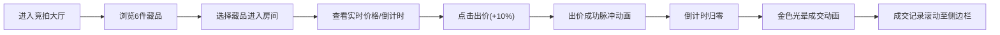

## 1. 产品概述
基于WebSocket的实时在线竞拍平台，模拟拍卖会现场氛围，让用户实时感受多件藏品同时竞拍的紧张刺激感。
- 解决传统列表式出价不直观的问题，提供沉浸式竞拍体验
- 目标用户：收藏爱好者、竞拍参与者
- 市场价值：提升用户参与度和竞拍活跃度，营造高端拍卖会氛围

## 2. 核心功能

### 2.1 用户角色
| 角色 | 注册方式 | 核心权限 |
|------|----------|----------|
| 竞拍用户 | 直接访问 | 浏览藏品、进入竞拍房间、手动出价、查看竞拍历史 |
| 虚拟竞拍者 | 后端模拟 | 自动随机出价，模拟真实竞拍场景 |

### 2.2 功能模块
1. **竞拍大厅**：展示6件虚拟藏品，响应式网格布局，显示当前价和倒计时
2. **竞拍房间**：实时价格显示、出价历史、出价按钮、倒计时
3. **成交记录侧边栏**：滚动显示所有成交记录，淡入动画效果
4. **虚拟竞拍者系统**：5个AI竞拍者定时随机出价

### 2.3 页面详情
| 页面名称 | 模块名称 | 功能描述 |
|---------|----------|----------|
| 竞拍大厅 | 藏品卡片网格 | 展示6件藏品，悬停放大效果，点击进入竞拍房间 |
| 竞拍大厅 | 藏品倒计时 | 独立30秒倒计时，最后5秒红色闪烁 |
| 竞拍房间 | 实时价格面板 | 显示当前价、起拍价、出价差价渐变条 |
| 竞拍房间 | 出价历史列表 | 滚动显示所有出价记录，用户出价绿色高亮 |
| 竞拍房间 | 出价按钮 | 每次出价溢价10%向上取整，点击出价成功脉冲动画 |
| 成交记录 | 侧边栏滚动条 | 实时显示成交记录，新记录淡入效果 |

## 3. 核心流程
用户进入竞拍大厅 → 浏览藏品列表 → 选择感兴趣的藏品进入竞拍房间 → 查看实时价格和出价历史 → 点击出价按钮参与竞拍 → 倒计时结束藏品成交 → 成交记录滚动到侧边栏

## 4. 用户界面设计
### 4.1 设计风格
- 主色调：深蓝色 #1a202c，营造高端沉稳氛围
- 点缀色：金色 #ecc94b，突出重要信息和成交效果
- 按钮风格：圆角设计，悬停金色发光效果
- 字体：等宽字体用于倒计时，优雅衬线字体用于藏品名称
- 布局：卡片式布局，阴影层次分明
- 图标风格：简洁线性图标，金色点缀

### 4.2 页面设计概述
| 页面名称 | 模块名称 | UI元素 |
|---------|----------|--------|
| 竞拍大厅 | 藏品卡片 | 图片占位、名称、起拍价、当前价、倒计时、悬停放大阴影(transition 0.3s) |
| 竞拍房间 | 价格面板 | 大字号当前价、金色强调、差价50px内绿色渐变条 |
| 竞拍房间 | 出价历史 | 头像、金额、时间戳，用户出价绿色背景 |
| 竞拍房间 | 成交动画 | 金色光晕从中心扩散(scale 0→1.2，0.3秒，透明度消失) |
| 侧边栏 | 成交记录 | 滚动列表，新记录底部插入淡入，自动滚动到底 |

### 4.3 响应性
- Desktop-first设计，优先保证桌面端体验
- 竞拍大厅网格：大屏3列，中屏2列，小屏1列自适应
- 侧边栏在移动端可折叠收起
- 触摸优化：按钮最小48px，确保移动端可点击

### 4.4 动画效果
- 出价成功：屏幕中央脉冲动画，1秒后消失
- 倒计时最后5秒：红色闪烁效果
- 藏品成交：金色光晕扩散动画 + 页面闪烁
- 新出价记录：底部插入向上滑动淡入
- 悬停效果：卡片放大、阴影加深(0.3s ease)
