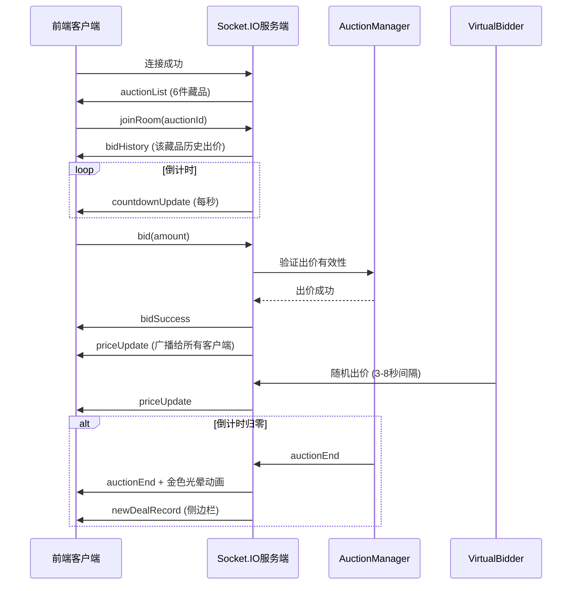

## 1. 架构设计

```mermaid
graph TD
    subgraph "前端 (React + TypeScript)"
        A["main.tsx 入口"] --> B["Socket.IO 客户端连接"]
        B --> C["App.tsx 路由管理"]
        C --> D["AuctionHall.tsx 竞拍大厅"]
        C --> E["AuctionRoom.tsx 竞拍房间"]
        E --> F["BidHistory.tsx 出价历史"]
        E --> G["DealRecord.tsx 成交记录"]
    end
    
    subgraph "后端 (Node.js + Express + Socket.IO)"
        H["server.ts 服务入口"] --> I["Socket.IO 服务端"]
        I --> J["auctionManager.ts 竞拍管理器"]
        J --> K["VirtualBidder.ts 虚拟竞拍者"]
        J --> L["房间状态管理"]
    end
    
    subgraph "数据流"
        M["客户端出价 emit('bid')"] --> N["服务端验证 & 更新价格"]
        N --> O["广播 emit('priceUpdate')"]
        O --> P["前端状态更新 UI 渲染"]
        Q["倒计时结束"] --> R["成交 emit('auctionEnd')"]
        R --> S["成交记录广播"]
    end
```



## 2. 技术描述
- 前端：React@18 + TypeScript + Vite + Socket.IO Client
- 后端：Node.js + Express@4 + Socket.IO + TypeScript
- 状态管理：React useState/useEffect 本地状态 + Socket.IO 实时同步
- 构建工具：Vite 5.x
- 包管理器：npm
- 样式：CSS Modules / Styled Components，纯CSS动画
- 额外依赖：uuid（唯一ID生成）

## 3. 目录结构
```
project/
├── package.json          # 项目依赖和脚本
├── vite.config.js        # Vite构建配置，代理socket.io
├── tsconfig.json         # TypeScript严格模式配置
├── index.html            # HTML入口文件
├── server.ts             # 后端服务入口
├── src/
│   ├── main.tsx          # 前端入口
│   ├── App.tsx           # 根组件，路由管理
│   ├── types/
│   │   └── auction.ts    # 类型定义
│   ├── components/
│   │   ├── AuctionHall.tsx    # 竞拍大厅
│   │   ├── AuctionRoom.tsx    # 竞拍房间
│   │   ├── BidHistory.tsx     # 出价历史
│   │   ├── DealRecords.tsx    # 成交记录侧边栏
│   │   ├── AuctionCard.tsx    # 藏品卡片
│   │   └── Toast.tsx          # 提示动画组件
│   ├── hooks/
│   │   └── useSocket.ts       # Socket连接hook
│   └── utils/
│       └── price.ts           # 价格计算工具
└── server/
    ├── types.ts           # 后端类型
    ├── auctionManager.ts  # 竞拍管理器
    └── virtualBidder.ts   # 虚拟竞拍者
```

## 4. Socket.IO 事件定义

### 客户端发送事件
| 事件名 | 参数 | 说明 |
|--------|------|------|
| `joinRoom` | `{ auctionId: string }` | 加入竞拍房间 |
| `leaveRoom` | `{ auctionId: string }` | 离开竞拍房间 |
| `bid` | `{ auctionId: string, amount: number, bidderId: string, bidderName: string }` | 出价 |

### 服务端广播事件
| 事件名 | 参数 | 说明 |
|--------|------|------|
| `auctionList` | `Auction[]` | 初始竞拍列表 |
| `priceUpdate` | `{ auctionId: string, currentPrice: number, lastBid: Bid }` | 价格更新 |
| `bidHistory` | `{ auctionId: string, bids: Bid[] }` | 出价历史 |
| `countdownUpdate` | `{ auctionId: string, remaining: number }` | 倒计时更新 |
| `auctionEnd` | `{ auctionId: string, winner: Bidder, finalPrice: number }` | 竞拍结束 |
| `newDealRecord` | `DealRecord` | 新成交记录 |
| `bidSuccess` | `{ auctionId: string }` | 出价成功确认 |

## 5. 数据模型

### 5.1 类型定义
```typescript
// 竞拍者
interface Bidder {
  id: string;
  name: string;
  avatar: string;
  isUser?: boolean;
}

// 出价记录
interface Bid {
  id: string;
  auctionId: string;
  bidder: Bidder;
  amount: number;
  timestamp: number;
}

// 竞拍品
interface Auction {
  id: string;
  name: string;
  image: string;
  startPrice: number;
  currentPrice: number;
  startTime: number;
  endTime: number;
  remainingTime: number;
  status: 'active' | 'ended';
  winner?: Bidder;
  bids: Bid[];
}

// 成交记录
interface DealRecord {
  id: string;
  auctionId: string;
  auctionName: string;
  winner: Bidder;
  price: number;
  timestamp: number;
}
```

### 5.2 数据流向图


## 6. 性能优化要点
1. **Socket.IO 优化**：使用 `volatile` 事件发送非关键数据，启用压缩
2. **React 优化**：使用 `useMemo`/`useCallback` 避免不必要重渲染，列表使用 `key`
3. **动画性能**：使用 CSS `transform` 和 `opacity` 动画，触发 GPU 加速
4. **状态更新**：批量处理状态更新，减少 render 次数
5. **延迟保证**：Socket.IO 消息到 UI 更新 < 200ms，使用 `requestAnimationFrame` 调度渲染
