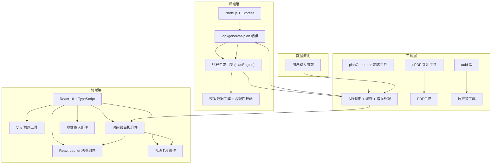
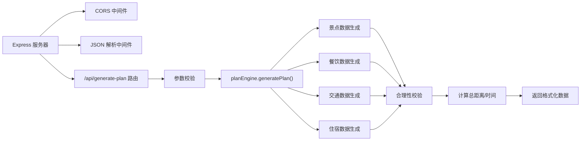
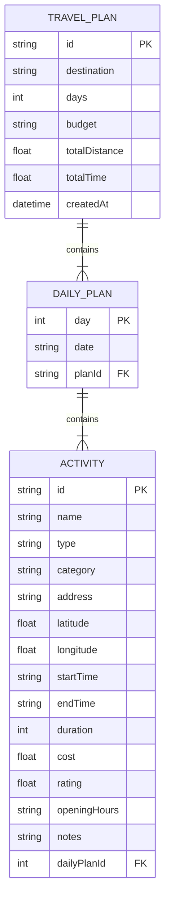

## 1. 架构设计



## 2. 技术选型

- **前端框架**：React 18 + TypeScript 5
- **构建工具**：Vite 5
- **状态管理**：React useState/useReducer（轻量级场景，无需Redux）
- **地图库**：Leaflet 1.9 + react-leaflet 4
- **样式方案**：原生CSS + CSS Variables（配合设计系统）
- **后端框架**：Express 4
- **PDF导出**：jsPDF 2
- **唯一标识**：uuid 9
- **HTTP客户端**：原生 fetch API
- **代理配置**：Vite 内置代理 /api → 后端服务

## 3. 路由定义

| 路由 | 用途 |
|-----|------|
| / | 应用主页面，包含参数输入和行程展示 |
| /api/generate-plan | POST 请求，生成行程计划 |
| /share/{shortCode} | 分享链接访问（前端路由处理） |

## 4. API 定义

### 4.1 生成行程接口

**请求类型**：POST /api/generate-plan

**请求体**：
```typescript
interface PlanRequest {
  destination: string;      // 目的地城市
  days: number;            // 旅行天数 (1-7)
  budget: 'economy' | 'standard' | 'luxury';  // 预算等级
  interests: ('nature' | 'culture' | 'food')[];  // 兴趣偏好
}
```

**响应体**：
```typescript
interface PlanResponse {
  success: boolean;
  data: TravelPlan;
  message?: string;
}

interface TravelPlan {
  id: string;
  destination: string;
  days: number;
  budget: string;
  totalDistance: number;   // 总距离(公里)
  totalTime: number;       // 总耗时(分钟)
  dailyPlans: DailyPlan[];
}

interface DailyPlan {
  day: number;
  date: string;
  activities: Activity[];
}

interface Activity {
  id: string;
  name: string;
  type: 'morning' | 'afternoon' | 'evening';
  category: 'attraction' | 'restaurant' | 'transport' | 'hotel';
  address: string;
  coordinates: [number, number];  // [lat, lng]
  startTime: string;
  endTime: string;
  duration: number;     // 分钟
  cost: number;         // 预计花费
  rating: number;       // 用户评分 0-5
  openingHours?: string;
  notes?: string;
  transportToNext?: {
    mode: 'walk' | 'drive' | 'transit';
    duration: number;   // 分钟
    distance: number;   // 公里
  };
}
```

## 5. 服务器架构



## 6. 数据模型

### 6.1 数据模型定义



### 6.2 核心文件结构

```
project-root/
├── package.json
├── index.html
├── vite.config.js
├── tsconfig.json
├── src/
│   ├── frontend/
│   │   ├── main.tsx              # React入口
│   │   ├── App.tsx               # 主应用组件
│   │   ├── types/
│   │   │   └── index.ts          # 类型定义
│   │   ├── components/
│   │   │   ├── TimelinePanel.tsx # 时间线面板
│   │   │   ├── MapPanel.tsx      # 地图面板
│   │   │   ├── ActivityCard.tsx  # 活动卡片
│   │   │   ├── InputForm.tsx     # 参数输入表单
│   │   │   └── AddActivityModal.tsx # 添加活动弹窗
│   │   ├── utils/
│   │   │   ├── planGenerator.ts  # 行程生成工具
│   │   │   └── pdfExporter.ts    # PDF导出工具
│   │   └── styles/
│   │       └── index.css         # 全局样式
│   └── backend/
│       ├── server.ts             # Express服务
│       └── planEngine.ts         # 行程生成引擎
```

## 7. 性能优化

1. **行程生成缓存**：相同参数的请求缓存结果5分钟，使用planGenerator中的Map缓存
2. **模拟延迟**：后端响应延迟1-2秒，模拟真实API
3. **地图懒加载**：地图面板组件使用React.lazy懒加载
4. **防抖处理**：参数输入时防抖300ms，避免频繁请求
5. **虚拟滚动**：活动较多时考虑虚拟滚动（可选优化）
6. **CSS动画优化**：使用transform和opacity属性，触发GPU加速
