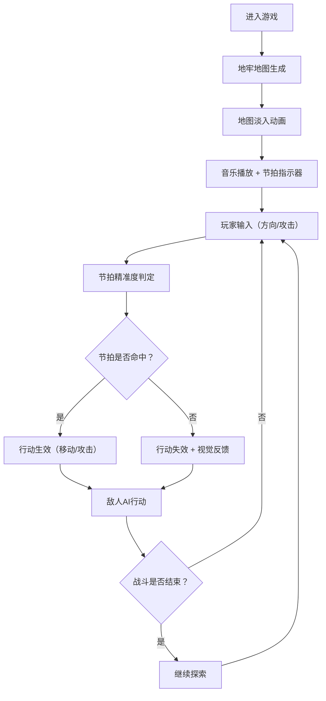

## 1. 产品概述

节奏地牢是一款将音乐节奏与地牢探索相结合的网页小游戏。玩家需要跟随背景音乐的节拍来移动和攻击，踩准节拍才能造成伤害，否则行动会失效。游戏融合了策略性、节奏感和探索乐趣，适合所有年龄段的休闲游戏玩家。

- 核心玩法：网格化地牢探索 + 节拍同步行动机制
- 目标用户：喜欢音乐节奏游戏和Roguelike地牢探索的玩家
- 产品价值：创新的游戏机制，将音乐和探索两种元素深度融合

## 2. 核心功能

### 2.1 用户角色

| 角色 | 注册方式 | 核心权限 |
|------|----------|----------|
| 玩家 | 无需注册，直接进入 | 开始游戏、移动、攻击、查看分数 |

### 2.2 功能模块

1. **主游戏场景**：地牢地图生成、玩家控制、敌人生成、战斗系统
2. **节奏系统**：音乐节拍解析、节拍指示器、节拍判定窗口
3. **战斗系统**：攻击判定、伤害计算、粒子特效、连击系统
4. **UI系统**：分数显示、连击计数、节拍指示器、游戏状态

### 2.3 页面详情

| 页面名称 | 模块名称 | 功能描述 |
|----------|----------|----------|
| 游戏主页面 | 地牢地图 | 网格化地图，包含墙壁、空地、宝箱、敌人，支持淡入动画和格子悬停高亮 |
| 游戏主页面 | 节拍指示器 | 同心圆环收缩动画，节拍点闪光效果，屏幕边缘脉冲光晕 |
| 游戏主页面 | 玩家角色 | 支持移动、攻击动画，节拍精准度判定 |
| 游戏主页面 | 敌人AI | 追踪玩家、受击反馈、死亡动画 |
| 游戏主页面 | 战斗特效 | 攻击粒子特效（音符碎片、闪光）、分数飘字 |
| 游戏主页面 | UI面板 | 分数显示、连击计数、游戏提示 |

## 3. 核心流程

玩家进入游戏 → 地图生成并淡入 → 音乐开始播放，节拍指示器启动 → 玩家通过键盘/触摸滑动控制 → 在节拍点按下移动/攻击指令 → 判定节拍精准度 → 行动成功/失效 → 敌人AI行动 → 战斗结算（分数、连击）→ 继续探索或游戏结束

## 4. 用户界面设计

### 4.1 设计风格

- **主色调**：深紫色（#1a0a2e、#2d1b4e、#4a2c7a），营造神秘氛围
- **装饰色**：发光金色（#ffd700、#ffb347），用于重点元素和发光边框
- **按钮风格**：圆角矩形，金色发光边框，悬停时亮度增强
- **字体**：使用具有奇幻风格的字体，标题使用装饰性字体，正文使用清晰易读的无衬线字体
- **布局风格**：居中游戏画布，四周为节拍指示器，顶部为分数和连击面板
- **视觉特效**：发光效果、粒子系统、屏幕闪烁、同心圆环动画

### 4.2 页面设计概述

| 页面名称 | 模块名称 | UI元素 |
|----------|----------|--------|
| 游戏主页面 | 地牢地图 | 深紫色格子地面、金色发光墙壁、宝箱图标、淡入动画、悬停高亮 |
| 游戏主页面 | 节拍指示器 | 中央同心圆环、屏幕边缘脉冲光晕、节拍点白色闪光 |
| 游戏主页面 | 玩家角色 | 金色发光轮廓、移动/攻击动画 |
| 游戏主页面 | 敌人 | 深红色/紫色发光敌人、追踪动画、受击红色闪烁 |
| 游戏主页面 | 战斗特效 | 金色音符碎片粒子、白色闪光、分数飘字（金色） |
| 游戏主页面 | UI面板 | 顶部半透明深色面板、金色文字、连击数发光特效 |

### 4.3 响应式设计

- 桌面端优先设计，支持移动端自适应
- 桌面端：使用键盘方向键控制移动，空格键攻击
- 移动端：使用触摸滑动控制方向，点击屏幕攻击
- 游戏画布根据屏幕尺寸自动缩放，保持正确的宽高比
- 移动端UI元素适当放大，确保可点击区域足够大

### 4.4 动画与性能

- 所有动画使用 Phaser.js 内置的动画系统，确保 60fps 流畅运行
- 节拍触发动画使用对象池管理粒子，避免频繁创建销毁
- 地图渲染使用瓦片图层，优化绘制性能
- 节拍检测使用时间戳计算而非每帧轮询，减少CPU开销
